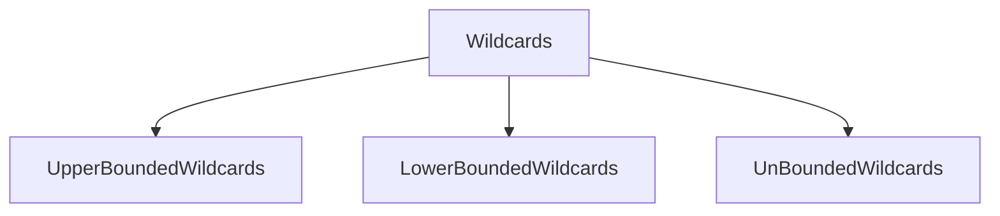

# JavaGeneric

This is all about Java Generics

<h3> Java includes support for writing generic classes and methods that can operate on variety of data types while often avoiding the need for explicit casts. The generics framework allow us to define a class in terms of a set of <em><i>formal type parameters</i></em>, which can then be used as the declared type for variables , parameters, and return values within the class definition. Those formal type parameters are later specified when using the generic class as a type elsewhere in a program. Generics are a feature of Java that allows us to create classes and methods that work with different types of data.Generics are a way to make our code more flexible and reusable.</h3>


<ul>
<h3><a href= "https://github.com/AvinandanBose/JavaGeneric/blob/main/java_generics.java" >Eg:  Representation a generic pair using a classic style </a></h3>
</ul>


<h3> <i>Note: As language Java is based on OOP based , java.lang.Object is the root of the  class hierarchy, and we can create any object of Object class and every class we create or predefined gets instantiated under Object class , hence Object class is Super class of every class. </i> </h3>

<h3> <i> Similarly Byte(java.lang.Byte), String (java.lang.String), Integer(java.lang.Integer) , Float(java.lang.Float), Double(java.lang.Short) etc. are wrapper classes comes from  Java's Lang package as they not only wraps , put a cast over a value and change its type but also perform some specific functions - gives a pure OOP concept . </i> </h3>

<h3> <i>On the above example , String , Integer , Double are such wrapper classes that puts a narrow explicit cast : Object to String/Integer/Double . The above example is the Representation a generic pair using a classic style in which code become used to with such explicit casts . </i> </h3>

```Syntax

illegal; Compiler Error
-------------------------
String stock = p1.getFirst();
String stock2 = p2.getFirst();
Double price = p1.getSecond();
Integer price2 = p2.getSecond();

```


<h3>Hence using <ins>Java Generic Framework</ins> we can remove such explicit casts. In the framework we have to use a pair class using formal type of parameters to represent the two relevant types in our composition. An implementation using this framework is given in the Code below: </h3>

<ul>
<h3><a href= "https://github.com/AvinandanBose/JavaGeneric/blob/main/java_generics1.java" >Eg:  Representation of a generic pair using a Java Generic Framework </a></h3>
  
  ```Syntax

class Pair <A,B> {} : Here A and B are formal type parameters.
 Pair<Integer, String> p1 :  Here Integer , String are Actual Parameters.
 
  So, we can write :
  
  p1 = new Pair<Integer, String>(1, "apple");

```
<h3><a href= "https://github.com/AvinandanBose/JavaGeneric/blob/main/java_generics2.java" >Eg:  Representation of a generic pair using a Java Generic Framework - 2  </a></h3>

  ```Syntax

1.  Type 1 Representation of Java Generic Framework:
Pair<Integer, String> p1 ;
p1 = new Pair<Integer, String>(1, "apple"); //Generic Type Parameters are explicitly specified between Angle Bracket.

2. Also, We Can subsequestly instantiate the generic class using the following syntax:

Pair<Integer, String> p3 ;
p3 = new Pair<>(3, "orange"); //Rely on type interference.

3. Classic type of Instantiation of Object:

 Pair<Integer, String> p2 ;
  p2 = new Pair(2, "pear"); // Classic Type

```
<h2> <ins> 1. Type Interference </ins> </h2>

<h3>

```Syntax

p3 = new Pair<>(3, "orange");

```
</h3>

<h3> After the new operator , we provide the name of the generic class , then an empty set of angle brackets(known as "diamond") and finally the parameters to the constructor. An instance of the generic class is created , with the actual types for the formal type parameters determined based upon the original declaration of the variable to which it is assigned . This process is known as <i> <ins> Type Interference <ins> </i> and was introduced to the generics framework in JAVA SE 7 .</h3> 

<h2> <ins> 2. Generic Type Parameters Are Explicitly Specified Between Angle Brackets During Instantiation.  </ins> </h2>

<h3>

```Syntax

p3 = new Pair<Integer, String>(3, "orange");

```
</h3>

<h3> The above style existed prior to JAVA SE 7 , in which the generic type parameters are explicitly specified between angle brackets during instantiation. </h3>

<h2> <ins> 3. Classic Style.  </ins> </h2>

<h3>

```Syntax

p3 = new Pai(3, "orange");

```
</h3>

<h3> However , it is important that one of the above styles used . If angle brackets are entirely omitted as shown above, this reverts to the classic style , with Object automatically used for all generic type parameters and resulting in a compiler warning to a variable with more specific types.</h3>


</ul>

<h2> Automatic-Unboxing of Wrapper Type To Primitive Data Type </h2> 
<ul>

<h3><a href= "https://github.com/AvinandanBose/JavaGeneric/blob/main/java_generics3.java" >Eg: Automatic-Unboxing of Wrapper Type To Primitive Data Type  </a></h3>
  
  
```Syntax

 int price = p1.getFirst();
 double price2 = p2.getSecond();

```
 <h3> Here automatic unboxing occurs , where Integer and Double wrapper type , convert to their primitive value of int , double primitive data type. </h3>
 <h3><a href= "https://github.com/AvinandanBose/JavaGeneric/blob/main/java_generics4.java" >Eg: Automatic-Unboxing of Wrapper Type To Primitive Data Type(2) </a></h3>
</ul>
  
 <h2> Generics and Arrays </h2> 
 
 <ul>
 <h3>A. For Loop </h3>
 <ul>
 <h3><li><a href= "https://github.com/AvinandanBose/JavaGeneric/blob/main/java_generics5.java" >Generics and Arrays[Using For Loop]- Eg-1  </a></li></h3>
   
   <h3>
     
   ```Syntax
   java_generics5<Integer, String>[] holdings;
     
    :Array of Object:
     
    holdings = new java_generics5[2];
     
   Size of the Array of Object holdings → 2
   :-------------------------------------------:  
   holdings[0] = new java_generics5<>(1, "apple");
   Hence:
     
   holdings[0].getFirst() → Returns Integer (1) 
   holdings[0].getSecond() → Returns String ("apple")
   
   :-------------------------------------------:
   holdings[1] = new java_generics5<>(2, "pear");
    Hence:
     
   holdings[1].getFirst() → Returns Integer (2) 
   holdings[1].getSecond() → Returns String  ("pear")
     
    
   ```
   <h3> <i> <ins> Note:</ins> holdings = new java_generics5[2]→ Correct but Warning about Unchecked Cast.  </i> </h3>
   </h3>
     
  <h3><li><a href= "https://github.com/AvinandanBose/JavaGeneric/blob/main/java_generics6.java" >Generics and Arrays[Using For Loop]- Eg-2  </a></li></h3>
  
  <h3>
  
   ```Syntax
     
    :Array of Object:
     
    T[] data; → Also A Member Instance of Class
    
    :Creating Object of A Generic Class:
    
    java_generics6<Integer> p1;
    p1 = new java_generics6<Integer>()
    
    :It represents : 
    
    Integer[] data ; → The formal Argument replaced by actual i.e. Integer.
    And p1 is object of the Generic Class.
     
   :Allocation of Size of the Array of Object:
   
   p1.data = new Integer[2];
   
  :Elements Assigned:
  
   p1.data[0] = 1;
   p1.data[1] = 2;
     
  :Fetching Elements from Array:
  
  for (Integer i =0 ; i < p1.data.length; i++) {
            System.out.println(p1.data[i]);
        }
     
   ```
   </h3>
    
   <h3><li><a href= "https://github.com/AvinandanBose/JavaGeneric/blob/main/java_generics7.java" >Generics and Arrays[Using For Loop]- Eg-3  </a></li></h3>
   
   <h3>
  
   ```Syntax
     
    Here A,B i.e. Two formal arguments used .
     
   ```
   </h3>
   
   <h3><li><a href= "https://github.com/AvinandanBose/JavaGeneric/blob/main/java_generics8.java" >Generics and Arrays[Using For Loop]- Eg-4  </a></li></h3>
   
   <h3>
  
   ```Syntax
     
    java_generics8(int capacity) {
        data = (T[]) new Integer[capacity];
    }
    
    Here we are assigning size of the Array through the Constructor.
    (T[]) is casted before with Compiler warning. 
     
   ```
   </h3>
   
 </ul>
 <h3>B. For Each Loop </h3>
 <ul>
 <h3><li><a href= "https://github.com/AvinandanBose/JavaGeneric/blob/main/java_generics9.java" >Generics and Arrays[Using For Each Loop]- Eg-5  </a></li></h3>
  <h3><li><a href= "https://github.com/AvinandanBose/JavaGeneric/blob/main/java_generics10.java" >Generics and Arrays[Using For Each Loop]- Eg-6  </a></li></h3>
   <h3><li><a href= "https://github.com/AvinandanBose/JavaGeneric/blob/main/java_generics11.java" >Generics and Arrays[Using For Each Loop]- Eg-7  </a></li></h3>
   <h3><li><a href= "https://github.com/AvinandanBose/JavaGeneric/blob/main/java_generics12.java" >Generics and Arrays[Using For Each Loop]- Eg-8  </a></li></h3>
 </ul>
 <h3>C. Using Object as Generic Type </h3>
 <ul>
 <h3><li><a href= "https://github.com/AvinandanBose/JavaGeneric/blob/main/java_generics13.java" >Generics and Arrays[Using For Loop]- Eg-9  </a></li></h3>
  <h3><li><a href= "https://github.com/AvinandanBose/JavaGeneric/blob/main/java_generics14.java" >Generics and Arrays[Using For Each Loop]- Eg-10  </a></li></h3>
 </ul>
 
 </ul>
 <h2> Generic Methods</h2> 
 <ul>
 <h3><li><a href= "https://github.com/AvinandanBose/JavaGeneric/blob/main/java_generics15.java" >Generic Methods -Eg-11  </a></li></h3>
   
   ```Syntax

class A2<T>{
    T data;

    A2(T item){

        data = item;

    }

    int view(){

        return(Integer)data;

    }

    public static void main(String[] args) {
        A2<Integer> p1;
        p1 = new A2<>( 2);

        System.out.println(p1.view());

    }

}


```
   
  <h3><li><a href= "https://github.com/AvinandanBose/JavaGeneric/blob/main/java_generics16.java" >Generic Methods- Eg-12  </a></li></h3>
   
```Syntax

class A2<T>{
    T data;

    A2(T item){

        data = item;

    }

    T view(){

        return data;

    }

    public static void main(String[] args) {
        A2<Integer> p1;
        p1 = new A2<>( 2);

        System.out.println(p1.view());

    }

}


```
  
<h3><li><a href= "https://github.com/AvinandanBose/JavaGeneric/blob/main/java_generics17.java" >Generic Methods- Eg-13  </a></li></h3>
   
   
```Syntax

class A2<S,T>{
    T data1;
    S data2;

    A2(T item1, S item2){

        data1 = item1;
        data2 = item2;

    }

    T view1(){

        return data1;

    }

    S view2(){

        return data2;

    }

    public static void main(String[] args) {
        A2<Integer, Integer> p1;
        p1 = new A2<>(  10, 2);

        System.out.println(p1.view1());
        System.out.println(p1.view2());

    }

}


```
   
<h3><li><a href= "https://github.com/AvinandanBose/JavaGeneric/blob/main/java_generics18.java" >Generic Methods- Eg-14  </a></li></h3>
   
   
```Syntax

class A2<S,T>{
    T data1;
    S data2;

    A2(T item1, S item2){

        data1 = item1;
        data2 = item2;

    }

    T view1(){

        return data1;

    }

    S view2(){

        return data2;

    }

    public static void main(String[] args) {
       A2<Integer, String> p1;
        p1 = new A2<>(   "Hello",2);

        System.out.println(p1.view1());
        System.out.println(p1.view2());

    }

}


```
   
  <h3><li><a href= "https://github.com/AvinandanBose/JavaGeneric/blob/main/java_generics19.java" >Generic Methods- Eg-15  </a></li></h3>
   
```Syntax

class A2{


    public static <A> void view(A item) {
        System.out.println("The value is: " + item);

    }

    public static <B> String view2(B item) {
        return (String) item;

    }


    public static void main(String[] args) {


        view(2);
        System.out.println(view2("Hello"));

    }

}

```

   <h3> Another : </h3>
 
```Syntax

class A2<T>{

    <A> T view(T data, A item) {
         System.out.print(item);
        return data;

    }


    public static void main(String[] args) {

        A2<Integer> a2 = new A2<>();

        System.out.println(a2.view(12, "Hello"));

    }

}

```
 <h3> Note : </h3>
      
```Syntax

class A2<T>{

   <T> T view(T data, T item) {
         System.out.print(item);
        return data;

    }
}


Here T represents the Type T of Generic Method but not of Parameterized Class.
     
Hence:
     
class A2<T>{

    <T> T view(T data, T item) {
         System.out.print(item);
        return data;

    }


    public static void main(String[] args) {

        A2<Integer> a2 = new A2<>();

        System.out.println(a2.view("A", "Hello"));

    }

}
      
      
```      
  <h3> But if : </h3>

```Syntax
      
  class A2<T>{

  <A> T view(T data, A item) {

        return item;

  }
    
 :Will generate error as return type now needs generic class's T type as:
    
 :T view() i.e. return Generric class T type,: 
 :though Generic method have an extended type A which has scope to the Method only.:  
      
``` 
        
  <h3><li><a href= "https://github.com/AvinandanBose/JavaGeneric/blob/main/java_generics20.java" >Generic Methods- Eg-16  </a></li></h3>
  <h3><li><a href= "https://github.com/AvinandanBose/JavaGeneric/blob/main/java_generics21.java" >Generic Methods- Eg-17  </a></li></h3>
  <h3><li><a href= "https://github.com/AvinandanBose/JavaGeneric/blob/main/java_generics39.java" >Generic Methods- Eg-18  </a></li></h3>
 </ul>
  <h2> Generic Methods AND Generic Arrays</h2>
   <ul>
   <h3><li><a href= "https://github.com/AvinandanBose/JavaGeneric/blob/main/java_generics22.java" >Generic Methods AND Generic Arrays(Print Data Element) -Eg-18  </a></li></h3>
  <h3><li><a href= "https://github.com/AvinandanBose/JavaGeneric/blob/main/java_generics23.java" >Generic Methods AND Generic Arrays(Swapping)- Eg-19 </a></li></h3>
  <h3><li><a href= "https://github.com/AvinandanBose/JavaGeneric/blob/main/java_generics24.java" >Generic Methods AND Generic Arrays(Print Data Element 2)- Eg-20  </a></li></h3>
  <h3><li><a href= "https://github.com/AvinandanBose/JavaGeneric/blob/main/java_generics25.java" >Generic Methods AND Generic Arrays(Add Elements In An Array)- Eg-21  </a></li></h3>
  <h3><li><a href= "https://github.com/AvinandanBose/JavaGeneric/blob/main/java_generics26.java" >Generic Methods AND Generic Arrays(Reverse The Elements In An Array)- Eg-22  </a></li></h3>
  
  <h3><li><a href= "https://github.com/AvinandanBose/JavaGeneric/blob/main/java_generics27.java" >Generic Methods AND Generic Arrays- Eg-23  </a></li></h3>
 
   </ul>
   
   <h2>Generic Type Overloading (Static Polymorphism ) </h2>
   <ul>
   <h3> <li>1. Type 1 [Using Class Generics]</li></h3>
   <ul>
  <h3> <li>1.a. Difference in the number of parameters passed with methods having the same name .</li></h3>
  <ul>
 <h3><li><a href= "https://github.com/AvinandanBose/JavaGeneric/blob/main/java_generics30.java" >Eg-1  </a></li></h3>
  <h3><li><a href= "https://github.com/AvinandanBose/JavaGeneric/blob/main/java_generics31.java" >Eg-2  </a></li></h3>
  <h3><li><a href= "https://github.com/AvinandanBose/JavaGeneric/blob/main/java_generics32.java" >Eg-3  </a></li></h3>
  <h3><li><a href= "https://github.com/AvinandanBose/JavaGeneric/blob/main/java_generics33.java" >Eg-4  </a></li></h3>
  
 </ul>
     
  
  ```Syntax
     
   Note:
    
    : As the Class is Generic :
    :b ) Overloading by Difference in Sequence or Order of Parameter (Is Not Possible ):
    
    Eg: 
    class A<T,K>{
    
    void swap(T a, K b ){
    
    }
    
     void swap(K b, T b ){
    
    }
    //Is Not Possible
    
    :c ) Overloading by Difference in datatypes of parameters passed in methods (Is Not Possible ):
    
     Eg: 
    class A<T,K>{
    
    void swap(T a, T b ){
    
    }
    
     void swap(K a, K b ){
    
    }
    
    //Is Not Possible
    
  ```
 
  
 </ul>
  <h3> <li>2. Type 2 [Using static and nonstatic Generics Method]</li></h3>
  <ul>
  <h3><li><a href= "https://github.com/AvinandanBose/JavaGeneric/blob/main/java_generics34.java" >Eg-1  </a></li></h3>
  <h3><li><a href= "https://github.com/AvinandanBose/JavaGeneric/blob/main/java_generics35.java" >Eg-2  </a></li></h3>
  <h3><li><a href= "https://github.com/AvinandanBose/JavaGeneric/blob/main/java_generics36.java" >Eg-3  </a></li></h3>
  <h3><li><a href= "https://github.com/AvinandanBose/JavaGeneric/blob/main/java_generics37.java" >Eg-4  </a></li></h3>
  <h3><li><a href= "https://github.com/AvinandanBose/JavaGeneric/blob/main/java_generics38.java" >Eg-5  </a></li></h3>
  </ul>
  </ul>
<h2> Bounded Generic Types</h2>
<ul>
<h3><li>1. There are times when we want to restrict the kind of types that are allowed to be passed to a type parameter.</li></h3>
<h3><li>2. To declare a bounded type parameter, list the parameter's name , followed by the extends keyword.</li></h3>
<h3><li>3. Parameter followed by extends called as upper bound.</li></h3>

<h2>1. Upper Bound Generic Types</h2>
<ul>
<h3><li><a href= "https://github.com/AvinandanBose/JavaGeneric/blob/main/javaGenUBEg2.java" > Upper Bound Eg-1  </a></li></h3>
<h3><li><a href= "https://github.com/AvinandanBose/JavaGeneric/blob/main/javaGenUBEg3.java" >Upper Bound Eg-2  </a></li></h3>

<h3> <i> <ins>Note:</ins> The abstract class Number is the superclass of platform classes representing numeric values that are convertible to the primitive types byte, double, float, int, long, and short.</i></h3>

<h3><li><a href= "https://github.com/AvinandanBose/JavaGeneric/blob/main/javaGenUBEg11.java" >Upper Bound Eg-3[String]  </a></li></h3>
<h3><li><a href= "https://github.com/AvinandanBose/JavaGeneric/blob/main/javaGenUBEg12.java" >Upper Bound Eg-4[Byte]  </a></li></h3>
<h3><li><a href= "https://github.com/AvinandanBose/JavaGeneric/blob/main/javaGenUBEg14.java" >Upper Bound Eg-5[StringBuffer]  </a></li></h3>
<h3><li><a href= "https://github.com/AvinandanBose/JavaGeneric/blob/main/javaGenUBEg15.java" >Upper Bound Eg-6[StringBuilder]  </a></li></h3>
<h3><li><a href= "https://github.com/AvinandanBose/JavaGeneric/blob/main/javaGenUBEg16.java" >Upper Bound Eg-7[Integer]  </a></li></h3>
<h3><li><a href= "https://github.com/AvinandanBose/JavaGeneric/blob/main/javaGenUBEg17.java" >Upper Bound Eg-8[Float]  </a></li></h3>
<h3><li><a href= "https://github.com/AvinandanBose/JavaGeneric/blob/main/javaGenUBEg18.java" >Upper Bound Eg-9[Character]  </a></li></h3>
<h3><li><a href= "https://github.com/AvinandanBose/JavaGeneric/blob/main/javaGenUBEg19.java" >Upper Bound Eg-10[Short]  </a></li></h3>
<h3><li><a href= "https://github.com/AvinandanBose/JavaGeneric/blob/main/javaGenUBEg20.java" >Upper Bound Eg-11[Long]  </a></li></h3>
<h3> <i> <ins>Note:</ins> The type T here shouldnot be bounded by final type of String,Byte, StringBuffer, StringBuilder,Integer,Float,Character,Short and Long. Its noted that all belongs to package: java.lang .And all of these are wrapper classes(except StringBuilder and StringBuffer as they are companion classes of String and they are mutable classes unlike String) declared as "Final" . And the rule is we cannot inherit them as they are final classes . Here T extends String,Byte,... etc. represents the type T is String,Byte,... etc. Final types cannot be further extended. Hence generates a warning and equally Legal representation.Hence types are fixed here i.e. if T extends String , Then during object creation the type must be String not Integer, Float and other types and it is same for others as given in above examples.</i></h3>
<h3><li><a href= "https://github.com/AvinandanBose/JavaGeneric/blob/main/javaGenUBEg4.java" >Upper Bound Eg-12[Comparable]  </a></li></h3>
<h3><li><a href= "https://github.com/AvinandanBose/JavaGeneric/blob/main/javaGenUBEg6.java" >Upper Bound Eg-13[Serializable]  </a></li></h3>
<h3><li><a href= "https://github.com/AvinandanBose/JavaGeneric/blob/main/javaGenUBEg7.java" >Upper Bound Eg-14[Runnable]  </a></li></h3>
<h3><li><a href= "https://github.com/AvinandanBose/JavaGeneric/blob/main/javaGenUBEg8.java" >Upper Bound Eg-15[Thread]  </a></li></h3>
<h3><li><a href= "https://github.com/AvinandanBose/JavaGeneric/blob/main/javaGenUBEg9.java" >Upper Bound Eg-16[List]  </a></li></h3>
<h3><li><a href= "https://github.com/AvinandanBose/JavaGeneric/blob/main/javaGenUBEg10.java" >Upper Bound Eg-17[Map]  </a></li></h3>
<h3><li><a href= "https://github.com/AvinandanBose/JavaGeneric/blob/main/javaGenUBEg13.java" >Upper Bound Eg-18[CharSequence]  </a></li></h3>
<h3><li><a href= "https://github.com/AvinandanBose/JavaGeneric/blob/main/javaGenUBEg21.java" >Upper Bound Eg-19[Object]  </a></li></h3>
<h3><li><a href= "https://github.com/AvinandanBose/JavaGeneric/blob/main/javaGenUBEg26.java" >Upper Bound Eg-20[Set]  </a></li></h3>
<h2> Custom Creation of UpperBound [user defined]</h2>
<ul>
<h3><li><a href= "https://github.com/AvinandanBose/JavaGeneric/blob/main/javaGenUBEg22.java" >Upper Bound Eg-21[Class[User Defined]]  </a></li></h3>
<h3><li><a href= "https://github.com/AvinandanBose/JavaGeneric/blob/main/javaGenUBEg23.java" >Upper Bound Eg-22[Interface[User Defined-1]]  </a></li></h3>
<h3><li><a href= "https://github.com/AvinandanBose/JavaGeneric/blob/main/javaGenUBEg24.java" >Upper Bound Eg-23[Interface[User Defined-2]]  </a></li></h3>
<h3><li><a href= "https://github.com/AvinandanBose/JavaGeneric/blob/main/javaGenUBEg25.java" >Upper Bound Eg-24[Abstract[User Defined]]  </a></li></h3>
</ul>
<h3> <i> <ins>Note:</ins> Likewise we can create upper bound by following above examples.</i></h3>
</ul>
<h2></h2>
<h2>1.A. Multiple Upper Bound Generic Types</h2>
<ul>
<h3> <i><ins>Rules for Multiple Upper Bound Generic Types:</ins></i></h3>
<ul>
<li><h3>1. As per Upper Bound , only extends is allowed for Type , to extend Class and Interfaces.</h3></li>
<h3><li>2. T is a type class can extends a Class and an Interface joined through '&' AND.  </li></h3>
<h3><li>3. Note the class being extended by type T must implement the Interface .  </li></h3>
<h3><li>4. No 'implement' Keyword is allowed it will generate error. </li></h3>
 
```Syntax
  
  interface A{
  }
  class B imlpements A{
  }
  class Ex<T extends B & A>{
  Ex<B> ex = new Ex<>();
  }
  
  :Here B is Class:
  :Here A is Interface:
  :And Class B implements Interface A:
  :And Type for Generic Class Ex is the Class which implements the Interface:
  :i.e. Ex<B> ex = new Ex<>():
```


 <ul>
   <h3><li><a href="https://github.com/AvinandanBose/JavaGeneric/blob/main/JavaGenMUB1.java">Example for Multiple Upper Bound Generic Types-1 </a></li></h3>
  </ul>
 <h3><li>3. Next it can extend two interfaces instead of a class and interface. </li></h3>
 <h3><li>4. And in that case the Type 'T'of Generic Class will represent the class implementing the two interfaces. </li></h3>
  
  ```Syntax
  
  interface A {}
  interface B {}
  Class C implements A , B{}
  class Ex<T extends A & B>{
  Ex<C> ex = new Ex<>();
  }
  
  :Here B is Interface:
  :Here A is Interface:
  :And Class C implements Interface A and Interface B:
  :And Type for Generic Class Ex is the Class which implements the Interface:
  :i.e. Ex<C> ex = new Ex<>():
  
```
 <ul>
   <h3><li><a href="https://github.com/AvinandanBose/JavaGeneric/blob/main/JavaGenMUB2.java">Example for Multiple Upper Bound Generic Types-2 </a></li></h3>
  </ul>
 <h3><li>5. Note Now , we have the overview of Multiple Upper Bound i.e. Generic Class 's Type say 'T' extends the Class that implements Interfaces and then all the Interfaces Or Only the Interfaces joined by '&' . The type 'T' of Generic class is the class that implements the interfaces . </li></h3>
  <ul>
   <h3><li><a href="https://github.com/AvinandanBose/JavaGeneric/blob/main/JavaGenMUB3.java">Example for Multiple Upper Bound Generic Types-3 </a></li></h3>
   <h3><li><a href="https://github.com/AvinandanBose/JavaGeneric/blob/main/JavaGenMUB4.java">Example for Multiple Upper Bound Generic Types-4 </a></li></h3>
  </ul>
  <ul>
  
</ul>
<h3> <i><ins>Rules:What if for Abstract Methods? </ins></i></h3>
  <ul> 
  <h3><li>Now for Abstract Methods the Class which extends Abstract Class and implement Interface becomes type T of Generic Class.But there is a difference that is we cannot use Generic type to extends the Class which extends Abstract Class if Abstract Class is extended by Generic Type 'T'. That we can only have one class and 'n' number of interfaces.</li></h3>
   
```Syntax
 
 interface A{}
 interface B{}
 abstract class C{}
 class D extends extends C implements A,B{}
 class Ex<T extends C &  A & B>{
  Ex<D>ex = new Ex<>();
 }

:OR:

 interface A{}
 interface B{}
 abstract class C{}
 class D extends extends C implements A,B{}
 class Ex<T extends D &  A & B>{
  Ex<D>ex = new Ex<>();
 }

:i.e. T either extends D or abstract Class C:
```
<ul>

<h3><li><a href="https://github.com/AvinandanBose/JavaGeneric/blob/main/JavaGenMUB5.java">Example for Multiple Upper Bound Generic Types-5 </a></li></h3>
<h3><li><a href="https://github.com/AvinandanBose/JavaGeneric/blob/main/JavaGenMUB6.java">Example for Multiple Upper Bound Generic Types-6 </a></li></h3>

</ul>
<h3> <i><ins>Implementation of Multiple Upper Bound based on Rules for predefined classes and interfaces of Java </ins></i></h3>
<ul>
<h3><li><a href="https://github.com/AvinandanBose/JavaGeneric/blob/main/JavaGenMUB7.java">T extends Number & Comparable<T> </a></li></h3>

```Syntax

java.lang.Number → Number is abstract class of java.lang package.
java.lang.Comparable<T> → Comparable<T> is interface of java.lang package.

```

<h3><li><a href="https://github.com/AvinandanBose/JavaGeneric/blob/main/JavaGenMUB8.java">T extends Number & Serializable</a></li></h3>

```Syntax

java.lang.Number → Number is abstract class of java.lang package.
java.io.Serializable → Serializable is interface of java.io package.

```

<h3><li><a href="https://github.com/AvinandanBose/JavaGeneric/blob/main/JavaGenMUB9.java">T extends Thread & Runnable</a></li></h3>

```Syntax

java.lang.Thread → Thread is a class of java.lang package ,
which implements interface Runnabe.

java.lang.Runnable → Runnable is an interface of java.lang package ,
implemented by Thread class.

```

<h3><li><a href="https://github.com/AvinandanBose/JavaGeneric/blob/main/JavaGenMUB10.java">T extends HashMap<K,V>& Map<K,V></a></li></h3>

```Syntax

java.util.HashMap → HashMap is a Class which is in java.util package.
Hash Map implements Map interface.

java.util.Map → Map is an interface of java.util package ,
implemented by HashMap class.

```


<h3><li><a href="https://github.com/AvinandanBose/JavaGeneric/blob/main/JavaGenMUB11.java">T extends ArrayList<V> & List<V></a></li></h3>

```Syntax

java.util.ArrayList → ArrayList is a Class which is in java.util package.
ArrayList implements List interface.

java.util.List → List is an interface of java.util package ,
implemented by ArrayList class.

```

<h3><li><a href="https://github.com/AvinandanBose/JavaGeneric/blob/main/JavaGenMUB12.java">T extends HashSet<V> & Set<V></a></li></h3>

```Syntax

java.util.HashSet → HashSet is a Class which is in java.util package.
HashSet implements Set interface.

java.util.Set → Set is an interface of java.util package ,
implemented by HashSet class.

```

<h3><li><a href="https://github.com/AvinandanBose/JavaGeneric/blob/main/JavaGenMUB13.java">T extends CharSequence & Comparable<T></a></li></h3>

```Syntax

java.lang.CharSequence → CharSequence is an interface in java.lang package.

java.lang.Comparable<T> → Comparable is an interface in java.lang package.

```

<h3><li><a href="https://github.com/AvinandanBose/JavaGeneric/blob/main/JavaGenMUB14.java">T extends Object & Comparable<T></a></li></h3>

```Syntax

java.lang.Object → Object is an interface in java.lang package.
Class Object is the root of the class hierarchy. 
Every class has Object as a superclass. 

java.lang.Comparable<T> → Comparable is an interface in java.lang package.

```
</ul>
</ul>
 
</ul>
<h2></h2>
 <h2>1.B.  Upper Bound Generic Type Methods</h2>
 <ul>
 <h3><ins><i>Note: The rules followed here are the same just like above.</i><ins></h3>
   <ul>
   <h3><li><a href= "https://github.com/AvinandanBose/JavaGeneric/blob/main/javaUBM1.java" >Upper Bound Generic Type Methods →Eg-1 (public static)[ T extends Number]  </a></li></h3>
     
```Syntax

Syntax:
     
public static <Type extends Class/Interface> returnType funcName(parameter){
    //code
}

```
   <h3><li><a href= "https://github.com/AvinandanBose/JavaGeneric/blob/main/javaUBM2.java" >Upper Bound Generic Type Methods →Eg-2 (public static)[T extends Comparable<T>]</a></li></h3>
   <h3><li><a href= "https://github.com/AvinandanBose/JavaGeneric/blob/main/javaUBM3.java" >Upper Bound Generic Type Methods →Eg-3 (creation of object)[ T extends Number]  </a></li></h3>
     
```Syntax

Syntax:
     
 <Type extends Class/Interface> returnType funcName(parameter){
    //code
}
public static void main(String[] args)
{
class_name<Type> var/obj_name = class_name<>();
:Or if not generic class:  
class_name var/obj_name = class_name();
}

```
   <h3><li><a href= "https://github.com/AvinandanBose/JavaGeneric/blob/main/javaUBM4.java" >Upper Bound Generic Type Methods →Eg-4 (creation of object)[T extends Comparable<T>] </a></li></h3>
     <h3><ins><i>Note: Its better to continue with static method rather than of creation of object.</i><ins>
    </ul>
    <h3><ins><i>Other Examples- Static Upper Bound Generic Methods </i><ins></h3>
    <ul>
<h3><li><a href= "https://github.com/AvinandanBose/JavaGeneric/blob/main/javaUBM5.java" >Upper Bound Generic Type Methods →Eg-5 [T extends Serializable] </a></li></h3>
 <h3><li><a href= "https://github.com/AvinandanBose/JavaGeneric/blob/main/javaUBM6.java" >Upper Bound Generic Type Methods →Eg-6 [T extends Runnable] </a></li></h3>
  <h3><li><a href= "https://github.com/AvinandanBose/JavaGeneric/blob/main/javaUBM7.java" >Upper Bound Generic Type Methods →Eg-7 [T extends Thread] </a></li></h3>
  <h3><li><a href= "https://github.com/AvinandanBose/JavaGeneric/blob/main/javaUBM8.java" >Upper Bound Generic Type Methods →Eg-8 [T extends List] </a></li></h3>
  <h3><li><a href= "https://github.com/AvinandanBose/JavaGeneric/blob/main/javaUBM9.java" >Upper Bound Generic Type Methods →Eg-9 [T extends Map] </a></li></h3>
  <h3><li><a href= "https://github.com/AvinandanBose/JavaGeneric/blob/main/javaUBM10.java" >Upper Bound Generic Type Methods →Eg-10 [T extends CharSequence] </a></li></h3>
   <h3><li><a href= "https://github.com/AvinandanBose/JavaGeneric/blob/main/javaUBM11.java" >Upper Bound Generic Type Methods →Eg-11 [T extends Object] </a></li></h3>
   <h3><li><a href= "https://github.com/AvinandanBose/JavaGeneric/blob/main/javaUBM12.java" >Upper Bound Generic Type Methods →Eg-12 [T extends Set] </a></li></h3>
    </ul>
    <h3><ins><i>Other Examples- With Creation of Object ,Upper Bound Generic Methods And Generic Classes </i><ins></h3>
 <ul>
 <h3><li><a href= "https://github.com/AvinandanBose/JavaGeneric/blob/main/javaUBM13.java" >Upper Bound Generic Type Methods →Eg-13 [T extends Serializable] </a></li></h3>
 <h3><li><a href= "https://github.com/AvinandanBose/JavaGeneric/blob/main/javaUBM14.java" >Upper Bound Generic Type Methods →Eg-14 [T extends Runnable] </a></li></h3>
  <h3><li><a href= "https://github.com/AvinandanBose/JavaGeneric/blob/main/javaUBM15.java" >Upper Bound Generic Type Methods →Eg-15 [T extends Thread] </a></li></h3>
  <h3><li><a href= "https://github.com/AvinandanBose/JavaGeneric/blob/main/javaUBM16.java" >Upper Bound Generic Type Methods →Eg-16 [T extends List] </a></li></h3>
  <h3><li><a href= "https://github.com/AvinandanBose/JavaGeneric/blob/main/javaUBM17.java" >Upper Bound Generic Type Methods →Eg-17 [T extends Map] </a></li></h3>
  <h3><li><a href= "https://github.com/AvinandanBose/JavaGeneric/blob/main/javaUBM18.java" >Upper Bound Generic Type Methods →Eg-18 [T extends CharSequence] </a></li></h3>
   <h3><li><a href= "https://github.com/AvinandanBose/JavaGeneric/blob/main/javaUBM19.java" >Upper Bound Generic Type Methods →Eg-19 [T extends Object] </a></li></h3>
   <h3><li><a href= "https://github.com/AvinandanBose/JavaGeneric/blob/main/javaUBM20.java" >Upper Bound Generic Type Methods →Eg-20 [T extends Set] </a></li></h3>   
    
  </ul>
 </ul>
 <h2></h2>
 <h2>1.C.  Multiple Upper Bound Generic Type Methods</h2>
 <ul>
 <h3><ins><i>Note: The rules followed here are the same just like above.</i><ins></h3>
 <h3><ins><i>1.  Examples- Static Upper Bound Generic Methods </i><ins></h3>
 <ul>
 <h3><li><a href= "https://github.com/AvinandanBose/JavaGeneric/blob/main/javaMBM1.java" >Multiple Upper Bound Generic Type Methods →Eg-1 [T extends Number & Comparable<T>] </a></li></h3>
 
 <h3><li><a href= "https://github.com/AvinandanBose/JavaGeneric/blob/main/javaMBM2.java" >Multiple Upper Bound Generic Type Methods →Eg-2 [T extends Number & Serializable] </a></li></h3>
 
  <h3><li><a href= "https://github.com/AvinandanBose/JavaGeneric/blob/main/javaMBM3.java" >Multiple Upper Bound Generic Type Methods →Eg-3 [T extends Thread & Runnable] </a></li></h3>
  
  <h3><li><a href= "https://github.com/AvinandanBose/JavaGeneric/blob/main/javaMBM4.java" >Multiple Upper Bound Generic Type Methods →Eg-4 [T extends HashMap<String, String> & Map<String, String>] </a></li></h3>
  
  <h3><li><a href= "https://github.com/AvinandanBose/JavaGeneric/blob/main/javaMBM5.java" >Multiple Upper Bound Generic Type Methods →Eg-5 [T extends ArrayList<String> & List<String>] </a></li></h3>
  
  <h3><li><a href= "https://github.com/AvinandanBose/JavaGeneric/blob/main/javaMBM6.java" >Multiple Upper Bound Generic Type Methods →Eg-6 [T extends HashSet<String> & Set<String>] </a></li></h3>
    
 <h3><li><a href= "https://github.com/AvinandanBose/JavaGeneric/blob/main/javaMBM7.java" >Multiple Upper Bound Generic Type Methods →Eg-7[T extends CharSequence & Comparable<T>] </a></li></h3>
 
  <h3><li><a href= "https://github.com/AvinandanBose/JavaGeneric/blob/main/javaMBM8java" >Multiple Upper Bound Generic Type Methods →Eg-8[T extends Object & Comparable<T>] </a></li></h3>
 
 
 </ul>
 <h3><ins><i>2.  Examples- With Creation of Object ,Upper Bound Generic Methods And Generic Classes</i><ins></h3>
 
  <ul>
 <h3><li><a href= "https://github.com/AvinandanBose/JavaGeneric/blob/main/javaMBM9.java" >Multiple Upper Bound Generic Type Methods →Eg-9 [T extends Number & Comparable<T>] </a></li></h3>
 
 <h3><li><a href= "https://github.com/AvinandanBose/JavaGeneric/blob/main/javaMBM10.java" >Multiple Upper Bound Generic Type Methods →Eg-10 [T extends Number & Serializable] </a></li></h3>
 
  <h3><li><a href= "https://github.com/AvinandanBose/JavaGeneric/blob/main/javaMBM11.java" >Multiple Upper Bound Generic Type Methods →Eg-11 [T extends Thread & Runnable] </a></li></h3>
  
  <h3><li><a href= "https://github.com/AvinandanBose/JavaGeneric/blob/main/javaMBM12.java" >Multiple Upper Bound Generic Type Methods →Eg-12 [T extends HashMap<String, String> & Map<String, String>] </a></li></h3>
  
  <h3><li><a href= "https://github.com/AvinandanBose/JavaGeneric/blob/main/javaMBM13.java" >Multiple Upper Bound Generic Type Methods →Eg-13 [T extends ArrayList<String> & List<String>] </a></li></h3>
  
  <h3><li><a href= "https://github.com/AvinandanBose/JavaGeneric/blob/main/javaMBM14.java" >Multiple Upper Bound Generic Type Methods →Eg-14 [T extends HashSet<String> & Set<String>] </a></li></h3>
    
 <h3><li><a href= "https://github.com/AvinandanBose/JavaGeneric/blob/main/javaMBM15.java" >Multiple Upper Bound Generic Type Methods →Eg-15[T extends CharSequence & Comparable<T>] </a></li></h3>
 
  <h3><li><a href= "https://github.com/AvinandanBose/JavaGeneric/blob/main/javaMBM16java" >Multiple Upper Bound Generic Type Methods →Eg-16[T extends Object & Comparable<T>] </a></li></h3>
 
 
 </ul>
 
 </ul>
</ul>
<h1></h1>
<h1> WildCards</h1>
<ul>
<h3><li>1. In generic code, the question mark (?), called the wildcard, represents an unknown type.</li></h3>

<h3><li>2. The wildcard is never used as a type argument for a generic method invocation, a generic class instance creation, or a supertype.</li></h3>

<h3><li>3.The wildcard can be used in a variety of situations such as the type of a parameter, field, or local variable; sometimes as a return type.</li></h3>


<h3><li>4.Unlike arrays, different instantiations of a generic type are not compatible with each other, not even explicitly. This incompatibility may be softened by the wildcard if ? is used as an actual type parameter.</li></h3>

<h2></h2>
<h2>Division of  WildCards</h2>
<ul>



</ul>
<h2></h2>
<h2>1.A. UpperBoundedWildcards</h2>
<ul>
  <h3><li>To declare a upper bounded Wildcard parameter, list the ?, followed by the extends keyword, followed by its upper bound.</li></h3>
  
  <h3><i><ins>Upper Bounded Wildcard </ins></i></h3>
  <h3><li><a href= "https://github.com/AvinandanBose/JavaGeneric/blob/main/WildCards.java" >Upper Bounded Wildcards →Eg-1 </a></li></h3>
  
```Syntax

interface A {

}

class Example<T> implements A {

}

public class WildCards<T extends Example<? extends A>>{

public static void main(String[] args) {

    WildCards<Example<A>> obj = new WildCards<>();
}

}

:Note→ As Generic Type Example class implements interface A:
:It is taken as Type to create object:


````

<h3><i><ins>Now,</ins></i></h3>
  
```Syntax

interface A {

}

interface B<T> {

}

:OR:

interface B<T>extends A {

}

class Example<T> implements A,B<T> {

}

public class WildCards<T extends Example<? extends A> & & B<? extends A>>{


}

}

:Will generate error as Example implements B<T>:
:It will be considered as - B<? extends A> in both the cases:
:B<? extends A> & B<? extends A> cannot exists in same time:


````

<h3><i><ins>Now, if interface B is not generic , then it can be possible:</ins></i></h3>
<h3><li><a href= "https://github.com/AvinandanBose/JavaGeneric/blob/main/WildCards1.java" >Upper Bounded Wildcards →Eg-2 </a></li></h3>

```Syntax

interface A {

}

interface B {
}

class Example<T> implements A,B {

}

public class WildCards<T extends Example<? extends A> & B>{

public static void main(String[] args) {

    WildCards<Example<A>> obj = new WildCards<>();
}

}

:Reason→As both the interfaces now considered as specific and different from each other:
````
<h3><li><a href= "https://github.com/AvinandanBose/JavaGeneric/blob/main/WildCards2.java" >Upper Bounded Wildcards →Eg-3 </a></li></h3>


```Syntax

interface A {

}

interface B<T> {
}

:OR:

interface B<T> extends A {
}

class Example<T> implements  B<T> {

}

public class WildCards2 <T extends Example<? extends B<? extends A>>>  {
    
    
        public static void main(String[] args) {
    
            WildCards2<Example<B<A>>> obj = new WildCards2<>();
            
    
        }
    
}

:The above is inclusive nature of Wildcard in Generic Types:
:During generating object of Class ,: 
:The type of Class should be the Class that implements the Interfaces:
````
<h3><li><a href= "https://github.com/AvinandanBose/JavaGeneric/blob/main/WildCards3.java" >Upper Bounded Wildcards →Eg-4 </a></li></h3>

```Syntax

interface A {

}

interface B<T extends A> {

}

class Example<T> implements B<A> {

}
class WildCards3 <T extends Example<? extends B<? extends A>>>{

public static void main(String[] args) {

        WildCards3<Example<B<A>>> obj = new WildCards3<>();
        
        obj.add(10, 20);

    }

}


```

<h3><li><a href= "https://github.com/AvinandanBose/JavaGeneric/blob/main/WildCards4.java" >Upper Bounded Wildcards →Eg-5 </a></li></h3>

```Syntax

interface A {

}

interface B<T> {

}

interface C<T> {

}

class D<T> implements B<A>, C<A>{
}

class WildCards4<T extends B<? extends A> & C<? extends A>> {

public static void main(String[] args) {

        WildCards4<D<A>> obj = new WildCards4<>();
        
        }


}


```

<h3><li><a href= "https://github.com/AvinandanBose/JavaGeneric/blob/main/WildCards5.java" >Upper Bounded Wildcards →Eg-6 </a></li></h3>

```Syntax

interface A {

}

interface B<T extends A> {

}

interface C<T extends A> {

}

class D<T extends A> implements B<A>, C<A> {
}


class WildCards5 <T extends B<? extends A> & C<? extends A>> {

public static void main(String[] args) {

       WildCards5<D<A>> obj = new WildCards5<>();

}


}


```

<h3><li><a href= "https://github.com/AvinandanBose/JavaGeneric/blob/main/WildCards6.java" >Upper Bounded Wildcards →Eg-7 </a></li></h3>

```Syntax

interface A{

}

interface B<T>{

}

class WildCards <T extends B<? extends A>> {

public static void main(String[] args) {

    WildCards<B<A>> obj = new WildCards<>();

  }

}


```

<h3><li><a href= "https://github.com/AvinandanBose/JavaGeneric/blob/main/WildCards7.java" >Upper Bounded Wildcards →Eg-8 </a></li></h3>

```Syntax

class A{

}

interface B<T>{

}


class WildCards <T extends B<? extends A>> {

public static void main(String[] args) {

      WildCards<B<A>> obj = new WildCards<>();

    }

}


```

<h3><i>Hence here are the rules :</i></h3>

<h3> <li>1. if the class extends a generic interface.</li></h3>

<h3>

```Syntax

interface A <T>{

}


class Example<T> implements A<T> {

}

```

</h3>

<h3>Then any class having upper bound wildcard cannot have both the class and the interface, As the upper bound wildcard of interface represent the same as upper bound wildcard of the class and both cannot co exists . As Java does <i> <ins>Type Erasure </ins></i> for type safety, what it does after compilation, all generic types are erased and the class implements interface and the super interface looks same in bytecode. </h3>

<h3>

```Syntax

class WildCards <T extends Example<? extends T> & A<? extends T>> {
    
}

:As→Example<? extends T> = A<? extends T>:
:And A<? extends T> & A<? extends T> cannot co-exists.:

```

</h3>


<h1> </h1>

<h3> <li>2. The generic class that implements interfaces becomes the Type which helps to create the object of the classes.</li></h3>


<h3>

```Syntax

interface A {

}

interface B<T> {

}


class Example<T> implements A , B<T> {

    //Creation of Object\'s

    Example<String> e1 = new Example<String>();
    Example<Integer> e2 = new Example<Integer>();
    Example<Example<String>> e3 = new Example<Example<String>>();

}

public class WildCards6 <T extends B<? extends A>> {

    public static void main(String[] args){

	//Same Objects can be created in class WildCard6 java class

  	Example<String> e1 = new Example<String>();
    	Example<Integer> e2 = new Example<Integer>();
    	Example<Example<String>> e3 = new Example<Example<String>>();


        // Creation of Object\'s of WildCards6

        WildCards6<Example<A>> obj = new WildCards6<>();
    }
    
}

```
</h3>

<h1> </h1>

<h3> <li>3. if interface is not generic and class is generic which implements the interface then the generic class which have upper bound  wild card can have the interface too .</li></h3>

<h3>

```Syntax

interface A {

}

interface B{

}
class Example<T> implements A,B {

    //Creation of Object\'s
    Example<String> e1 = new Example<String>();
    Example<Integer> e2 = new Example<Integer>();
    Example<Example<String>> e3 = new Example<Example<String>>();

}

 class WildCards6 <T extends Example<? extends A> & B >{

    public static void main(String[] args){
        
        // Creation of Object\'s
        WildCards6<Example<A>> obj = new WildCards6<>();
    }
    
}

```
</h3>


<h3> <i>But if the interface is generic , then the generic class which implements the generic interface cannot be present at same time with the interface i.e. rule 1.</i></h3>

<h1> </h1>

<h3> <li>4. In Upper Bound Wild Card : ? extends Interface / Class . And that Interface / Class must exist. Or will throw Error. </li></h3>

<h3>

```Syntax

interface A{

}

interface B<T>{

}

class WildCards <T extends B<? extends A>>{

public static void main(String[] args) {

WildCards<B<A>> obj = new WildCards<>();


     }


}


OR

class A{

}

interface B<T>{

}

class WildCards <T extends B<? extends A>>{

public static void main(String[] args) {

WildCards<B<A>> obj = new WildCards<>();


   }


}


```

</h3>

<h1> </h1>

<h3><li>5. Rather than using the generic Class which implements the generic interfaces, single generic interfaces can also be taken as Upper Bound WildCard.  And can be used as types to generate object of the Class. Also we can use the generic class(if present) which implement the interface/s. </li></h3>


<h3>

```Syntax

interface A{

}

interface B<T>{

}

class WildCards <T extends B<? extends A>>{

public static void main(String[] args) {

WildCards<B<A>> obj = new WildCards<>();

     }


}

OR

interface A{

}

interface B<T>{

}

class E<T> implements B<T>{

}

class WildCards <T extends B<? extends A>>{

public static void main(String[] args) {

WildCards<E<A>> obj = new WildCards<>();

     }


}


```

</h3>

<h3><i>But if two Upper Bound WildCard joined by '&' [AND] i.e. constituting Multiple Upper Bound then the Generic Class implement both the interfaces must be used as 'Type' to create object i.e. rule no.2 is must . </i></h3>

<h1> </h1>

<h3><li>6. In Upper Bound WildCard if WildCard extends a generic interface it creates another <i>Inner Upper Bound Wild Card </i>.  </li></h3>

<h3>

```Syntax

interface A{

}

interface B<T>{

}

interface E<T> {

}

class WildCards <T extends E<? extends B<? extends A>>>{

public static void main(String[] args) {

WildCards<E<B<A>>> obj = new WildCards<>();

     }


}


```

</h3>

<h3><i> If a generic class implements generic interfaces. Then the inner upper bound can be used with the generic class as Type to create object.  </i></h3>

<h3>

```Syntax

interface A{

}

interface B<T>{

}

interface E<T> {

}

class D<T> implements E<T>,B<T>, A{

}

class WildCards <T extends E<? extends B<? extends A>>>

{

public static void main(String[] args) {

WildCards<D<B<A>>> obj = new WildCards<>();

     }


}

OR


class WildCards <T extends D<? extends B<? extends A>>>

//Here D is Class

{

public static void main(String[] args) {

WildCards<D<B<A>>> obj = new WildCards<>();

     }


}


```

</h3>
<h3><i> Now if there is Multiple Upper Bound present , it acts the same as above i.e. the inner upper bound can be used with the generic class as Type to create object.  </i></h3>

<h3>

```Syntax

interface A {

}

interface B<T> {

}

interface E<T> {

}

interface F<T> {

}

class D<T> implements E<T>,B<T>, F<T>,A{

}

class WildCards<T extends E<? extends B<? extends A>> 
& F<? extends B<? extends A>>> {

public static void main(String[] args) { 

        WildCards<D<B<A>>> obj = new WildCards<>();

       }

}


```

</h3>

<h3><i> But the generic class which implements the interfaces if put as multiple upper bound , then rule no.1 is implemented i.e.  Generic Class which implemented the generic interface and the  generic interface cannot co-exists in multiple upper bound wildcards. </i></h3>

<h3>

```Syntax

interface A {

}

interface B<T> {

}

interface E<T> {

}

interface F<T> {

}

class D<T> implements E<T>,B<T>, F<T>,A{

}

Then

class WildCards<T extends D<? extends B<? extends A>> 
&F<? extends B<? extends A>>> {}

cannot occur that is:


D<? extends B<? extends A>>  = F<? extends B<? extends A>>

And both cannot co-exists.

```

</h3>

<h1></h1>
<h3><li>7. Unlike Multiple Upper Bound we cannot use '&' operator inside Upper Bound Wild Card.  </li></h3>

<h3>

```Syntax

class A{

}

class A1<T> {
    
}

interface B1{


}

interface C1{


}

class WildCards<T  extends A1<? extends A & B1 & C1>> 

= NOT ALLOWED


```
</h3>

<h1></h1>

<h3><li>8. Suppose there are two classes and one of them is generic , then it is possible to create an Upper Bound Wild Card and its object.  </li></h3>

<h3>

```Syntax

class A1 {
    
}


class B1<T>  {
    
}

class WildCards<T  extends B1<? extends A1>>{

public static void main(String[] args) { 

WildCards<B1<A1>> obj = new WildCards<>();

}

}


```
</h3>


<h3><i> Or an Interface and a generic class , then also it gives permission to create Upper Bound WildCards and its Object . </i></h3>

<h3>

```Syntax

interface A1 {
    
}


class B1<T>  {
    
}

class WildCards<T  extends B1<? extends A1>>{

public static void main(String[] args) { 

WildCards<B1<A1>> obj = new WildCards<>();

}

}


```
</h3>

<h3><i> But when there are more than one interface, then we need a Class which implement those interfaces so that we can create its object using the Class as Type during multiple upper bound is applied else Type remains unknown and in such cases we use <i> <ins>Unbounded Wild Cards</ins></i>  . </i></h3>

<h3>

```Syntax

interface A1 {
    
}

interface C1 <T>{


}


class B1<T> {

}

class WildCards<T  extends B1<? extends A1> & C<? extends A1>>{

public static void main(String[] args) {

WildCards<TypeUnkown> obj = new WildCards<>();

//As TypeUnkown we cannot create Object 
//hence here we use unbounded wild card.

}

}

OR

interface A1 {
    
}

interface B1<T>{

}

interface C1 <T>{


}


class WildCards<T  extends B1<? extends A1> & C<? extends A1>>{

WildCards<TypeUnkown> obj = new WildCards<>();

//As TypeUnkown we cannot create Object 
//hence here we use unbounded wild card.

}

}

```
</h3>

<h3><li>9. Whether its Abstract Class or Class procedure remains same for Abstract Class and Class.  </li></h3>

<h3>

```Syntax

Eg: 

interface A{

}

interface B<T>{

}

interface C<T>{

}
abstract class A1<T> implements A,B<T>, C<T> {

}

class WildCards8<T  extends A1<? extends A>> {

}

public static void main(String[] args) {

WildCards<A1<A>> obj = new WildCards<>();

}

}


```

</h3>

<h1></h1>

<h3><li>10. If a generic interface extends another generic interface , then another generic class implements both the interfaces as Upper Bound Wild Card . Then the super interface become equal to the sub interface which extends the super interface and erase the sub interface and impose error. Like rule no.1 and this type of erasure called as: <i> <ins>Type Erasure. </ins></i> where after compilation, all generic types are erased, both interfaces ending looking the same in the bytecode.  </li></h3>

<h3>

```Syntax

interface A{

}

interface B<E> extends A{
	
}

interface C<E> extends B<E>{
	
}

class D implements C<A>{
	
	
}

class WildCards<T extends C<? extends D> & B<? extends D>>{
	
}

Then :

C<? extends D> = B<? extends D>

 B<? extends D> and B<? extends D> cannot co-exist


```

</h3>


<h1> </h1>

<h3><li>11. Iterating Rule 1 , 9 and 10 , if generic Abstract Class implements  Generic Interface . Where super interface and abstract class after compilation looks sane in bytecode causing <i><ins> Type Erasure.  </ins></i>   </li></h3>

<h3>

```Syntax

interface A{}

interface A1<T>{}


abstract class B<T> implements A1<T>{}

 class WildCardss<T extends B<? extends A> & A1<? extends A>> {}

Then :

B<? extends D> = A1<? extends A>

A1<? extends A> and A1<? extends A> cannot co-exist


```

</h3>


<h1> </h1>

<h3><i> <ins>Example of Implementation of Some of the PreBuilt Interfaces and Classes in Upper Bound WildCards.<ins> </i></h3>

<ul>

<h3 align="Center"> <a href="https://github.com/AvinandanBose/JavaGeneric/blob/main/upperBoundWCEg1.java">First Example -1 </h3>

<h3 align="Center">

```Syntax

T extends List<? extends ArrayList<E>>

Where E is a Class , in the Example.

```

</h3>

```Syntax

java.util.List → is an Interface

java.util.ArrayList → A class which implements List Interface.

Therefore,

class A  {}

:Now, Class A can be an Interface:
:i.e. Interface A:

class upperBoundWCEg1<T extends List<? extends ArrayList<A>>>{

public static void main(String[] args) {


upperBoundWCEg1<ArrayList<ArrayList<A>>> obj =
 new upperBoundWCEg1<>();
 
    }

}


```

<h3 align="Center"> <a href="https://github.com/AvinandanBose/JavaGeneric/blob/main/upperBoundWCEg2.java">Second Example -2 </h3>

<h3 align="Center">

```Syntax

T extends List<? extends ArrayList<E>>

Where E is an Interface , in the Example.

```

</h3>

<h3><i><ins>Note:</ins></i></h3>


```Syntax

Implementation of Rule : 11 , Where,
 
AbstractList is an Abstract Class which implements List interface,
 
cannot co-exist with List in upper bound wild card.

```


<h3 align="Center"> <a href="https://github.com/AvinandanBose/JavaGeneric/blob/main/upperBoundWCEg3.java">Third Example -3 </h3>

<h3 align="Center">

```Syntax

T extends Set<E>

Further:

T extends Set<? extends TreeSet<E>>

Where E is an Interface , in the Example.

```

</h3>

<h3><i><ins>Note:</ins></i></h3>


```Syntax

java.util.Set → Is an Interface
java.util.NavigableSet → Is an Interface

:And TreeSet is the class which implements NavigableSet:
:NavigableSet extends SortedSet interface:
:And SortedSet extends Set interface:

:Implementaion of Rule 10 and As :
:NavigableSet extends SortedSet interface:
:And SortedSet extends Set interface:
:Hence Set and NavigableSet cannot co-exist:
:In Upper Bound Wild Card:

```

<h3 align="Center"> <a href="https://github.com/AvinandanBose/JavaGeneric/blob/main/upperBoundWCEg4.java">Fourth Example -4 </h3>

<h3 align="Center">

```Syntax

T extends Map<K,V>

Further:

T extends Map<? extends TreeMap<E,F> , 
? extends TreeMap<E,F>>

Where E and F are Interfaces , in the Example.

And TreeMap is a Class which implements Map interface,
through SortedMap interface.

TreeMap also implements Navigable Map.

```

</h3>

<h3 align="Center"> <a href="https://github.com/AvinandanBose/JavaGeneric/blob/main/upperBoundWCEg5.java">Fifth Example -5 </h3>

<h3 align="Center">

```Syntax

T extends Map<K,V> 

Further:

T extends Map<? extends TreeMap<K,V> ,
? extends TreeMap<K,V> >

Further:

T extends Map<? extends TreeMap<? extends I,? extends J> ,
? extends TreeMap<? extends I,? extends J>>

Where I and J are Interfaces , in the Example.

And TreeMap is a Class which implements Map interface,
through SortedMap interface.

TreeMap also implements Navigable Map.

```

</h3>


```Syntax

Note :

If ,

T extends Map<? extends TreeMap<? extends I,? extends J> , 
? extends TreeMap<? extends I,? extends J>> & 
NavigableMap<? extends TreeMap<? extends I,? extends J >,
? extends TreeMap<? extends I,? extends J > >

As  Interface NavigableMap<K,V> extends Interface SortedMap<K,V>
And Interface  SortedMap<K,V> extends Interface Map<K,V>

Hence it will throw error as Both cannot co-exist as per Rule 10.


```


<h3 align="Center"> <a href="https://github.com/AvinandanBose/JavaGeneric/blob/main/UpperBoundWildCardMeth5.java">Sixth Example -6 </h3>

<h3 align="Center">

```Syntax

T extends List<? extends Number>


```

</h3>


<h3 align="Center"> <a href="https://github.com/AvinandanBose/JavaGeneric/blob/main/UpperBoundWildCardMeth6.java">Seventh Example -7 </h3>

<h3 align="Center">

```Syntax

T extends Set<? extends Number>


```

</h3>

<h3 align="Center"> <a href="https://github.com/AvinandanBose/JavaGeneric/blob/main/UpperBoundWildCardMeth7.java">Eighth Example -8 </h3>

<h3 align="Center">

```Syntax

T extends Map<? extends String, ? extends Number>


```

</h3>


</ul>
<h2><i><ins>Implementing Upper Bound WildCard as returnType of Method</ins></i></h2>
<ul>
<h3><i>Note : What Does  < T extends List  <  ? extends Number >  > returnType FuncName(T t) mean? </i></h3>
<h3> A parameter "t" of type T, where T is a generic type that extends a List of elements that are subtypes of Number. This means that the parameter "t" could be a List of any type of Number, such as Integer, Double, Float, etc. That is : List  < Integer  > , List  < Double  > , List  < Float  > etc. is the bound for List  <  ? extends Number >  . </h3>

<h3 align="Center"> <a href="https://github.com/AvinandanBose/JavaGeneric/blob/main/UpperBoundWildCardMeth1.java"> < T extends List  <  ? extends Number >  > returnType FuncName(T t) - Eg 1 </h3>

<h3><i>Note : What Does  < T extends List  <  ? extends String  >  > returnType FuncName(T t) mean? </i></h3>
<h3> This means that the first parameter, "t", is a List of elements that are subtypes of String. That is : List  < String  >  .</h3>

<h3 align="Center"> <a href="https://github.com/AvinandanBose/JavaGeneric/blob/main/UpperBoundWildCardMeth2.java"> < T extends List  <  ? extends String  >  > returnType FuncName(T t) - Eg 2 </h3>

<h3><i>Note :Now its Same for Float, Double ,..., etc. That is for: List  <  ? extends Float  > , List  <  ? extends Double  > , ... etc. </i></h3> 

<h3><i>Note : What Does  < T extends Set  <  ? extends Number >  > returnType FuncName(T t) mean? </i></h3>

<h3>This is a type parameter for a generic class or method in Java. The type parameter "T" is bounded by the interface "Set" and it is further specified that the type of elements in this Set must be a subclass of "Number". In other words, this type parameter "T" represents a Set of elements, where the elements must be of type Number or a subclass of Number.A subclass of "Number" in Java is a class that extends the "Number" class. The "Number" class is a superclass for several subclasses in Java such as "Integer", "Double", "Float", "Long", etc. Here 't' is the parameter of the method. It is of type T, which is a Set of elements that are a subclass of "Number". That is : Set  < Integer  > , Set  < Double  > , Set  < Float  > etc. is the bound for Set  <  ? extends Number >   . </h3>

<h3 align="Center"> <a href="https://github.com/AvinandanBose/JavaGeneric/blob/main/UpperBoundWildCardMeth3.java"> < T extends Set  <  ? extends Number >  > returnType FuncName(T t) - Eg 3 </h3>

<h3><i> Similarly for Maps: </i></h3>

<h3><i>Note : What Does  < T extends Map < ? extends String, ? extends Number > > returnType FuncName(T t) mean? </i></h3>

<h3>This is a type parameter for a generic class or method in Java. The type parameter "T" is bounded by the interface "Map" and it is further specified that the type of elements in this Map i.e. it's Keys must be sub types of String class and Values must be a subclass of "Number"  . In other words, this type parameter "T" represents a Map of elements constitute of Keys and Values, where the Keys must be of type String or a subclass of String and Values must be of type Number or a subclass of Number.A subclass of "Number" in Java is a class that extends the "Number" class. The "Number" class is a superclass for several subclasses in Java such as "Integer", "Double", "Float", "Long", etc. Here 't' is the parameter of the method. It is of type T, which is a Map of elements. That is : Map  < String, Integer > , Map  < String, Float  >  etc. is the bound for Map < ? extends String, ? extends Number > . </h3>

<h3 align="Center"> <a href="https://github.com/AvinandanBose/JavaGeneric/blob/main/UpperBoundWildCardMeth4.java"> < T extends Map < ? extends String, ? extends Number > > returnType FuncName(T t) - Eg 4 </h3>

</ul>

<h2><i><ins>Implementing Upper Bound WildCard as Parameter of Method</ins></i></h2>
<ul>

<h3><i>Note : What Does   ' void funcName( List < ? extends Number > num ) ' mean?  </i></h3>

<h3>This method takes a list of objects that are instances of or subclasses of the Number class. The wildcard ? extends Number specifies that the list can contain elements of any type that is a subclass of Number, including Number itself. Since this method has a void return type, it doesn't return the list. </h3>

<h3 align="Center"> <a href="https://github.com/AvinandanBose/JavaGeneric/blob/main/UpperBoundWildCardMeth8.java"> void funcName( List < ? extends Number > num ) - [Return Type Void ] -Eg 5 </h3>


<h3><i>Note : What Does   ' List < ? extends Number > funcName ( List < ? extends Number > num ) ' mean ?  </i></h3>

<h3>This method takes a list of objects that are instances of or subclasses of the Number class. The wildcard ? extends Number specifies that the list can contain elements of any type that is a subclass of Number, including Number itself. List < ? extends Number > is return type , hence returns the same list. </h3>

<h3 align="Center"> <a href="https://github.com/AvinandanBose/JavaGeneric/blob/main/UpperBoundWildCardMeth9.java"> List < ? extends Number > funcName ( List < ? extends Number > num )- [Return Type List ] -Eg 6 </h3>

</ul>
</ul>

<h2></h2>
<h2>1.B. Lower Bound And Lower Bounded Wildcards</h2>
<ul>

</ul>
</ul>
</ul>
<h1> Implementation of  Set in Java Generics</h1>
<ul>
<li><h2> Implementation of  Hash Set in Java Generics</h2></li>
<ul>
<h3><li><a href= "https://github.com/AvinandanBose/JavaGeneric/blob/main/javaGenericsSet1.java" >Hash Set in Java Generics →Eg-1  </a></li></h3>
<h3><li><a href= "https://github.com/AvinandanBose/JavaGeneric/blob/main/javaGenericsSet2.java" >Hash Set in Java Generics →Eg-2  </a></li></h3>
<h3><li><a href= "https://github.com/AvinandanBose/JavaGeneric/blob/main/javaGenericsSet3.java" >Hash Set in Java Generics →Eg-3(1)(Constructor)  </a></li></h3>
<h3><li><a href= "https://github.com/AvinandanBose/JavaGeneric/blob/main/javaGenericsSet5.java" >Hash Set in Java Generics →Eg-3(2)(Constructor)  </a></li></h3>
<h3><li><a href= "https://github.com/AvinandanBose/JavaGeneric/blob/main/javaGenericsSet6.java" >Hash Set in Java Generics →Eg-3(3)(Constructor)  </a></li></h3>
<h3><li><a href= "https://github.com/AvinandanBose/JavaGeneric/blob/main/javaGenericsSet7.java" >Hash Set in Java Generics →Eg-3(4)(Constructor)  </a></li></h3>
<h3><li><a href= "https://github.com/AvinandanBose/JavaGeneric/blob/main/javaGenericsSet9.java" >Hash Set in Java Generics →Eg-3(5)(Constructor)(User Input-Type1)  </a></li></h3>
<h3><li><a href= "https://github.com/AvinandanBose/JavaGeneric/blob/main/javaGenericsSet10.java" >Hash Set in Java Generics →Eg-3(6)(Constructor)(User Input-Type2)  </a></li></h3>
<h3><li><a href= "https://github.com/AvinandanBose/JavaGeneric/blob/main/javaGenericsSet4.java" >Hash Set in Java Generics →Eg-4(Function)  </a></li></h3>
<h3><li><a href= "https://github.com/AvinandanBose/JavaGeneric/blob/main/javaGenericsSet11.java" >Hash Set in Java Generics →Eg-4(1)(Function-User Input)  </a></li></h3>
<h3><li><a href= "https://github.com/AvinandanBose/JavaGeneric/blob/main/javaGenericsSet12.java" >Hash Set in Java Generics →Eg-5(Constructor and Function)  </a></li></h3>
<h3><li><a href= "https://github.com/AvinandanBose/JavaGeneric/blob/main/javaGenericsSet13.java" >Hash Set in Java Generics →Eg-5(1)(Constructor and Function)  </a></li></h3>

<h3><i><ins>Now, </ins> lets implement every functions of the HashSet in Generics type method using the logic.</i></h3>
<ul>
<h3><li><a href= "https://github.com/AvinandanBose/JavaGeneric/blob/main/javaGenericsSet14.java" >Implementation of every functions of the Hash Set in Java Generics</a></li></h3>


</ul>
</ul>
  
<h3> <i> </ins> Note: </ins> </i> Except EnumSet which only depends only on Enum type , Every other Set such as LinkedHashSet ,Navigable Set, TreeSet etc. follow the same kinds of implementation . </i> </h3>
      
      
</ul>
