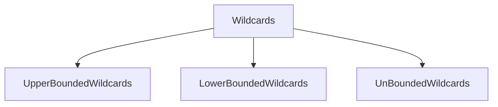

# JavaGeneric

This is all about Java Generics

<h3> Java includes support for writing generic classes and methods that can operate on variety of data types while often avoiding the need for explicit casts. The generics framework allow us to define a class in terms of a set of <em><i>formal type parameters</i></em>, which can then be used as the declared type for variables , parameters, and return values within the class definition. Those formal type parameters are later specified when using the generic class as a type elsewhere in a program. Generics are a feature of Java that allows us to create classes and methods that work with different types of data.Generics are a way to make our code more flexible and reusable.</h3>

<h3><ins> Diamond Operator</ins>: In Java Generics introduced " < > " <i>Diamond Operator</i> which is a Java 7 feature , to simplify the use of generics when creating an object. Along with it , introduced <i><ins>Type Erasure</ins></i> technique, as discussed below.</h3>


<ul>
<h3><a href= "https://github.com/AvinandanBose/JavaGeneric/blob/main/java_generics.java" >Eg:  Representation a generic pair using a classic style </a></h3>
</ul>


<h3> <i>Note: As language Java is based on OOP based , java.lang.Object is the root of the  class hierarchy, and we can create any object of Object class and every class we create or predefined gets instantiated under Object class , hence Object class is Super class of every class. </i> </h3>

<h3> <i> Similarly Byte(java.lang.Byte), String (java.lang.String), Integer(java.lang.Integer) , Float(java.lang.Float), Double(java.lang.Short) etc. are wrapper classes comes from  Java's Lang package as they not only wraps , put a cast over a value and change its type but also perform some specific functions - gives a pure OOP concept . </i> </h3>

<h3> <i>On the above example , String , Integer , Double are such wrapper classes that puts a narrow explicit cast : Object to String/Integer/Double . The above example is the Representation a generic pair using a classic style in which code become used to with such explicit casts . </i> </h3>

```Syntax

illegal; Compiler Error
-------------------------
String stock = p1.getFirst();
String stock2 = p2.getFirst();
Double price = p1.getSecond();
Integer price2 = p2.getSecond();

```


<h3>Hence using <ins>Java Generic Framework</ins> we can remove such explicit casts. In the framework we have to use a pair class using formal type of parameters to represent the two relevant types in our composition. An implementation using this framework is given in the Code below: </h3>

<ul>
<h3><a href= "https://github.com/AvinandanBose/JavaGeneric/blob/main/java_generics1.java" >Eg:  Representation of a generic pair using a Java Generic Framework </a></h3>
  
  ```Syntax

class Pair <A,B> {} : Here A and B are formal type parameters.
 Pair<Integer, String> p1 :  Here Integer , String are Actual Parameters.
 
  So, we can write :
  
  p1 = new Pair<Integer, String>(1, "apple");

```
<h3><a href= "https://github.com/AvinandanBose/JavaGeneric/blob/main/java_generics2.java" >Eg:  Representation of a generic pair using a Java Generic Framework - 2  </a></h3>

  ```Syntax

1.  Type 1 Representation of Java Generic Framework:
Pair<Integer, String> p1 ;
p1 = new Pair<Integer, String>(1, "apple"); //Generic Type Parameters are explicitly specified between Angle Bracket.

2. Also, We Can subsequestly instantiate the generic class using the following syntax:

Pair<Integer, String> p3 ;
p3 = new Pair<>(3, "orange"); //Rely on type interference.

3. Classic type of Instantiation of Object:

 Pair<Integer, String> p2 ;
  p2 = new Pair(2, "pear"); // Classic Type

```
<h2> <ins> 1. Type Inference </ins> </h2>

<h3>

```Syntax

p3 = new Pair<>(3, "orange");

```
</h3>

<h3> After the new operator , we provide the name of the generic class , then an empty set of angle brackets(known as "diamond") and finally the parameters to the constructor. An instance of the generic class is created , with the actual types for the formal type parameters determined based upon the original declaration of the variable to which it is assigned . This process is known as <i> <ins> Type Inference <ins> </i> and was introduced to the generics framework in JAVA SE 7 .</h3> 

<h2> <ins> 2. Generic Type Parameters Are Explicitly Specified Between Angle Brackets During Instantiation.  </ins> </h2>

<h3>

```Syntax

p3 = new Pair<Integer, String>(3, "orange");

```
</h3>

<h3> The above style existed prior to JAVA SE 7 , in which the generic type parameters are explicitly specified between angle brackets during instantiation. </h3>

<h2> <ins> 3. Classic Style.  </ins> </h2>

<h3>

```Syntax

p3 = new Pai(3, "orange");

```
</h3>

<h3> However , it is important that one of the above styles used . If angle brackets are entirely omitted as shown above, this reverts to the classic style , with Object automatically used for all generic type parameters and resulting in a compiler warning to a variable with more specific types.</h3>


</ul>

<h2> Automatic-Unboxing of Wrapper Type To Primitive Data Type </h2> 
<ul>

<h3><a href= "https://github.com/AvinandanBose/JavaGeneric/blob/main/java_generics3.java" >Eg: Automatic-Unboxing of Wrapper Type To Primitive Data Type  </a></h3>
  
  
```Syntax

 int price = p1.getFirst();
 double price2 = p2.getSecond();

```
 <h3> Here automatic unboxing occurs , where Integer and Double wrapper type , convert to their primitive value of int , double primitive data type. </h3>
 <h3><a href= "https://github.com/AvinandanBose/JavaGeneric/blob/main/java_generics4.java" >Eg: Automatic-Unboxing of Wrapper Type To Primitive Data Type(2) </a></h3>
</ul>
  
 <h2> Generics and Arrays </h2> 
 
 <ul>
 <h3>A. For Loop </h3>
 <ul>
 <h3><li><a href= "https://github.com/AvinandanBose/JavaGeneric/blob/main/java_generics5.java" >Generics and Arrays[Using For Loop]- Eg-1  </a></li></h3>
   
   <h3>
     
   ```Syntax
   java_generics5<Integer, String>[] holdings;
     
    :Array of Object:
     
    holdings = new java_generics5[2];
     
   Size of the Array of Object holdings → 2
   :-------------------------------------------:  
   holdings[0] = new java_generics5<>(1, "apple");
   Hence:
     
   holdings[0].getFirst() → Returns Integer (1) 
   holdings[0].getSecond() → Returns String ("apple")
   
   :-------------------------------------------:
   holdings[1] = new java_generics5<>(2, "pear");
    Hence:
     
   holdings[1].getFirst() → Returns Integer (2) 
   holdings[1].getSecond() → Returns String  ("pear")
     
    
   ```
   <h3> <i> <ins> Note:</ins> holdings = new java_generics5[2]→ Correct but Warning about Unchecked Cast.  </i> </h3>
   </h3>
     
  <h3><li><a href= "https://github.com/AvinandanBose/JavaGeneric/blob/main/java_generics6.java" >Generics and Arrays[Using For Loop]- Eg-2  </a></li></h3>
  
  <h3>
  
   ```Syntax
     
    :Array of Object:
     
    T[] data; → Also A Member Instance of Class
    
    :Creating Object of A Generic Class:
    
    java_generics6<Integer> p1;
    p1 = new java_generics6<Integer>()
    
    :It represents : 
    
    Integer[] data ; → The formal Argument replaced by actual i.e. Integer.
    And p1 is object of the Generic Class.
     
   :Allocation of Size of the Array of Object:
   
   p1.data = new Integer[2];
   
  :Elements Assigned:
  
   p1.data[0] = 1;
   p1.data[1] = 2;
     
  :Fetching Elements from Array:
  
  for (Integer i =0 ; i < p1.data.length; i++) {
            System.out.println(p1.data[i]);
        }
     
   ```
   </h3>
    
   <h3><li><a href= "https://github.com/AvinandanBose/JavaGeneric/blob/main/java_generics7.java" >Generics and Arrays[Using For Loop]- Eg-3  </a></li></h3>
   
   <h3>
  
   ```Syntax
     
    Here A,B i.e. Two formal arguments used .
     
   ```
   </h3>
   
   <h3><li><a href= "https://github.com/AvinandanBose/JavaGeneric/blob/main/java_generics8.java" >Generics and Arrays[Using For Loop]- Eg-4  </a></li></h3>
   
   <h3>
  
   ```Syntax
     
    java_generics8(int capacity) {
        data = (T[]) new Integer[capacity];
    }
    
    Here we are assigning size of the Array through the Constructor.
    (T[]) is casted before with Compiler warning. 
     
   ```
   </h3>
   
 </ul>
 <h3>B. For Each Loop </h3>
 <ul>
 <h3><li><a href= "https://github.com/AvinandanBose/JavaGeneric/blob/main/java_generics9.java" >Generics and Arrays[Using For Each Loop]- Eg-5  </a></li></h3>
  <h3><li><a href= "https://github.com/AvinandanBose/JavaGeneric/blob/main/java_generics10.java" >Generics and Arrays[Using For Each Loop]- Eg-6  </a></li></h3>
   <h3><li><a href= "https://github.com/AvinandanBose/JavaGeneric/blob/main/java_generics11.java" >Generics and Arrays[Using For Each Loop]- Eg-7  </a></li></h3>
   <h3><li><a href= "https://github.com/AvinandanBose/JavaGeneric/blob/main/java_generics12.java" >Generics and Arrays[Using For Each Loop]- Eg-8  </a></li></h3>
 </ul>
 <h3>C. Using Object as Generic Type </h3>
 <ul>
 <h3><li><a href= "https://github.com/AvinandanBose/JavaGeneric/blob/main/java_generics13.java" >Generics and Arrays[Using For Loop]- Eg-9  </a></li></h3>
  <h3><li><a href= "https://github.com/AvinandanBose/JavaGeneric/blob/main/java_generics14.java" >Generics and Arrays[Using For Each Loop]- Eg-10  </a></li></h3>
 </ul>
 
 </ul>
 <h2> Generic Methods</h2> 
 <ul>
 <h3><li><a href= "https://github.com/AvinandanBose/JavaGeneric/blob/main/java_generics15.java" >Generic Methods -Eg-11  </a></li></h3>
   
   ```Syntax

class A2<T>{
    T data;

    A2(T item){

        data = item;

    }

    int view(){

        return(Integer)data;

    }

    public static void main(String[] args) {
        A2<Integer> p1;
        p1 = new A2<>( 2);

        System.out.println(p1.view());

    }

}


```
   
  <h3><li><a href= "https://github.com/AvinandanBose/JavaGeneric/blob/main/java_generics16.java" >Generic Methods- Eg-12  </a></li></h3>
   
```Syntax

class A2<T>{
    T data;

    A2(T item){

        data = item;

    }

    T view(){

        return data;

    }

    public static void main(String[] args) {
        A2<Integer> p1;
        p1 = new A2<>( 2);

        System.out.println(p1.view());

    }

}


```
  
<h3><li><a href= "https://github.com/AvinandanBose/JavaGeneric/blob/main/java_generics17.java" >Generic Methods- Eg-13  </a></li></h3>
   
   
```Syntax

class A2<S,T>{
    T data1;
    S data2;

    A2(T item1, S item2){

        data1 = item1;
        data2 = item2;

    }

    T view1(){

        return data1;

    }

    S view2(){

        return data2;

    }

    public static void main(String[] args) {
        A2<Integer, Integer> p1;
        p1 = new A2<>(  10, 2);

        System.out.println(p1.view1());
        System.out.println(p1.view2());

    }

}


```
   
<h3><li><a href= "https://github.com/AvinandanBose/JavaGeneric/blob/main/java_generics18.java" >Generic Methods- Eg-14  </a></li></h3>
   
   
```Syntax

class A2<S,T>{
    T data1;
    S data2;

    A2(T item1, S item2){

        data1 = item1;
        data2 = item2;

    }

    T view1(){

        return data1;

    }

    S view2(){

        return data2;

    }

    public static void main(String[] args) {
       A2<Integer, String> p1;
        p1 = new A2<>(   "Hello",2);

        System.out.println(p1.view1());
        System.out.println(p1.view2());

    }

}


```
   
  <h3><li><a href= "https://github.com/AvinandanBose/JavaGeneric/blob/main/java_generics19.java" >Generic Methods- Eg-15  </a></li></h3>
   
```Syntax

class A2{


    public static <A> void view(A item) {
        System.out.println("The value is: " + item);

    }

    public static <B> String view2(B item) {
        return (String) item;

    }


    public static void main(String[] args) {


        view(2);
        System.out.println(view2("Hello"));

    }

}

```

   <h3> Another : </h3>
 
```Syntax

class A2<T>{

    <A> T view(T data, A item) {
         System.out.print(item);
        return data;

    }


    public static void main(String[] args) {

        A2<Integer> a2 = new A2<>();

        System.out.println(a2.view(12, "Hello"));

    }

}

```
 <h3> Note : </h3>
      
```Syntax

class A2<T>{

   <T> T view(T data, T item) {
         System.out.print(item);
        return data;

    }
}


Here T represents the Type T of Generic Method but not of Parameterized Class.
     
Hence:
     
class A2<T>{

    <T> T view(T data, T item) {
         System.out.print(item);
        return data;

    }


    public static void main(String[] args) {

        A2<Integer> a2 = new A2<>();

        System.out.println(a2.view("A", "Hello"));

    }

}
      
      
```      
  <h3> But if : </h3>

```Syntax
      
  class A2<T>{

  <A> T view(T data, A item) {

        return item;

  }
    
 :Will generate error as return type now needs generic class's T type as:
    
 :T view() i.e. return Generric class T type,: 
 :though Generic method have an extended type A which has scope to the Method only.:  
      
``` 
        
  <h3><li><a href= "https://github.com/AvinandanBose/JavaGeneric/blob/main/java_generics20.java" >Generic Methods- Eg-16  </a></li></h3>
  <h3><li><a href= "https://github.com/AvinandanBose/JavaGeneric/blob/main/java_generics21.java" >Generic Methods- Eg-17  </a></li></h3>
  <h3><li><a href= "https://github.com/AvinandanBose/JavaGeneric/blob/main/java_generics39.java" >Generic Methods- Eg-18  </a></li></h3>
 </ul>
  <h2> Generic Methods AND Generic Arrays</h2>
   <ul>
   <h3><li><a href= "https://github.com/AvinandanBose/JavaGeneric/blob/main/java_generics22.java" >Generic Methods AND Generic Arrays(Print Data Element) -Eg-18  </a></li></h3>
  <h3><li><a href= "https://github.com/AvinandanBose/JavaGeneric/blob/main/java_generics23.java" >Generic Methods AND Generic Arrays(Swapping)- Eg-19 </a></li></h3>
  <h3><li><a href= "https://github.com/AvinandanBose/JavaGeneric/blob/main/java_generics24.java" >Generic Methods AND Generic Arrays(Print Data Element 2)- Eg-20  </a></li></h3>
  <h3><li><a href= "https://github.com/AvinandanBose/JavaGeneric/blob/main/java_generics25.java" >Generic Methods AND Generic Arrays(Add Elements In An Array)- Eg-21  </a></li></h3>
  <h3><li><a href= "https://github.com/AvinandanBose/JavaGeneric/blob/main/java_generics26.java" >Generic Methods AND Generic Arrays(Reverse The Elements In An Array)- Eg-22  </a></li></h3>
  
  <h3><li><a href= "https://github.com/AvinandanBose/JavaGeneric/blob/main/java_generics27.java" >Generic Methods AND Generic Arrays- Eg-23  </a></li></h3>
 
   </ul>
   
   <h2>Generic Type Overloading (Static Polymorphism ) </h2>
   <ul>
   <h3> <li>1. Type 1 [Using Class Generics]</li></h3>
   <ul>
  <h3> <li>1.a. Difference in the number of parameters passed with methods having the same name .</li></h3>
  <ul>
 <h3><li><a href= "https://github.com/AvinandanBose/JavaGeneric/blob/main/java_generics30.java" >Eg-1  </a></li></h3>
  <h3><li><a href= "https://github.com/AvinandanBose/JavaGeneric/blob/main/java_generics31.java" >Eg-2  </a></li></h3>
  <h3><li><a href= "https://github.com/AvinandanBose/JavaGeneric/blob/main/java_generics32.java" >Eg-3  </a></li></h3>
  <h3><li><a href= "https://github.com/AvinandanBose/JavaGeneric/blob/main/java_generics33.java" >Eg-4  </a></li></h3>
  
 </ul>
     
  
  ```Syntax
     
   Note:
    
    : As the Class is Generic :
    :b ) Overloading by Difference in Sequence or Order of Parameter (Is Not Possible ):
    
    Eg: 
    class A<T,K>{
    
    void swap(T a, K b ){
    
    }
    
     void swap(K b, T b ){
    
    }
    //Is Not Possible
    
    :c ) Overloading by Difference in datatypes of parameters passed in methods (Is Not Possible ):
    
     Eg: 
    class A<T,K>{
    
    void swap(T a, T b ){
    
    }
    
     void swap(K a, K b ){
    
    }
    
    //Is Not Possible
    
  ```
 
  
 </ul>
  <h3> <li>2. Type 2 [Using static and nonstatic Generics Method]</li></h3>
  <ul>
  <h3><li><a href= "https://github.com/AvinandanBose/JavaGeneric/blob/main/java_generics34.java" >Eg-1  </a></li></h3>
  <h3><li><a href= "https://github.com/AvinandanBose/JavaGeneric/blob/main/java_generics35.java" >Eg-2  </a></li></h3>
  <h3><li><a href= "https://github.com/AvinandanBose/JavaGeneric/blob/main/java_generics36.java" >Eg-3  </a></li></h3>
  <h3><li><a href= "https://github.com/AvinandanBose/JavaGeneric/blob/main/java_generics37.java" >Eg-4  </a></li></h3>
  <h3><li><a href= "https://github.com/AvinandanBose/JavaGeneric/blob/main/java_generics38.java" >Eg-5  </a></li></h3>
  </ul>
  </ul>
  
<h1>Generic Class Hierarchies</h1>
<h3> Generics classes can be part of a class hierarchy in just the same way as a non-generic class. Thus a generic class can act as a super-class or be a subclass. The key difference between generic and non-generic is that in a generic hierarchy, any type arguments needed by a generic super-class must be passed up the hierarchy by all subclasses. This is similar to the way that constructor arguments must be passed up a hierarchy. </h3>
<ul>
<h2> 1. Using a Generic Superclass </h2> 
 <ul>
 <h3> <a href="https://github.com/AvinandanBose/JavaGeneric/blob/main/GenHierarchy1.java"> Generic Hierarchy→ Eg- 1 </a></h3>
 
 <h3 align="Left">
 
 ```Syntax
 
 class Gen<T> {
    T obj;

    Gen(T o) {
        obj = o;
    }

    T getObj() {
        return obj;
    }

}

public class GenHierarchy1 <T> extends Gen<T> {
    GenHierarchy1(T o) {
        super(o);
    }

    public static void main(String args[]) {
        GenHierarchy1<String> x = new GenHierarchy1<String>("Generics Test");
        System.out.println(x.getObj());
    }
 
 
 ```
 
 </h3>
 
 <h3 align="Left">

```Synatx

class GenHierarchy1 <T> extends Gen<T>


```

</h3>


<h3> <i> Here type 'T' is specified by Gen2 and is also passed to Gen in the extends clause.</i></h3>
<h3> <i> This means that whatever type is passed to Gen2 will also be passed to Gen.</i></h3>

<h3 align="Left">

```Synatx


 GenHierarchy1<String> x = new GenHierarchy1<String>("Generics Test");

```

</h3>

<h3> <i>It passes String as type parameter to <i>Gen</i>. Thus the obj inside the Gen portion of Gen2 will be of type Integer.</i></h3> 

 <h3> <a href="https://github.com/AvinandanBose/JavaGeneric/blob/main/GenHierarchy2.java"> Generic Hierarchy→ Eg- 2 </a></h3>
 
 <h3 align="Left">

```Synatx

class Gen<T> {
    T obj;

    Gen(T o) {
        obj = o;
    }

    T getObj() {
        return obj;
    }

}

public class GenHierarchy2 extends Gen<String> {
    <T> GenHierarchy2(T o) {
        super((String)o);
    }

    public static void main(String args[]) {
        GenHierarchy2 x = new GenHierarchy2("Generics Test");
        System.out.println(x.getObj());
    }
    
}


```

</h3>

<h3><i>Notice also that GenHierarchy2 does not use the type parameter T except to support
the Gen superclass. Thus, even if a subclass of a generic superclass would
otherwise not need to be generic, it still must specify the type parameter(s)
required by its generic superclass. If type "T" is not specified then we have to specify the type of class Gen whether <i>Integer</i>, <i>String</i> etc. during Inheritance and then compiler will ask to have a  constructor of Sub Class as super Generic class have a constructor and the SubClass's constructor will have a cast of Type "< T >" as shown above.</i></h3>

<h3><i> A subclass is free to add its own type parameters, if needed.</i></h3>

 <h3> <a href="https://github.com/AvinandanBose/JavaGeneric/blob/main/GenHierarchy3.java"> Generic Hierarchy→ Eg- 3 </a></h3>

<h3 align="Left">

```Synatx

class Gen<T> {
    T obj;

    Gen(T o) {
        obj = o;
    }

    T getObj() {
        return obj;
    }

}

public class GenHierarchy3<V> extends Gen<V> {

    GenHierarchy3(V o) {
        super(o);
        
    }

    public static void main(String args[]) {
        GenHierarchy3<String> x = new GenHierarchy3<String>("Generics Test");
        System.out.println(x.getObj());
    }
    
}


```
</h3>

<h3> Here if Sub Class have single Type parameter and if it changes , then the same type must be put to the "Type" to the Parent class.  </h3>

<h3> <a href="https://github.com/AvinandanBose/JavaGeneric/blob/main/GenHierarchy4.java"> Generic Hierarchy→ Eg- 4 </a></h3>

<h3 align="Left">

```Synatx

class Gen<T> {
    T obj;

    Gen(T o) {
        obj = o;
    }

    T getObj() {
        return obj;
    }

}

 public class GenHierarchy4<V,T> extends Gen<T> {
    V ob2;

    GenHierarchy4(T o, V o2) {
        super(o);
        ob2 = o2;
        
    }

    V getOb2() {
        return ob2;
    }

    public static void main(String args[]) {
        GenHierarchy4<Integer, String> x = 
		new GenHierarchy4<>("Generics Test", 88);
        System.out.println(x.getObj());
        System.out.println(x.getOb2());
    }
    
}


```
</h3>

<h3>Here, T is the type passed to Gen, and V is the type that is specific to GenHierarchy4. V
is used to declare an object called ob2, and as a return type for the method
getob2( ). In main( ), a Gen2 object is created in which type parameter T is
String, and type parameter V is Integer.</h3>
 
 </ul>
 
 <h2> 2. A Generic Subclass </h2> 
 
 <h3> <a href="https://github.com/AvinandanBose/JavaGeneric/blob/main/GenHierarchy5.java"> Generic Hierarchy→ Eg- 5 </a></h3>
 
 <ul>
 
 <h3 align="Left">
 
 ```Synatx
 
 class NonGen {... }
 
 class Gen<T> extends NonGen { ... }
 
 class HierDemo {
 
  public static void main(String args[]) {
     
     Gen<String> x = new Gen<String>();
	
}
 
 
 ```
 
 </h3>
 
 <h3> In the program, notice how Gen inherits NonGen in the following
declaration: </h3>

<h3 align="Left">
 
 ```Synatx
 
class Gen<T> extends NonGen {...}
 
 ```
 
 </h3>
 
  <h3> Because NonGen is not generic, no type argument is specified. Thus, even
though Gen declares the type parameter T, it is not needed by (nor can it be
used by) NonGen. Thus, NonGen is inherited by Gen in the normal way. No
special conditions apply. </h3>
 
 
 </ul>
 
 <h2> 3. Run-Time Comparisons within a Generic Hierarchy </h2> 
 
 <ul>
  <h3> <a href="https://github.com/AvinandanBose/JavaGeneric/blob/main/GenHierarchy6.java"> Generic Hierarchy→ Eg- 6 </a></h3>
	 
<h3 align="Left">
 
 ```Synatx
 
class Gen3<T>{ ... }
	
class Gen4<T> extends Gen3<T>{ ... }
	
class HierDemo{ 

	Gen3<Integer> iOb = new Gen3<Integer>();
        Gen4<Integer> iOb2 = new Gen4<Integer>();
        Gen4<String> strOb2 = new Gen4<String>();
	
	if(iOb2 instanceof Gen4<Integer>){...}

        if (iOb2 instanceof Gen3<Integer>) {...}

        if(strOb2 instanceof Gen4<String>){...}
 
        if (strOb2 instanceof Gen3<String>) {...}

        if (iOb instanceof Gen3<Integer>) {...}

        if (iOb instanceof Gen4<Integer>) {...}
           
	
	}
 
 ```
 
 </h3>
	 
<h3> Explanation: The program performs these instanceof tests on the type of Objects through <i> instanceof </i> which shows RunTime Comparisons between Objects with a specified type. </h3>
 
 </ul>

 <h2> 4. Casting </h2> 
 
 <ul>
 <h3>We can cast one instance of a generic class into another only if the two are
otherwise compatible and their type arguments are the same. For example,
assuming the foregoing program, this cast is legal: </h3>

 <h3> <a href="https://github.com/AvinandanBose/JavaGeneric/blob/main/GenHierarchy7.java"> Generic Hierarchy→ Eg- 7 </a></h3>

<h3 align="Left">

```Syntax

((Gen<Integer>) iOb2 ).obj = 100; //Legal
((Gen<String>) strOb2).obj = "Generics Test 2";// Legal
((Gen<Integer>) iOb).obj = 1000;// Legal

```
</h3>

<h3> iOb2 includes an instance of Gen < Integer > , strOb2 includes an instance of Gen < String > and iOb is an instance of Gen < Integer > . But, this cast: </h3>

<h3 align="Left">

```Syntax

((Gen<Long>) iOb2).obj = 101; Illegal

```
</h3>

<h3> is not legal because iOb2 is not an instance of Gen < Long >. </h3>
 
 </ul>
 
 
<h2> 5. Overriding Methods in a Generic Class </h2> 

<ul>
<h3> <a href="https://github.com/AvinandanBose/JavaGeneric/blob/main/GenHierarchy8.java"> Overriding Methods in a Generic Class - Eg</a></h3>

<h3 align="Left">

```Syntax

class Gen9<T> {
    T ob;

    Gen9(T o) {
        ob = o;
    }

    T getob() {
        System.out.print("Gen9's getob(): ");
        return ob;
    }
}

class Gen10<T> extends Gen9<T> {
    Gen10(T o) {
        super(o);
    }

    // Override getob()
    T getob() {
        System.out.print("Gen10's getob(): ");
        return ob;
    }
}

class OverrideDemo {
    public static void main(String args[]) {
        Gen9<Integer> iOb = new Gen9<Integer>(88);
        Gen10<Integer> iOb2 = new Gen10<Integer>(99);
        Gen10<String> strOb2 = new Gen10<String>("Generics Test");

        System.out.println(iOb.getob());
        System.out.println(iOb2.getob());
        System.out.println(strOb2.getob());
    }
}

Output
-----------

Gen9's getob(): 88
Gen10's getob(): 99
Gen10's getob(): Generics Test

```

<h3>As the output confirms, the overridden version of getob( ) is called for objects
of type Gen10, but the superclass version is called for objects of type Gen9.</h3>

</ul>


<h2> 6. Type Inference with Generics </h2>

<ul>

<h3> Here <i> Inference :</i> means Compiler decision making ability to decide where to put the Context  based on its Type. Hence its known as <i> Type Inference </i> . That is : </h3>

<h3 align= "Left">

```Syntax

class MyClass<T, V> {
    T ob1;
    V ob2;

    MyClass(T o1, V o2) {
        ob1 = o1;
        ob2 = o2;
    }
    
    public static void main(String[] args) { 
    
    MyClass<Integer, String> a = new MyClass<Integer, String>(100, "Generics");
    
    }
    
 }
 
 

```

<h3>

<h3 > Here <i> MyClass < Integer , String > a = new MyClass < Integer , String > (  100 , " Generics " ) ; </i> here ,Compiler decides that 100 is for Integer and " Generics " for String . As we know " < > " is known as <i><ins>Diamond Operator</ins></i>  and Syntax it goes like:</h3>

<h3 align= "Left">

```Syntax

class-name<type-arg-list> var-name = 
	new class-name<>(cons-arg-list);
	
Where,

cons→Constructor.
arg→Argument.
 

```

</h3>

<h3><i><ins>Consider the example:</ins></i></h3>
<h3> <a href="https://github.com/AvinandanBose/JavaGeneric/blob/main/GenHierarchy9.java"> Type Inference in Java - Eg</a></h3>

<h3 align= "Left">

```Syntax

boolean isEqual(MyClass<T, V> o) {
        if (ob1 == o.ob1 && ob2 == o.ob2) {
            return true;
        } else {
            return false;
        }

       

    }
    
    MyClass<Integer, String> a = new MyClass<Integer, String>(100, "Generics");

        if (a.isEqual(new MyClass<Integer, String>(100, "Generics"))) {
            System.out.println("Equal");
        } else {
            System.out.println("Not Equal");
        }
 

```

</h3>

<h3> In this case , the type arguments for the arguments passed to <i> isSame() </i> can be Inferred from the parameter's type </h3>

<h3> <i> Note: Some part of Type Inference is discussed above. </i></h3>

</ul>

</ul>

<h1> Bounded Generic Types</h1>
<ul>
<h3><li>1. There are times when we want to restrict the kind of types that are allowed to be passed to a type parameter.</li></h3>
<h3><li>2. To declare a bounded type parameter, list the parameter's name , followed by the extends keyword.</li></h3>
<h3><li>3. Parameter followed by extends called as upper bound.</li></h3>

<h2>1. Upper Bound Generic Types</h2>
<ul>
<h3><li><a href= "https://github.com/AvinandanBose/JavaGeneric/blob/main/javaGenUBEg2.java" > Upper Bound Eg-1  </a></li></h3>
<h3><li><a href= "https://github.com/AvinandanBose/JavaGeneric/blob/main/javaGenUBEg3.java" >Upper Bound Eg-2  </a></li></h3>

<h3> <i> <ins>Note:</ins> The abstract class Number is the superclass of platform classes representing numeric values that are convertible to the primitive types byte, double, float, int, long, and short.</i></h3>

<h3><li><a href= "https://github.com/AvinandanBose/JavaGeneric/blob/main/javaGenUBEg11.java" >Upper Bound Eg-3[String]  </a></li></h3>
<h3><li><a href= "https://github.com/AvinandanBose/JavaGeneric/blob/main/javaGenUBEg12.java" >Upper Bound Eg-4[Byte]  </a></li></h3>
<h3><li><a href= "https://github.com/AvinandanBose/JavaGeneric/blob/main/javaGenUBEg14.java" >Upper Bound Eg-5[StringBuffer]  </a></li></h3>
<h3><li><a href= "https://github.com/AvinandanBose/JavaGeneric/blob/main/javaGenUBEg15.java" >Upper Bound Eg-6[StringBuilder]  </a></li></h3>
<h3><li><a href= "https://github.com/AvinandanBose/JavaGeneric/blob/main/javaGenUBEg16.java" >Upper Bound Eg-7[Integer]  </a></li></h3>
<h3><li><a href= "https://github.com/AvinandanBose/JavaGeneric/blob/main/javaGenUBEg17.java" >Upper Bound Eg-8[Float]  </a></li></h3>
<h3><li><a href= "https://github.com/AvinandanBose/JavaGeneric/blob/main/javaGenUBEg18.java" >Upper Bound Eg-9[Character]  </a></li></h3>
<h3><li><a href= "https://github.com/AvinandanBose/JavaGeneric/blob/main/javaGenUBEg19.java" >Upper Bound Eg-10[Short]  </a></li></h3>
<h3><li><a href= "https://github.com/AvinandanBose/JavaGeneric/blob/main/javaGenUBEg20.java" >Upper Bound Eg-11[Long]  </a></li></h3>
<h3> <i> <ins>Note:</ins> The type T here shouldnot be bounded by final type of String,Byte, StringBuffer, StringBuilder,Integer,Float,Character,Short and Long. Its noted that all belongs to package: java.lang .And all of these are wrapper classes(except StringBuilder and StringBuffer as they are companion classes of String and they are mutable classes unlike String) declared as "Final" . And the rule is we cannot inherit them as they are final classes . Here T extends String,Byte,... etc. represents the type T is String,Byte,... etc. Final types cannot be further extended. Hence generates a warning and equally Legal representation.Hence types are fixed here i.e. if T extends String , Then during object creation the type must be String not Integer, Float and other types and it is same for others as given in above examples.</i></h3>
<h3><li><a href= "https://github.com/AvinandanBose/JavaGeneric/blob/main/javaGenUBEg4.java" >Upper Bound Eg-12[Comparable]  </a></li></h3>
<h3><li><a href= "https://github.com/AvinandanBose/JavaGeneric/blob/main/javaGenUBEg6.java" >Upper Bound Eg-13[Serializable]  </a></li></h3>
<h3><li><a href= "https://github.com/AvinandanBose/JavaGeneric/blob/main/javaGenUBEg7.java" >Upper Bound Eg-14[Runnable]  </a></li></h3>
<h3><li><a href= "https://github.com/AvinandanBose/JavaGeneric/blob/main/javaGenUBEg8.java" >Upper Bound Eg-15[Thread]  </a></li></h3>
<h3><li><a href= "https://github.com/AvinandanBose/JavaGeneric/blob/main/javaGenUBEg9.java" >Upper Bound Eg-16[List]  </a></li></h3>
<h3><li><a href= "https://github.com/AvinandanBose/JavaGeneric/blob/main/javaGenUBEg10.java" >Upper Bound Eg-17[Map]  </a></li></h3>
<h3><li><a href= "https://github.com/AvinandanBose/JavaGeneric/blob/main/javaGenUBEg13.java" >Upper Bound Eg-18[CharSequence]  </a></li></h3>
<h3><li><a href= "https://github.com/AvinandanBose/JavaGeneric/blob/main/javaGenUBEg21.java" >Upper Bound Eg-19[Object]  </a></li></h3>
<h3><li><a href= "https://github.com/AvinandanBose/JavaGeneric/blob/main/javaGenUBEg26.java" >Upper Bound Eg-20[Set]  </a></li></h3>
<h2> Custom Creation of UpperBound [user defined]</h2>
<ul>
<h3><li><a href= "https://github.com/AvinandanBose/JavaGeneric/blob/main/javaGenUBEg22.java" >Upper Bound Eg-21[Class[User Defined]]  </a></li></h3>
<h3><li><a href= "https://github.com/AvinandanBose/JavaGeneric/blob/main/javaGenUBEg23.java" >Upper Bound Eg-22[Interface[User Defined-1]]  </a></li></h3>
<h3><li><a href= "https://github.com/AvinandanBose/JavaGeneric/blob/main/javaGenUBEg24.java" >Upper Bound Eg-23[Interface[User Defined-2]]  </a></li></h3>
<h3><li><a href= "https://github.com/AvinandanBose/JavaGeneric/blob/main/javaGenUBEg25.java" >Upper Bound Eg-24[Abstract[User Defined]]  </a></li></h3>
</ul>
<h3> <i> <ins>Note:</ins> Likewise we can create upper bound by following above examples.</i></h3>
</ul>
<h2></h2>
<h2>1.A. Multiple Upper Bound Generic Types</h2>
<ul>
<h3> <i><ins>Rules for Multiple Upper Bound Generic Types:</ins></i></h3>
<ul>
<li><h3>1. As per Upper Bound , only extends is allowed for Type , to extend Class and Interfaces.</h3></li>
<h3><li>2. T is a type class can extends a Class and an Interface joined through '&' AND.  </li></h3>
<h3><li>3. Note the class being extended by type T must implement the Interface .  </li></h3>
<h3><li>4. No 'implement' Keyword is allowed it will generate error. </li></h3>
 
```Syntax
  
  interface A{
  }
  class B imlpements A{
  }
  class Ex<T extends B & A>{
  Ex<B> ex = new Ex<>();
  }
  
  :Here B is Class:
  :Here A is Interface:
  :And Class B implements Interface A:
  :And Type for Generic Class Ex is the Class which implements the Interface:
  :i.e. Ex<B> ex = new Ex<>():
```


 <ul>
   <h3><li><a href="https://github.com/AvinandanBose/JavaGeneric/blob/main/JavaGenMUB1.java">Example for Multiple Upper Bound Generic Types-1 </a></li></h3>
  </ul>
 <h3><li>3. Next it can extend two interfaces instead of a class and interface. </li></h3>
 <h3><li>4. And in that case the Type 'T'of Generic Class will represent the class implementing the two interfaces. </li></h3>
  
  ```Syntax
  
  interface A {}
  interface B {}
  Class C implements A , B{}
  class Ex<T extends A & B>{
  Ex<C> ex = new Ex<>();
  }
  
  :Here B is Interface:
  :Here A is Interface:
  :And Class C implements Interface A and Interface B:
  :And Type for Generic Class Ex is the Class which implements the Interface:
  :i.e. Ex<C> ex = new Ex<>():
  
```
 <ul>
   <h3><li><a href="https://github.com/AvinandanBose/JavaGeneric/blob/main/JavaGenMUB2.java">Example for Multiple Upper Bound Generic Types-2 </a></li></h3>
  </ul>
 <h3><li>5. Note Now , we have the overview of Multiple Upper Bound i.e. Generic Class 's Type say 'T' extends the Class that implements Interfaces and then all the Interfaces Or Only the Interfaces joined by '&' . The type 'T' of Generic class is the class that implements the interfaces . </li></h3>
  <ul>
   <h3><li><a href="https://github.com/AvinandanBose/JavaGeneric/blob/main/JavaGenMUB3.java">Example for Multiple Upper Bound Generic Types-3 </a></li></h3>
   <h3><li><a href="https://github.com/AvinandanBose/JavaGeneric/blob/main/JavaGenMUB4.java">Example for Multiple Upper Bound Generic Types-4 </a></li></h3>
  </ul>
  <ul>
  
</ul>
<h3> <i><ins>Rules:What if for Abstract Methods? </ins></i></h3>
  <ul> 
  <h3><li>Now for Abstract Methods the Class which extends Abstract Class and implement Interface becomes type T of Generic Class.But there is a difference that is we cannot use Generic type to extends the Class which extends Abstract Class if Abstract Class is extended by Generic Type 'T'. That we can only have one class and 'n' number of interfaces.</li></h3>
   
```Syntax
 
 interface A{}
 interface B{}
 abstract class C{}
 class D extends extends C implements A,B{}
 class Ex<T extends C &  A & B>{
  Ex<D>ex = new Ex<>();
 }

:OR:

 interface A{}
 interface B{}
 abstract class C{}
 class D extends extends C implements A,B{}
 class Ex<T extends D &  A & B>{
  Ex<D>ex = new Ex<>();
 }

:i.e. T either extends D or abstract Class C:
```
<ul>

<h3><li><a href="https://github.com/AvinandanBose/JavaGeneric/blob/main/JavaGenMUB5.java">Example for Multiple Upper Bound Generic Types-5 </a></li></h3>
<h3><li><a href="https://github.com/AvinandanBose/JavaGeneric/blob/main/JavaGenMUB6.java">Example for Multiple Upper Bound Generic Types-6 </a></li></h3>

</ul>
<h3> <i><ins>Implementation of Multiple Upper Bound based on Rules for predefined classes and interfaces of Java </ins></i></h3>
<ul>
<h3><li><a href="https://github.com/AvinandanBose/JavaGeneric/blob/main/JavaGenMUB7.java">T extends Number & Comparable<T> </a></li></h3>

```Syntax

java.lang.Number → Number is abstract class of java.lang package.
java.lang.Comparable<T> → Comparable<T> is interface of java.lang package.

```

<h3><li><a href="https://github.com/AvinandanBose/JavaGeneric/blob/main/JavaGenMUB8.java">T extends Number & Serializable</a></li></h3>

```Syntax

java.lang.Number → Number is abstract class of java.lang package.
java.io.Serializable → Serializable is interface of java.io package.

```

<h3><li><a href="https://github.com/AvinandanBose/JavaGeneric/blob/main/JavaGenMUB9.java">T extends Thread & Runnable</a></li></h3>

```Syntax

java.lang.Thread → Thread is a class of java.lang package ,
which implements interface Runnabe.

java.lang.Runnable → Runnable is an interface of java.lang package ,
implemented by Thread class.

```

<h3><li><a href="https://github.com/AvinandanBose/JavaGeneric/blob/main/JavaGenMUB10.java">T extends HashMap<K,V>& Map<K,V></a></li></h3>

```Syntax

java.util.HashMap → HashMap is a Class which is in java.util package.
Hash Map implements Map interface.

java.util.Map → Map is an interface of java.util package ,
implemented by HashMap class.

```


<h3><li><a href="https://github.com/AvinandanBose/JavaGeneric/blob/main/JavaGenMUB11.java">T extends ArrayList<V> & List<V></a></li></h3>

```Syntax

java.util.ArrayList → ArrayList is a Class which is in java.util package.
ArrayList implements List interface.

java.util.List → List is an interface of java.util package ,
implemented by ArrayList class.

```

<h3><li><a href="https://github.com/AvinandanBose/JavaGeneric/blob/main/JavaGenMUB12.java">T extends HashSet<V> & Set<V></a></li></h3>

```Syntax

java.util.HashSet → HashSet is a Class which is in java.util package.
HashSet implements Set interface.

java.util.Set → Set is an interface of java.util package ,
implemented by HashSet class.

```

<h3><li><a href="https://github.com/AvinandanBose/JavaGeneric/blob/main/JavaGenMUB13.java">T extends CharSequence & Comparable<T></a></li></h3>

```Syntax

java.lang.CharSequence → CharSequence is an interface in java.lang package.

java.lang.Comparable<T> → Comparable is an interface in java.lang package.

```

<h3><li><a href="https://github.com/AvinandanBose/JavaGeneric/blob/main/JavaGenMUB14.java">T extends Object & Comparable<T></a></li></h3>

```Syntax

java.lang.Object → Object is an interface in java.lang package.
Class Object is the root of the class hierarchy. 
Every class has Object as a superclass. 

java.lang.Comparable<T> → Comparable is an interface in java.lang package.

```

<h3><i>Similarly, </i></h3>

<h3><li><a href="https://github.com/AvinandanBose/JavaGeneric/blob/main/JavaGenMUB15.java">T extends AbstractList < Number > & List < Number ></a></li></h3>
<h3><li><a href="https://github.com/AvinandanBose/JavaGeneric/blob/main/JavaGenMUB16.java">T extends AbstractSet < Number > & Set < Number ></a></li></h3>
<h3><li><a href="https://github.com/AvinandanBose/JavaGeneric/blob/main/JavaGenMUB17.java">T extends Set < Number > & NavigableSet < Number ></a></li></h3>
<h3><li><a href="https://github.com/AvinandanBose/JavaGeneric/blob/main/JavaGenMUB18.java">T extends AbstractMap < String ,Number > & Map < String ,Number ></a></li></h3>
<h3><li><a href="https://github.com/AvinandanBose/JavaGeneric/blob/main/JavaGenMUB19.java">T extends HashMap < String, Number > & Map < String, Number ></a></li></h3>
<h3><li><a href="https://github.com/AvinandanBose/JavaGeneric/blob/main/JavaGenMUB20.java">T extends NavigableMap < String, Number > & Map < String, Number ></a></li></h3>
</ul>
</ul>
 
</ul>
<h2></h2>
 <h2>1.B.  Upper Bound Generic Type Methods</h2>
 <ul>
 <h3><ins><i>Note: The rules followed here are the same just like above.</i><ins></h3>
   <ul>
   <h3><li><a href= "https://github.com/AvinandanBose/JavaGeneric/blob/main/javaUBM1.java" >Upper Bound Generic Type Methods →Eg-1 (public static)[ T extends Number]  </a></li></h3>
     
```Syntax

Syntax:
     
public static <Type extends Class/Interface> returnType funcName(parameter){
    //code
}

```
   <h3><li><a href= "https://github.com/AvinandanBose/JavaGeneric/blob/main/javaUBM2.java" >Upper Bound Generic Type Methods →Eg-2 (public static)[T extends Comparable<T>]</a></li></h3>
   <h3><li><a href= "https://github.com/AvinandanBose/JavaGeneric/blob/main/javaUBM3.java" >Upper Bound Generic Type Methods →Eg-3 (creation of object)[ T extends Number]  </a></li></h3>
     
```Syntax

Syntax:
     
 <Type extends Class/Interface> returnType funcName(parameter){
    //code
}
public static void main(String[] args)
{
class_name<Type> var/obj_name = class_name<>();
:Or if not generic class:  
class_name var/obj_name = class_name();
}

```
   <h3><li><a href= "https://github.com/AvinandanBose/JavaGeneric/blob/main/javaUBM4.java" >Upper Bound Generic Type Methods →Eg-4 (creation of object)[T extends Comparable<T>] </a></li></h3>
     <h3><ins><i>Note: Its better to continue with static method rather than of creation of object.</i><ins>
    </ul>
    <h3><ins><i>Other Examples- Static Upper Bound Generic Methods </i><ins></h3>
    <ul>
<h3><li><a href= "https://github.com/AvinandanBose/JavaGeneric/blob/main/javaUBM5.java" >Upper Bound Generic Type Methods →Eg-5 [T extends Serializable] </a></li></h3>
 <h3><li><a href= "https://github.com/AvinandanBose/JavaGeneric/blob/main/javaUBM6.java" >Upper Bound Generic Type Methods →Eg-6 [T extends Runnable] </a></li></h3>
  <h3><li><a href= "https://github.com/AvinandanBose/JavaGeneric/blob/main/javaUBM7.java" >Upper Bound Generic Type Methods →Eg-7 [T extends Thread] </a></li></h3>
  <h3><li><a href= "https://github.com/AvinandanBose/JavaGeneric/blob/main/javaUBM8.java" >Upper Bound Generic Type Methods →Eg-8 [T extends List] </a></li></h3>
  <h3><li><a href= "https://github.com/AvinandanBose/JavaGeneric/blob/main/javaUBM9.java" >Upper Bound Generic Type Methods →Eg-9 [T extends Map] </a></li></h3>
  <h3><li><a href= "https://github.com/AvinandanBose/JavaGeneric/blob/main/javaUBM10.java" >Upper Bound Generic Type Methods →Eg-10 [T extends CharSequence] </a></li></h3>
   <h3><li><a href= "https://github.com/AvinandanBose/JavaGeneric/blob/main/javaUBM11.java" >Upper Bound Generic Type Methods →Eg-11 [T extends Object] </a></li></h3>
   <h3><li><a href= "https://github.com/AvinandanBose/JavaGeneric/blob/main/javaUBM12.java" >Upper Bound Generic Type Methods →Eg-12 [T extends Set] </a></li></h3>
    </ul>
    <h3><ins><i>Other Examples- With Creation of Object ,Upper Bound Generic Methods And Generic Classes </i><ins></h3>
 <ul>
 <h3><li><a href= "https://github.com/AvinandanBose/JavaGeneric/blob/main/javaUBM13.java" >Upper Bound Generic Type Methods →Eg-13 [T extends Serializable] </a></li></h3>
 <h3><li><a href= "https://github.com/AvinandanBose/JavaGeneric/blob/main/javaUBM14.java" >Upper Bound Generic Type Methods →Eg-14 [T extends Runnable] </a></li></h3>
  <h3><li><a href= "https://github.com/AvinandanBose/JavaGeneric/blob/main/javaUBM15.java" >Upper Bound Generic Type Methods →Eg-15 [T extends Thread] </a></li></h3>
  <h3><li><a href= "https://github.com/AvinandanBose/JavaGeneric/blob/main/javaUBM16.java" >Upper Bound Generic Type Methods →Eg-16 [T extends List] </a></li></h3>
  <h3><li><a href= "https://github.com/AvinandanBose/JavaGeneric/blob/main/javaUBM17.java" >Upper Bound Generic Type Methods →Eg-17 [T extends Map] </a></li></h3>
  <h3><li><a href= "https://github.com/AvinandanBose/JavaGeneric/blob/main/javaUBM18.java" >Upper Bound Generic Type Methods →Eg-18 [T extends CharSequence] </a></li></h3>
   <h3><li><a href= "https://github.com/AvinandanBose/JavaGeneric/blob/main/javaUBM19.java" >Upper Bound Generic Type Methods →Eg-19 [T extends Object] </a></li></h3>
   <h3><li><a href= "https://github.com/AvinandanBose/JavaGeneric/blob/main/javaUBM20.java" >Upper Bound Generic Type Methods →Eg-20 [T extends Set] </a></li></h3>   
    
  </ul>
 </ul>
 <h2></h2>
 <h2>1.C.  Multiple Upper Bound Generic Type Methods</h2>
 <ul>
 <h3><ins><i>Note: The rules followed here are the same just like above.</i><ins></h3>
 <h3><ins><i>1.  Examples- Static Upper Bound Generic Methods </i><ins></h3>
 <ul>
 <h3><li><a href= "https://github.com/AvinandanBose/JavaGeneric/blob/main/javaMBM1.java" >Multiple Upper Bound Generic Type Methods →Eg-1 [T extends Number & Comparable<T>] </a></li></h3>
 
 <h3><li><a href= "https://github.com/AvinandanBose/JavaGeneric/blob/main/javaMBM2.java" >Multiple Upper Bound Generic Type Methods →Eg-2 [T extends Number & Serializable] </a></li></h3>
 
  <h3><li><a href= "https://github.com/AvinandanBose/JavaGeneric/blob/main/javaMBM3.java" >Multiple Upper Bound Generic Type Methods →Eg-3 [T extends Thread & Runnable] </a></li></h3>
  
  <h3><li><a href= "https://github.com/AvinandanBose/JavaGeneric/blob/main/javaMBM4.java" >Multiple Upper Bound Generic Type Methods →Eg-4 [T extends HashMap<String, String> & Map<String, String>] </a></li></h3>
  
  <h3><li><a href= "https://github.com/AvinandanBose/JavaGeneric/blob/main/javaMBM5.java" >Multiple Upper Bound Generic Type Methods →Eg-5 [T extends ArrayList<String> & List<String>] </a></li></h3>
  
  <h3><li><a href= "https://github.com/AvinandanBose/JavaGeneric/blob/main/javaMBM6.java" >Multiple Upper Bound Generic Type Methods →Eg-6 [T extends HashSet<String> & Set<String>] </a></li></h3>
    
 <h3><li><a href= "https://github.com/AvinandanBose/JavaGeneric/blob/main/javaMBM7.java" >Multiple Upper Bound Generic Type Methods →Eg-7[T extends CharSequence & Comparable<T>] </a></li></h3>
 
  <h3><li><a href= "https://github.com/AvinandanBose/JavaGeneric/blob/main/javaMBM8java" >Multiple Upper Bound Generic Type Methods →Eg-8[T extends Object & Comparable<T>] </a></li></h3>
 
 
 </ul>
 <h3><ins><i>2.  Examples- With Creation of Object ,Upper Bound Generic Methods And Generic Classes</i><ins></h3>
 
  <ul>
 <h3><li><a href= "https://github.com/AvinandanBose/JavaGeneric/blob/main/javaMBM9.java" >Multiple Upper Bound Generic Type Methods →Eg-9 [T extends Number & Comparable<T>] </a></li></h3>
 
 <h3><li><a href= "https://github.com/AvinandanBose/JavaGeneric/blob/main/javaMBM10.java" >Multiple Upper Bound Generic Type Methods →Eg-10 [T extends Number & Serializable] </a></li></h3>
 
  <h3><li><a href= "https://github.com/AvinandanBose/JavaGeneric/blob/main/javaMBM11.java" >Multiple Upper Bound Generic Type Methods →Eg-11 [T extends Thread & Runnable] </a></li></h3>
  
  <h3><li><a href= "https://github.com/AvinandanBose/JavaGeneric/blob/main/javaMBM12.java" >Multiple Upper Bound Generic Type Methods →Eg-12 [T extends HashMap<String, String> & Map<String, String>] </a></li></h3>
  
  <h3><li><a href= "https://github.com/AvinandanBose/JavaGeneric/blob/main/javaMBM13.java" >Multiple Upper Bound Generic Type Methods →Eg-13 [T extends ArrayList<String> & List<String>] </a></li></h3>
  
  <h3><li><a href= "https://github.com/AvinandanBose/JavaGeneric/blob/main/javaMBM14.java" >Multiple Upper Bound Generic Type Methods →Eg-14 [T extends HashSet<String> & Set<String>] </a></li></h3>
    
 <h3><li><a href= "https://github.com/AvinandanBose/JavaGeneric/blob/main/javaMBM15.java" >Multiple Upper Bound Generic Type Methods →Eg-15[T extends CharSequence & Comparable<T>] </a></li></h3>
 
  <h3><li><a href= "https://github.com/AvinandanBose/JavaGeneric/blob/main/javaMBM16java" >Multiple Upper Bound Generic Type Methods →Eg-16[T extends Object & Comparable<T>] </a></li></h3>
 
 
 </ul>
 
 </ul>
</ul>
<h1></h1>
<h1> WildCards</h1>
<ul>
<h3><li>1. In generic code, the question mark (?), called the wildcard, represents an unknown type.</li></h3>

<h3><li>2. The wildcard is never used as a type argument for a generic method invocation, a generic class instance creation, or a supertype.</li></h3>

<h3><li>3.The wildcard can be used in a variety of situations such as the type of a parameter, field, or local variable; sometimes as a return type.</li></h3>


<h3><li>4.Unlike arrays, different instantiations of a generic type are not compatible with each other, not even explicitly. This incompatibility may be softened by the wildcard if ? is used as an actual type parameter.</li></h3>

<h2></h2>
<h2>Division of  WildCards</h2>
<ul>



</ul>
<h2></h2>
<h2>1.A. UpperBoundedWildcards</h2>
<ul>
  <h3><li>To declare a upper bounded Wildcard parameter, list the ?, followed by the extends keyword, followed by its upper bound.</li></h3>
  
  <h3><i><ins>Upper Bounded Wildcard </ins></i></h3>
  <h3><li><a href= "https://github.com/AvinandanBose/JavaGeneric/blob/main/WildCards.java" >Upper Bounded Wildcards →Eg-1 </a></li></h3>
  
```Syntax

interface A {

}

class Example<T> implements A {

}

public class WildCards<T extends Example<? extends A>>{

public static void main(String[] args) {

    WildCards<Example<A>> obj = new WildCards<>();
}

}

:Note→ As Generic Type Example class implements interface A:
:It is taken as Type to create object:


````

<h3><i><ins>Now,</ins></i></h3>
  
```Syntax

interface A {

}

interface B<T> {

}

:OR:

interface B<T>extends A {

}

class Example<T> implements A,B<T> {

}

public class WildCards<T extends Example<? extends A> & & B<? extends A>>{


}

}

:Will generate error as Example implements B<T>:
:It will be considered as - B<? extends A> in both the cases:
:B<? extends A> & B<? extends A> cannot exists in same time:


````

<h3><i><ins>Now, if interface B is not generic , then it can be possible:</ins></i></h3>
<h3><li><a href= "https://github.com/AvinandanBose/JavaGeneric/blob/main/WildCards1.java" >Upper Bounded Wildcards →Eg-2 </a></li></h3>

```Syntax

interface A {

}

interface B {
}

class Example<T> implements A,B {

}

public class WildCards<T extends Example<? extends A> & B>{

public static void main(String[] args) {

    WildCards<Example<A>> obj = new WildCards<>();
}

}

:Reason→As both the interfaces now considered as specific and different from each other:
````
<h3><li><a href= "https://github.com/AvinandanBose/JavaGeneric/blob/main/WildCards2.java" >Upper Bounded Wildcards →Eg-3 </a></li></h3>


```Syntax

interface A {

}

interface B<T> {
}

:OR:

interface B<T> extends A {
}

class Example<T> implements  B<T> {

}

public class WildCards2 <T extends Example<? extends B<? extends A>>>  {
    
    
        public static void main(String[] args) {
    
            WildCards2<Example<B<A>>> obj = new WildCards2<>();
            
    
        }
    
}

:The above is inclusive nature of Wildcard in Generic Types:
:During generating object of Class ,: 
:The type of Class should be the Class that implements the Interfaces:
````
<h3><li><a href= "https://github.com/AvinandanBose/JavaGeneric/blob/main/WildCards3.java" >Upper Bounded Wildcards →Eg-4 </a></li></h3>

```Syntax

interface A {

}

interface B<T extends A> {

}

class Example<T> implements B<A> {

}
class WildCards3 <T extends Example<? extends B<? extends A>>>{

public static void main(String[] args) {

        WildCards3<Example<B<A>>> obj = new WildCards3<>();
        
        obj.add(10, 20);

    }

}


```

<h3><li><a href= "https://github.com/AvinandanBose/JavaGeneric/blob/main/WildCards4.java" >Upper Bounded Wildcards →Eg-5 </a></li></h3>

```Syntax

interface A {

}

interface B<T> {

}

interface C<T> {

}

class D<T> implements B<A>, C<A>{
}

class WildCards4<T extends B<? extends A> & C<? extends A>> {

public static void main(String[] args) {

        WildCards4<D<A>> obj = new WildCards4<>();
        
        }


}


```

<h3><li><a href= "https://github.com/AvinandanBose/JavaGeneric/blob/main/WildCards5.java" >Upper Bounded Wildcards →Eg-6 </a></li></h3>

```Syntax

interface A {

}

interface B<T extends A> {

}

interface C<T extends A> {

}

class D<T extends A> implements B<A>, C<A> {
}


class WildCards5 <T extends B<? extends A> & C<? extends A>> {

public static void main(String[] args) {

       WildCards5<D<A>> obj = new WildCards5<>();

}


}


```

<h3><li><a href= "https://github.com/AvinandanBose/JavaGeneric/blob/main/WildCards6.java" >Upper Bounded Wildcards →Eg-7 </a></li></h3>

```Syntax

interface A{

}

interface B<T>{

}

class WildCards <T extends B<? extends A>> {

public static void main(String[] args) {

    WildCards<B<A>> obj = new WildCards<>();

  }

}


```

<h3><li><a href= "https://github.com/AvinandanBose/JavaGeneric/blob/main/WildCards7.java" >Upper Bounded Wildcards →Eg-8 </a></li></h3>

```Syntax

class A{

}

interface B<T>{

}


class WildCards <T extends B<? extends A>> {

public static void main(String[] args) {

      WildCards<B<A>> obj = new WildCards<>();

    }

}


```

<h3><i>Hence here are the rules :</i></h3>

<h3> <li>1. if the class extends a generic interface.</li></h3>

<h3>

```Syntax

interface A <T>{

}


class Example<T> implements A<T> {

}

```

</h3>

<h3>Then any class having upper bound wildcard cannot have both the class and the interface, As the upper bound wildcard of interface represent the same as upper bound wildcard of the class and both cannot co exists . As Java does <i> <ins>Type Erasure </ins></i> for type safety, what it does after compilation, all generic types are erased and the class implements interface and the super interface looks same in bytecode. </h3>

<h3>

```Syntax

class WildCards <T extends Example<? extends T> & A<? extends T>> {
    
}

:As→Example<? extends T> = A<? extends T>:
:And A<? extends T> & A<? extends T> cannot co-exists.:

```

</h3>


<h1> </h1>

<h3> <li>2. The generic class that implements interfaces becomes the Type which helps to create the object of the classes.</li></h3>


<h3>

```Syntax

interface A {

}

interface B<T> {

}


class Example<T> implements A , B<T> {

    //Creation of Object\'s

    Example<String> e1 = new Example<String>();
    Example<Integer> e2 = new Example<Integer>();
    Example<Example<String>> e3 = new Example<Example<String>>();

}

public class WildCards6 <T extends B<? extends A>> {

    public static void main(String[] args){

	//Same Objects can be created in class WildCard6 java class

  	Example<String> e1 = new Example<String>();
    	Example<Integer> e2 = new Example<Integer>();
    	Example<Example<String>> e3 = new Example<Example<String>>();


        // Creation of Object\'s of WildCards6

        WildCards6<Example<A>> obj = new WildCards6<>();
    }
    
}

```
</h3>

<h1> </h1>

<h3> <li>3. if interface is not generic and class is generic which implements the interface then the generic class which have upper bound  wild card can have the interface too .</li></h3>

<h3>

```Syntax

interface A {

}

interface B{

}
class Example<T> implements A,B {

    //Creation of Object\'s
    Example<String> e1 = new Example<String>();
    Example<Integer> e2 = new Example<Integer>();
    Example<Example<String>> e3 = new Example<Example<String>>();

}

 class WildCards6 <T extends Example<? extends A> & B >{

    public static void main(String[] args){
        
        // Creation of Object\'s
        WildCards6<Example<A>> obj = new WildCards6<>();
    }
    
}

```
</h3>


<h3> <i>But if the interface is generic , then the generic class which implements the generic interface cannot be present at same time with the interface i.e. rule 1.</i></h3>

<h1> </h1>

<h3> <li>4. In Upper Bound Wild Card : ? extends Interface / Class . And that Interface / Class must exist. Or will throw Error. </li></h3>

<h3>

```Syntax

interface A{

}

interface B<T>{

}

class WildCards <T extends B<? extends A>>{

public static void main(String[] args) {

WildCards<B<A>> obj = new WildCards<>();


     }


}


OR

class A{

}

interface B<T>{

}

class WildCards <T extends B<? extends A>>{

public static void main(String[] args) {

WildCards<B<A>> obj = new WildCards<>();


   }


}


```

</h3>

<h1> </h1>

<h3><li>5. Rather than using the generic Class which implements the generic interfaces, single generic interfaces can also be taken as Upper Bound WildCard.  And can be used as types to generate object of the Class. Also we can use the generic class(if present) which implement the interface/s. </li></h3>


<h3>

```Syntax

interface A{

}

interface B<T>{

}

class WildCards <T extends B<? extends A>>{

public static void main(String[] args) {

WildCards<B<A>> obj = new WildCards<>();

     }


}

OR

interface A{

}

interface B<T>{

}

class E<T> implements B<T>{

}

class WildCards <T extends B<? extends A>>{

public static void main(String[] args) {

WildCards<E<A>> obj = new WildCards<>();

     }


}


```

</h3>

<h3><i>But if two Upper Bound WildCard joined by '&' [AND] i.e. constituting Multiple Upper Bound then the Generic Class implement both the interfaces must be used as 'Type' to create object i.e. rule no.2 is must . </i></h3>

<h1> </h1>

<h3><li>6. In Upper Bound WildCard if WildCard extends a generic interface it creates another <i>Inner Upper Bound Wild Card </i>.  </li></h3>

<h3>

```Syntax

interface A{

}

interface B<T>{

}

interface E<T> {

}

class WildCards <T extends E<? extends B<? extends A>>>{

public static void main(String[] args) {

WildCards<E<B<A>>> obj = new WildCards<>();

     }


}


```

</h3>

<h3><i> If a generic class implements generic interfaces. Then the inner upper bound can be used with the generic class as Type to create object.  </i></h3>

<h3>

```Syntax

interface A{

}

interface B<T>{

}

interface E<T> {

}

class D<T> implements E<T>,B<T>, A{

}

class WildCards <T extends E<? extends B<? extends A>>>

{

public static void main(String[] args) {

WildCards<D<B<A>>> obj = new WildCards<>();

     }


}

OR


class WildCards <T extends D<? extends B<? extends A>>>

//Here D is Class

{

public static void main(String[] args) {

WildCards<D<B<A>>> obj = new WildCards<>();

     }


}


```

</h3>
<h3><i> Now if there is Multiple Upper Bound present , it acts the same as above i.e. the inner upper bound can be used with the generic class as Type to create object.  </i></h3>

<h3>

```Syntax

interface A {

}

interface B<T> {

}

interface E<T> {

}

interface F<T> {

}

class D<T> implements E<T>,B<T>, F<T>,A{

}

class WildCards<T extends E<? extends B<? extends A>> 
& F<? extends B<? extends A>>> {

public static void main(String[] args) { 

        WildCards<D<B<A>>> obj = new WildCards<>();

       }

}


```

</h3>

<h3><i> But the generic class which implements the interfaces if put as multiple upper bound , then rule no.1 is implemented i.e.  Generic Class which implemented the generic interface and the  generic interface cannot co-exists in multiple upper bound wildcards. </i></h3>

<h3>

```Syntax

interface A {

}

interface B<T> {

}

interface E<T> {

}

interface F<T> {

}

class D<T> implements E<T>,B<T>, F<T>,A{

}

Then

class WildCards<T extends D<? extends B<? extends A>> 
&F<? extends B<? extends A>>> {}

cannot occur that is:


D<? extends B<? extends A>>  = F<? extends B<? extends A>>

And both cannot co-exists.

```

</h3>

<h1></h1>
<h3><li>7. Unlike Multiple Upper Bound we cannot use '&' operator inside Upper Bound Wild Card.  </li></h3>

<h3>

```Syntax

class A{

}

class A1<T> {
    
}

interface B1{


}

interface C1{


}

class WildCards<T  extends A1<? extends A & B1 & C1>> 

= NOT ALLOWED


```
</h3>

<h1></h1>

<h3><li>8. Suppose there are two classes and one of them is generic , then it is possible to create an Upper Bound Wild Card and its object.  </li></h3>

<h3>

```Syntax

class A1 {
    
}


class B1<T>  {
    
}

class WildCards<T  extends B1<? extends A1>>{

public static void main(String[] args) { 

WildCards<B1<A1>> obj = new WildCards<>();

}

}


```
</h3>


<h3><i> Or an Interface and a generic class , then also it gives permission to create Upper Bound WildCards and its Object . </i></h3>

<h3>

```Syntax

interface A1 {
    
}


class B1<T>  {
    
}

class WildCards<T  extends B1<? extends A1>>{

public static void main(String[] args) { 

WildCards<B1<A1>> obj = new WildCards<>();

}

}


```
</h3>

<h3><i> But when there are more than one interface, then we need a Class which implement those interfaces so that we can create its object using the Class as Type during multiple upper bound is applied else Type remains unknown and in such cases we use <i> <ins>Unbounded Wild Cards</ins></i>  . </i></h3>

<h3>

```Syntax

interface A1 {
    
}

interface C1 <T>{


}


class B1<T> {

}

class WildCards<T  extends B1<? extends A1> & C<? extends A1>>{

public static void main(String[] args) {

WildCards<TypeUnkown> obj = new WildCards<>();

//As TypeUnkown we cannot create Object 
//hence here we use unbounded wild card.

}

}

OR

interface A1 {
    
}

interface B1<T>{

}

interface C1 <T>{


}


class WildCards<T  extends B1<? extends A1> & C<? extends A1>>{

WildCards<TypeUnkown> obj = new WildCards<>();

//As TypeUnkown we cannot create Object 
//hence here we use unbounded wild card.

}

}

```
</h3>

<h3><li>9. Whether its Abstract Class or Class procedure remains same for Abstract Class and Class.  </li></h3>

<h3>

```Syntax

Eg: 

interface A{

}

interface B<T>{

}

interface C<T>{

}
abstract class A1<T> implements A,B<T>, C<T> {

}

class WildCards8<T  extends A1<? extends A>> {

}

public static void main(String[] args) {

WildCards<A1<A>> obj = new WildCards<>();

}

}


```

</h3>

<h1></h1>

<h3><li>10. If a generic interface extends another generic interface , then another generic class implements both the interfaces as Upper Bound Wild Card . Then the super interface become equal to the sub interface which extends the super interface and erase the sub interface and impose error. Like rule no.1 and this type of erasure called as: <i> <ins>Type Erasure. </ins></i> where after compilation, all generic types are erased, both interfaces ending looking the same in the bytecode.  </li></h3>

<h3>

```Syntax

interface A{

}

interface B<E> extends A{
	
}

interface C<E> extends B<E>{
	
}

class D implements C<A>{
	
	
}

class WildCards<T extends C<? extends D> & B<? extends D>>{
	
}

Then :

C<? extends D> = B<? extends D>

 B<? extends D> and B<? extends D> cannot co-exist


```

</h3>


<h1> </h1>

<h3><li>11. Iterating Rule 1 , 9 and 10 , if generic Abstract Class implements  Generic Interface . Where super interface and abstract class after compilation looks same in bytecode causing <i><ins> Type Erasure.  </ins></i>   </li></h3>

<h3>

```Syntax

interface A{}

interface A1<T>{}


abstract class B<T> implements A1<T>{}

 class WildCardss<T extends B<? extends A> & A1<? extends A>> {}

Then :

B<? extends D> = A1<? extends A>

A1<? extends A> and A1<? extends A> cannot co-exist


```

</h3>


<h1> </h1>

<h3><i> <ins>Example of Implementation of Some of the PreBuilt Interfaces and Classes in Upper Bound WildCards.<ins> </i></h3>

<ul>

<h3 align="Center"> <a href="https://github.com/AvinandanBose/JavaGeneric/blob/main/upperBoundWCEg1.java">First Example -1 </h3>

<h3 align="Center">

```Syntax

T extends List<? extends ArrayList<E>>

Where E is a Class , in the Example.

```

</h3>

```Syntax

java.util.List → is an Interface

java.util.ArrayList → A class which implements List Interface.

Therefore,

class A  {}

:Now, Class A can be an Interface:
:i.e. Interface A:

class upperBoundWCEg1<T extends List<? extends ArrayList<A>>>{

public static void main(String[] args) {


upperBoundWCEg1<ArrayList<ArrayList<A>>> obj =
 new upperBoundWCEg1<>();
 
    }

}


```

<h3 align="Center"> <a href="https://github.com/AvinandanBose/JavaGeneric/blob/main/upperBoundWCEg2.java">Second Example -2 </h3>

<h3 align="Center">

```Syntax

T extends List<? extends ArrayList<E>>

Where E is an Interface , in the Example.

```

</h3>

<h3><i><ins>Note:</ins></i></h3>


```Syntax

Implementation of Rule : 11 , Where,
 
AbstractList is an Abstract Class which implements List interface,
 
cannot co-exist with List in upper bound wild card.

```


<h3 align="Center"> <a href="https://github.com/AvinandanBose/JavaGeneric/blob/main/upperBoundWCEg3.java">Third Example -3 </h3>

<h3 align="Center">

```Syntax

T extends Set<E>

Further:

T extends Set<? extends TreeSet<E>>

Where E is an Interface , in the Example.

```

</h3>

<h3><i><ins>Note:</ins></i></h3>


```Syntax

java.util.Set → Is an Interface
java.util.NavigableSet → Is an Interface

:And TreeSet is the class which implements NavigableSet:
:NavigableSet extends SortedSet interface:
:And SortedSet extends Set interface:

:Implementaion of Rule 10 and As :
:NavigableSet extends SortedSet interface:
:And SortedSet extends Set interface:
:Hence Set and NavigableSet cannot co-exist:
:In Upper Bound Wild Card:

```

<h3 align="Center"> <a href="https://github.com/AvinandanBose/JavaGeneric/blob/main/upperBoundWCEg4.java">Fourth Example -4 </h3>

<h3 align="Center">

```Syntax

T extends Map<K,V>

Further:

T extends Map<? extends TreeMap<E,F> , 
? extends TreeMap<E,F>>

Where E and F are Interfaces , in the Example.

And TreeMap is a Class which implements Map interface,
through SortedMap interface.

TreeMap also implements Navigable Map.

```

</h3>

<h3 align="Center"> <a href="https://github.com/AvinandanBose/JavaGeneric/blob/main/upperBoundWCEg5.java">Fifth Example -5 </h3>

<h3 align="Center">

```Syntax

T extends Map<K,V> 

Further:

T extends Map<? extends TreeMap<K,V> ,
? extends TreeMap<K,V> >

Further:

T extends Map<? extends TreeMap<? extends I,? extends J> ,
? extends TreeMap<? extends I,? extends J>>

Where I and J are Interfaces , in the Example.

And TreeMap is a Class which implements Map interface,
through SortedMap interface.

TreeMap also implements Navigable Map.

```

</h3>


```Syntax

Note :

If ,

T extends Map<? extends TreeMap<? extends I,? extends J> , 
? extends TreeMap<? extends I,? extends J>> & 
NavigableMap<? extends TreeMap<? extends I,? extends J >,
? extends TreeMap<? extends I,? extends J > >

As  Interface NavigableMap<K,V> extends Interface SortedMap<K,V>
And Interface  SortedMap<K,V> extends Interface Map<K,V>

Hence it will throw error as Both cannot co-exist as per Rule 10.


```


<h3 align="Center"> <a href="https://github.com/AvinandanBose/JavaGeneric/blob/main/UpperBoundWildCardMeth5.java">Sixth Example -6 </h3>

<h3 align="Center">

```Syntax

T extends List<? extends Number>


```

</h3>


<h3 align="Center"> <a href="https://github.com/AvinandanBose/JavaGeneric/blob/main/UpperBoundWildCardMeth6.java">Seventh Example -7 </h3>

<h3 align="Center">

```Syntax

T extends Set<? extends Number>


```

</h3>

<h3 align="Center"> <a href="https://github.com/AvinandanBose/JavaGeneric/blob/main/UpperBoundWildCardMeth7.java">Eighth Example -8 </h3>

<h3 align="Center">

```Syntax

T extends Map<? extends String, ? extends Number>


```

</h3>


</ul>
<h2><i><ins>Implementing Upper Bound WildCard as returnType of Method</ins></i></h2>
<ul>
<h3><i>Note : What Does  < T extends List  <  ? extends Number >  > returnType FuncName(T t) mean? </i></h3>
<h3> A parameter "t" of type T, where T is a generic type that extends a List of elements that are subtypes of Number. This means that the parameter "t" could be a List of any type of Number, such as Integer, Double, Float, etc. That is : List  < Integer  > , List  < Double  > , List  < Float  > etc. is the bound for List  <  ? extends Number >  . </h3>

<h3 align="Center"> <a href="https://github.com/AvinandanBose/JavaGeneric/blob/main/UpperBoundWildCardMeth1.java"> < T extends List  <  ? extends Number >  > returnType FuncName(T t) - Eg 1 </h3>

<h3><i>Note : What Does  < T extends List  <  ? extends String  >  > returnType FuncName(T t) mean? </i></h3>
<h3> This means that the first parameter, "t", is a List of elements that are subtypes of String. That is : List  < String  >  .</h3>

<h3 align="Center"> <a href="https://github.com/AvinandanBose/JavaGeneric/blob/main/UpperBoundWildCardMeth2.java"> < T extends List  <  ? extends String  >  > returnType FuncName(T t) - Eg 2 </h3>

<h3><i>Note :Now its Same for Float, Double ,..., etc. That is for: List  <  ? extends Float  > , List  <  ? extends Double  > , ... etc. </i></h3> 

<h3><i>Note : What Does  < T extends Set  <  ? extends Number >  > returnType FuncName(T t) mean? </i></h3>

<h3>This is a type parameter for a generic class or method in Java. The type parameter "T" is bounded by the interface "Set" and it is further specified that the type of elements in this Set must be a subclass of "Number". In other words, this type parameter "T" represents a Set of elements, where the elements must be of type Number or a subclass of Number.A subclass of "Number" in Java is a class that extends the "Number" class. The "Number" class is a superclass for several subclasses in Java such as "Integer", "Double", "Float", "Long", etc. Here 't' is the parameter of the method. It is of type T, which is a Set of elements that are a subclass of "Number". That is : Set  < Integer  > , Set  < Double  > , Set  < Float  > etc. is the bound for Set  <  ? extends Number >   . </h3>

<h3 align="Center"> <a href="https://github.com/AvinandanBose/JavaGeneric/blob/main/UpperBoundWildCardMeth3.java"> < T extends Set  <  ? extends Number >  > returnType FuncName(T t) - Eg 3 </h3>

<h3><i> Similarly for Maps: </i></h3>

<h3><i>Note : What Does  < T extends Map < ? extends String, ? extends Number > > returnType FuncName(T t) mean? </i></h3>

<h3>This is a type parameter for a generic class or method in Java. The type parameter "T" is bounded by the interface "Map" and it is further specified that the type of elements in this Map i.e. it's Keys must be sub types of String class and Values must be a subclass of "Number"  . In other words, this type parameter "T" represents a Map of elements constitute of Keys and Values, where the Keys must be of type String or a subclass of String and Values must be of type Number or a subclass of Number.A subclass of "Number" in Java is a class that extends the "Number" class. The "Number" class is a superclass for several subclasses in Java such as "Integer", "Double", "Float", "Long", etc. Here 't' is the parameter of the method. It is of type T, which is a Map of elements. That is : Map  < String, Integer > , Map  < String, Float  >  etc. is the bound for Map < ? extends String, ? extends Number > . </h3>

<h3 align="Center"> <a href="https://github.com/AvinandanBose/JavaGeneric/blob/main/UpperBoundWildCardMeth4.java"> < T extends Map < ? extends String, ? extends Number > > returnType FuncName(T t) - Eg 4 </h3>

</ul>

<h2><i><ins>Implementing Upper Bound WildCard as Parameter of Method</ins></i></h2>
<ul>

<h3><i>Note : What Does   ' void funcName( List < ? extends Number > num ) ' mean?  </i></h3>

<h3>This method takes a list of objects that are instances of or subclasses of the Number class. The wildcard ? extends Number specifies that the list can contain elements of any type that is a subclass of Number, including Number itself. Since this method has a void return type, it doesn't return the list. </h3>

<h3 align="Center"> <a href="https://github.com/AvinandanBose/JavaGeneric/blob/main/UpperBoundWildCardMeth8.java"> void funcName( List < ? extends Number > num ) - [Return Type Void ] -Eg 5 </h3>


<h3><i>Note : What Does   ' List < ? extends Number > funcName ( List < ? extends Number > num ) ' mean ?  </i></h3>

<h3>This method takes a list of objects that are instances of or subclasses of the Number class. The wildcard ? extends Number specifies that the list can contain elements of any type that is a subclass of Number, including Number itself. List < ? extends Number > is return type , hence returns the same list. </h3>

<h3 align="Center"> <a href="https://github.com/AvinandanBose/JavaGeneric/blob/main/UpperBoundWildCardMeth9.java"> List < ? extends Number > funcName ( List < ? extends Number > num )- [Return Type List ] -Eg 6 </h3>

<h3><i><ins> Similarly,</ins></i></h3>

<ul>

<h3> <a href="https://github.com/AvinandanBose/JavaGeneric/blob/main/UpperBoundWildCardMeth10.java"> 1. void FuncName ( Set < ? extends Number > num) - [Return Type Void ] -Eg 7 </h3>

<h3> <a href="https://github.com/AvinandanBose/JavaGeneric/blob/main/UpperBoundWildCardMeth11.java"> 2.  Set < ? extends Number > FuncName ( Set < ? extends Number > num)- [ Return Type Set ] -Eg 8 </h3> 

<h3> <a href="https://github.com/AvinandanBose/JavaGeneric/blob/main/UpperBoundWildCardMeth12.java"> 3.  void FuncName ( Map < ? extends String , ? extends Number > map )- [ Return Type Void ] -Eg 8 </h3>

<h3> <a href="https://github.com/AvinandanBose/JavaGeneric/blob/main/UpperBoundWildCardMeth13.java"> 4.  Map < ? extends String , ? extends Number > FuncName ( Map < ? extends String , ? extends Number > map )- [ Return Type Map ] -Eg 9 </h3>

</ul>


</ul>

<h2><i><ins>Implementing Upper Bound WildCard as Object/Variable</ins></i></h2>
<ul>
<h3><i><ins>Note:</ins> We know List < Type/Object > can create List which can be editable and alterable i.e. we can add and remove during runtime. Similarly for Set < Type/Object > , Map < Key , Value > but when we say List < ? extends Type > , Set < ? extends Type > and Map < ? extends Key , ? extends  Value > i.e. their type information are not available at runtime i.e. <i> <ins>not reifiable</ins></i>, hence not alterable and editable. Therefore we cannot  add , remove , any element during runtime. Hence, we can use Set.of() and Map.of()  to create unmodifiable Set and Map and Arrays.asList() to convert an array into a List object , as they take constant elements according to their types in a fixed compile time . </i> </h3>

<ul>

<h3><li> <a href="https://github.com/AvinandanBose/JavaGeneric/blob/main/WildCardUpperBoundVarList.java"> 1.  List < ? extends Number > list = Arrays.asList( ) -Eg 1 </li></h3>

<h3><li> <a href="https://github.com/AvinandanBose/JavaGeneric/blob/main/WildCardUpperBoundVarMap.java"> 2.  Map < ? extends String , ? extends Integer > map = Map.of( ) -Eg 2</li></h3>

<h3><li> <a href="https://github.com/AvinandanBose/JavaGeneric/blob/main/WildCardUpperBoundVarSet.java"> 3.  Set< ? extends Number > set = Set.of( )-Eg 3 </li></h3>

<h3><i><ins>Note:</ins> List < ? extends Number > means can store 'Any Type Of Number'i.e. any subclasses of Number including Number itself but what type , which we donot know or the information is not available during runtime. This goes same for Set and Map. </i> </h3>


</ul>

</ul>
<h2><i><ins>Implementing Upper Bound WildCard in Class and Method</ins></i></h2>
<ul>
<ul>
<h3><li> <a href="https://github.com/AvinandanBose/JavaGeneric/blob/main/ClassAndMethod1.java"> 1.  T extends List < ? extends Number > -Eg 1 </li></h3>

<h3><li> <a href="https://github.com/AvinandanBose/JavaGeneric/blob/main/ClassAndMethod2.java"> 2.  T extends Set < ? extends Number > -Eg 2 </li></h3>

<h3><li> <a href="https://github.com/AvinandanBose/JavaGeneric/blob/main/ClassAndMethod3.java"> 3. T extends Map < ? extends String, ? extends  Number > -Eg 3 </li></h3>

</ul>
</ul>

<h3><i><ins>Note:</ins> Rule 1 , 10, 11 of Upper Bound WildCard i.e. based on <ins>TypeErasure</ins> may get bypassed by some IDE like IntelliJ IDEA and some online editor like <a href="https://www.onlinegdb.com/"> ONLINE GDB COMPILER </a> and may get compiled successfully, the above rules are set based on IDE : <ins>VS CODE</ins> and <ins> ECLIPSE IDE . </i></h3>

<h3><i><ins>Some Generics allowed in IDE like IntelliJ IDEA to Run </ins></i></h3>

<ul>

<h3><li> <a href="https://github.com/AvinandanBose/JavaGeneric/blob/main/Example2.java"> 1. T extends Set < ? extends  Number > & NavigableSet < ? extends Number > -Eg 1 </li></h3>

<h3><li> <a href="https://github.com/AvinandanBose/JavaGeneric/blob/main/Example3.java"> 2.  T extends Map <? extends  String, ? extends Number > & NavigableMap < ? extends  String, ? extends Number > -Eg 2 </li></h3>

<h3><i>i.e.</i></h3>

<h3 align="Left">

```
interface A1{ }

interface B1<T> { }
interface C1<T> extends B1<T>{ }
class D1<T> implements C1<T>,A1{ }
public class Example4 <T extends B1<? extends A1> & C1<? extends A1>>{

    public static void main(String[] args) {

        Example4<D1<A1>> d = new Example4<>();

    }
}

OR

class/abstract class A1{ }
[i.e. Class or Abstract Class]

interface B1<T> {}
interface C1<T> extends B1<T>{ }
class D1<T> extends A1 implements C1<T> { }
public class Example4 <T extends B1<? extends A1> & C1<? extends A1>>{

    public static void main(String[] args) {

        Example4<D1<A1>> d = new Example4<>();

    }
}


```
</h3>

<h3><i><ins>Note:</ins> If anyone see that NavigableSet extends Set interface , hence NavigableSet implements all the functions of Set , hence in VSCODE compiler compiles and while converting into bytecode erases the Type and it shows NavigableSet is put two times hence the implementation  T extends Set < ? extends  Number > & NavigableSet < ? extends Number > =  T extends NavigableSet < ? extends Number > . This is same for Map and NavigableMap .  </i></h3>


</ul>

</ul>

<h2></h2>
<h2>1.B. Lower Bound And Lower Bounded Wildcards</h2>
<ul>
<h3><i> <ins>Description</ins> :  In the Java programming language, a lower bound is a type that specifies that a type parameter must be either the specified type or a supertype of the specified type. Lower bounds are specified using the super keyword followed by the type that you want to use as the lower bound. </i></h3>

<h3><i>'Super' keyword is used to refer and invoke parent class's properties . But unlike upper bound 'extend' , we cannot just call 'Super' after Type 'T' i.e. `T super AnyClass/Interface` . It generally comes  with the `?` wildcard i.e. what we called `Lower Bound Wild Card`. </i></h3> 

<ul>
<h3><i><ins>Lower Bound Wild Card</ins></i></h3>
<ul>
<h3><i><ins>Explanation :</ins> To explain about Lower Bound Wild Card , lets take example of Upper Bound Wild Card : < T extends List < ? extends Number > >, here , T extends List falls under Upper Bound where `Type is bound to List` and we know ArrayList class extends List, hence say ,the Type is ArrayList then Object of Type `T` can access all of its predefined methods .   </i></h3>

<h3 align="Left">

```Syntax

<T extends List <Number>> void test (T type, Integer a){

type.add(a); //Here `type` is Object of T 


} 

//Say T is ArrayList which `Extends` List
//formal object reference 'type`will be ,
//replaced by the Object of ArrayList
//That is:

ArrayList<Integer> al =  new ArrayList<>();

test(al,1);

//That is al.add(1) 

```
</h3>

<h3><i>Now, for < T extends List < ? extends Number > >  , < ? extends Number > ,is known as Upper Bound WildCard . Due to the use of `?` Wild Card , Compiler could not recognise which subclass of Number will be there for `?` during run time , hence type information remain unavailable i.e. <i> <ins>not reifiable</ins></i> ,hence we cannot alter without knowing its type. Hence: </i></h3>

<h3 align="Left">

```Syntax

<T extends List <? extends Number>> void test (T type, Integer a){

type.add(a); //Cannot takes place it will throw Error 

type.remove(a); //Cannot takes place it will throw Error 


} 


```
</h3>

<h3><i>And we know that : ArrayList < Integer > , ArrayList < Float >,  ArrayList < Double > ...etc. are all bound to < T extends List < ? extends Number > > , since Integer extends Number , Float extends Number, Double extends Number ...etc . Here Integer, Float , Double ...etc. are all sub-classes or child-classes of Number abstract class and after the addition and removal i.e. alteration of elements , the objects of ArrayList < Integer > , ArrayList < Float >,  ArrayList < Double > ...etc. passed to the method as actual parameter .As it takes constant elements according to their types in a fixed compile time . </i></h3>

<h3 align="Left">

```Syntax

<T extends List <? extends Number>> void test (T type){} 

ArrayList<Integer> intList = new ArrayList<>();
intList.add(1);
intList.add(2);
intList.add(3);
intList.remove(1);

test(intList);

```
</h3>

<h3><i>Now, <ins> Lower Bound Wild Card </ins> i.e. < T extends List < ? super Number > > , super keyword will fetch all elements that contains inside the class Number.  Abstract Class Number have abstract methods which returns byte, double, float, int, long, and short. Moreover the abstract class Number is the superclass/parent class of platform classes(Wrapper Classes :Integer, Float, Byte,Double,Long and Short) representing numeric values that are convertible to the primitive types byte, double, float, int, long, and short. Hence now `Compiler` knows what type of information needed i.e. Number which implies Integer, Float, Byte,Double,Long and Short or any of its supertypes, such as  Object[java.lang.Object] and Serializable[java.io.Serializable] . As we know Object class is superclass/ parent class of all classes and abstract class Number implements java.io.Serializable interface.  Hence now it is <i> <ins> reifiable</ins></i> : `Now information available at runtime. And can be alterable at runtime.` . </i></h3>

<h3 align="Left">

```Syntax

<T extends List <? super Number>> void test (T type){
t.add(1);
t.add(2);
t.add(3);
t.remove(1);
} 

//Now it is possible to alter during runtime .

ArrayList<Number>list = new ArrayList<>();
ArrayList<Object> list1 = new ArrayList<>();
ArrayList<Serializable> list2 = new ArrayList<>();

test(list);
test(list1);
test(list2);

```
</h3>

<h3><i> Hence ArrayList < Number > ,ArrayList < Object >, and  ArrayList < Serializable > are lower bound to  < T extends List < ? super Number > > where  Number, Object and Serializable are super types of Number. And Lower Bound WildCard is <ins> reifiable .</ins></i></h3>

</ul>
<h3><i><ins>Rules :</ins> </i></h3>

<ul>
<h3><i><ins> Note: </ins>  The rules are similar to the Upper Bound WildCard.</i></h3>
<ul>
<h3><i> <li> 1. If a generic class implements generic interface then during multiple upper bound including lower bound wild card implemented , cannot co-exist , it causes type erasure - same like Upper Bound .</li></i></h3>

<h3 align="Left">

```Syntax

interface A{

}

interface A1<T>{

}

class B<T> implements A1<T>,A{

}

public class JavaWild1 <T extends B<? super A> & A1< ? super A>>{}

:As→B<? super A> = A1< ? super A>:
:And A1< ? super A> & A1< ? super A> cannot co-exists.:

```
</h3>

<h3><i> <li> 2. Instantiation.</li></i></h3>
<ul>
<h3><i> <li> 2.a. Based only on Interfaces .</li></i></h3>

<h3 align="Left">

```Syntax

interface A {

}

interface C extends A{

}

interface A1<T>{

}

 class JavaWild1 <T extends A1<? super C>>{

    public static void main(String[] args) {
        JavaWild1<A1<C>> jw1 = new JavaWild1<>();
        JavaWild1<A1<A>> jw2 = new JavaWild1<>();
    }
}

Note→ A is Super interface of C.

Hence , both C and A are used as Type to create Object.

```
</h3>


<h3><i> <li> 2.b. Based only on Classes .</li></i></h3>

<h3 align="Left">

```Syntax

class A{

}

class B extends A{

}

class C<T> extends B {

}
public class JavaWild2<T extends C<? super B>> {
    public static void main(String[] args) {
        JavaWild2<C<B>> jw1 = new JavaWild2<>();
        JavaWild2<C<A>> jw2 = new JavaWild2<>();
    }
    
}

Note→ A is Super Class of B.

Hence , both B and A are used as Type to create Object.

```
</h3>


<h3><i> <li> 2.c. Based on  Classes & Interfaces .</li></i></h3>

<h3 align="Left">

```Syntax

interface A{}

interface B extends A{}


class C<T> implements B{}

public class JavaWild3<T extends C<? super B>>{

    public static void main(String[] args) {
        JavaWild3<C<B>> jw1 = new JavaWild3<>();
        JavaWild3<C<A>> jw2 = new JavaWild3<>();
    }
}

Note→ A is Super Interface of B.

Hence , both B and A are used as Type to create Object.

```
</h3>

</ul>

<h3><i> <li> 3. Instantiation[Multiple Upper Bound].</li></i></h3>

<ul>
<h3><i> <li> 3.a. Instantiation based on Multiple Upper Bound -1 .</li></i></h3>

<h3 align="Left">

```Syntax

interface A {}

interface C extends A {}

interface B extends C {}

interface A1<T> {}

interface C1<T> {}

class A2<T> implements A1<T>,C1<T> {}

public class JavaWild4 <T extends A1<? super B> 
			& C1<? super B>> {

    public static void main(String[] args) {
        JavaWild4<A2<A>> jw1 = new JavaWild4<>();
        JavaWild4<A2<B>> jw2 = new JavaWild4<>();
        JavaWild4<A2<C>> jw3 = new JavaWild4<>();
        
    }
    
}

Note→ A is Super Interface of B.
And, C is Super Interface of B.
And, Including B itself.
Hence , both B,C and A are used as Type to create Object.


```
</h3>

<h3><i> <li> 3.b. Instantiation based on Multiple Upper Bound -2.</li></i></h3>

<h3 align="Left">

```Syntax

interface A {}

interface C extends A {}

interface B extends C {}

interface A1<T> {}

interface C1<T> {}

class A2<T> implements A1<T>, C1<T> {}

public class JavaWild5 <T extends A1<? super C> 
			& C1<? super B>>{
			
    public static void main(String[] args) {
        JavaWild5<A2<A>> jw1 = new JavaWild5<>();
        JavaWild5<A2<C>> jw3 = new JavaWild5<>();
    }
    
}

Note→ A is Super Interface of B.
And, C is Super Interface of B.
And, But B is not super interface of C.

Hence B Cannot be taken as Type.

```
</h3>
</ul>

<h3><i> <li> 4. Instantiation based on Inner  Lower Bound .</li></i></h3>

<ul>

<h3><i> <li> 4.a. Instantiation based on Inner  Lower Bound  -1 .</li></i></h3>

<h3 align="Left">

```Syntax

interface A {}

interface C extends A {}

interface B extends C {}

interface A1<T> extends B {}

interface C1<T>  {}

class A2<T> implements C1<T>{}

public class JavaWild6 <T extends C1<? super A1<? super B>>> {

    public static void main(String[] args) {
        JavaWild6<A2<A>> jw1 = new JavaWild6<>();
        JavaWild6<A2<B>> jw2 = new JavaWild6<>();
        JavaWild6<A2<C>> jw3 = new JavaWild6<>();
        JavaWild6<A2<A1>> jw4 = new JavaWild6<>();
        JavaWild6<C1<A>> jw5 = new JavaWild6<>();
        JavaWild6<C1<B>> jw6 = new JavaWild6<>();
        JavaWild6<C1<C>> jw7 = new JavaWild6<>();
        JavaWild6<C1<A1>> jw8 = new JavaWild6<>();
        
    }
    
}

Note →  Super types of A1 is: B , C, A and A1.
To implement A1 as type i.e. A1 we cannot implement as Generic , 
i.e. Cannot be Parameterized , which will generate error,
i.e. A1<A>, A1<B> cannot be used, where A,B is super of B.
Rather than we implement it as RAW type and will ,
generate Warning of saying Parameterized.

As,
JavaWild6<A2<A1>> jw4 = new JavaWild6<>();
JavaWild6<C1<A1>> jw8 = new JavaWild6<>();

```
</h3>

<h3><i> <li> 4.b. Instantiation based on Inner  Lower Bound  -2 .</li></i></h3>

<h3 align="Left">

```Syntax

interface A {}

interface C extends A {}

interface B extends C {}

interface A1<T> extends B {}

interface A2<T> extends A1<T> {}

interface C1<T> {}

class A3<T> implements C1<T>, A2<T> {}

public class JavaWild8 <T extends C1<? super A1<? super B>> & 
				A2<? super A1<? super C>>>{

    public static void main(String[] args) {
        JavaWild8<A3<A>> jw1 = new JavaWild8<>();
        JavaWild8<A3<B>> jw2 = new JavaWild8<>();
        JavaWild8<A3<C>> jw3 = new JavaWild8<>();
        JavaWild8<A3<A1>> jw4 = new JavaWild8<>();
        
    }
    
}

```
</h3>

</ul>

<h3><i> <li> 5. Instantiation based on Inner  Lower Bound and Inner Upper Bound.</li></i></h3>
<ul>
<h3><i> <li> 5.a. Instantiation based on Inner  Lower Bound and Inner Upper Bound -1 .</li></i></h3>

<h3 align="Left">

```Syntax

interface A {}

interface C extends A {}

interface B extends C {}

interface A1<T> extends B {}

interface A2<T> extends A1<T> {}

interface C1<T> {}

class A3<T> implements C1<T> {}

public class JavaWild10<T extends C1<? extends A1<? super B>>> 

{

        public static void main(String[] args) {

            JavaWild10<C1<A1<B>>> jw1 = new JavaWild10<>();
            JavaWild10<C1<A1<C>>> jw2 = new JavaWild10<>();
            JavaWild10<C1<A1<A>>> jw3 = new JavaWild10<>();
            
            JavaWild10<A3<A1<A>>> jw4 = new JavaWild10<>();
            JavaWild10<A3<A1<B>>> jw5 = new JavaWild10<>();
            JavaWild10<A3<A1<C>>> jw6 = new JavaWild10<>();
    
        }
    
}


```
</h3>

<h3><i> <li> 5.b. Instantiation based on Inner  Lower Bound and Inner Upper Bound -2 .</li></i></h3>

<h3 align="Left">

```Syntax

interface C extends A {}

interface B extends C {}

interface A1<T> extends B {}

interface A2<T> extends A1<T> {}

interface C1<T> {}

class A3<T> implements C1<T> {

}

public class JavaWild10<T extends C1<? super A1<? extends C>>>
{
    
        public static void main(String[] args) {
            JavaWild10<A3<A>> jw1 = new JavaWild10<>();
            JavaWild10<A3<B>> jw2 = new JavaWild10<>();
            JavaWild10<A3<C>> jw3 = new JavaWild10<>();
            JavaWild10<A3<A1>> jw4 = new JavaWild10<>();


            JavaWild10<C1<A>> jw5 = new JavaWild10<>();
            JavaWild10<C1<B>> jw6 = new JavaWild10<>();
            JavaWild10<C1<C>> jw7 = new JavaWild10<>();
            JavaWild10<C1<A1>> jw8 = new JavaWild10<>();
    
        }
    
}

```

<h3><i> <li> 5.c. Instantiation based on Inner  Lower Bound and Inner Upper Bound -3 .</li></i></h3>

<h3 align="Left">

```Syntax

interface A {}

interface C extends A {}

interface B extends C {}

interface A1<T> extends B {}

interface A2<T> extends A1<T> {}

interface C1<T> {}

class A3<T> implements C1<T>, A2<T> {}

public class JavaWild9<T extends C1<? extends A1<? super B>> 
			& A2<? extends A1<? super C>>> 
{

    public static void main(String[] args) {
        JavaWild9<A3<A1<A>>> jw1 = new JavaWild9<>();
        

    }

}


```
</h3>

<h3><i> <li> 5.d. Instantiation based on Inner  Lower Bound and Inner Upper Bound -4 .</li></i></h3>

<h3 align="Left">

```Syntax

interface A {}

interface C extends A {}

interface B extends C {}

interface A1<T> extends B {}

interface A2<T> extends A1<T> {}

interface C1<T> {}

class A3<T> implements C1<T>, A2<T> {

    }

public class JavaWild9<T extends C1<? super A1<? extends B>> 
			& A2<? super A1<? extends C>>> {

    public void add () {
        System.out.println("int");
    }

    public static void main(String[] args) {
        JavaWild9<A3<A>> jw1 = new JavaWild9<>();
        JavaWild9<A3<B>> jw2 = new JavaWild9<>();
        JavaWild9<A3<C>> jw3 = new JavaWild9<>();
        JavaWild9<A3<A1>> jw4 = new JavaWild9<>();       
     
    }	
}


```
</h3>

</ul>
<h3><i> <li> 6. Other Type Erasures.</li></i></h3>
<ul>
<h3><i> <li> 6.a Other Type Erasures-1.</li></i></h3>

<h3 align="Left">

```Synatx

interface A {}

interface B<T> extends A {}

interface C<T> extends B<T> {}

class D implements C<A> {}

public class JavaWild11<T extends C<? super D> & B<? super D>>{
}

```
</h3>

<h3><i><ins>Note:</ins> Generic interface C<T> extends B<T> , hence super or parent is B , during compilation the byte code and erase the sub interface and impose error for type safety which also known as Type Erasure. </i></h3>

<h3><i> <li> 6.b Other Type Erasures-2. [Same Rule for Abstract Class ]</li></i></h3>

<h3 align="Left">

```Synatx

interface A {}

interface B<T> extends A {}

interface C<T> extends B<T> {}

abstract class D<T> implements C<T>{} 

class JavaWild11<T extends D<? super A> & C<? super A>>{
}

class JavaWild12<T extends D<? super A> & B<? super A>>{
}

[Explanation:]

D<? super A> = C<? super A>
C<? super A> = C<? super A> cannot co-exist.


D<? super A> = B<? super A>
B<? super A> = B<? super A> cannot co-exist.

```
</h3>

<h3><i><ins>Note:</ins> Abstract Class and Class 's rules are same . </i></h3>

</ul>
</ul>
</ul>
</ul>
<h1> </h1>
<h3><i> <ins>Example of Implementation of Some of the PreBuilt Interfaces and Classes in Lower Bound WildCards. </ins></i></h3>

<h3 align="Center"> <a href="https://github.com/AvinandanBose/JavaGeneric/blob/main/LowerBoundWildCard.java">First Example -1 </h3>

<h3 align="Center">

```Syntax

T extends List<? super ArrayList<E>>

Where E is a Class , in the Example.

Here in the Example:

ArrayList<AbstractList<E>>,ArrayList<ArrayList<E>>,
ArrayList<Object> are bound to 
T extends List<? extends ArrayList<E>>

And AbstractList, Object , and ArrayList
are super types of ArrayList .

```

</h3>


<h3 align="Center"> <a href="https://github.com/AvinandanBose/JavaGeneric/blob/main/LowerBoundWildCard1.java">Second Example -2 </h3>

<h3 align="Center">

```Syntax

T extends List<? super ArrayList<E>>

Where E is an Interface , in the Example.

Here in the Example:

ArrayList<AbstractList<E>>,ArrayList<ArrayList<E>>,
ArrayList<Object> are bound to 
T extends List<? extends ArrayList<E>>

And AbstractList, Object , and ArrayList
are super types of ArrayList .

```

</h3>


<h3 align="Center"> <a href="https://github.com/AvinandanBose/JavaGeneric/blob/main/LowerBoundWildCard2.java">Third Example -3 </h3>

<h3 align="Center">

```Syntax

T extends Set<? super TreeSet<E>>

Where E is an Interface , in the Example.

Here in the Example:

TreeSet<TreeSet<E>>,TreeSet<Object>,
TreeSet<Set<E>> , TreeSet<AbstractSet<E>>,
TreeSet<NavigableSet<E>> and TreeSet<SortedSet<E>>
are bound to T extends Set<? super TreeSet<E>>

And TreeSet, Object , Set , AbstractSet,
AbstractSet, NavigableSet and SortedSet
are super types of TreeSet . 
```

</h3>

<h3 align="Center"> <a href="https://github.com/AvinandanBose/JavaGeneric/blob/main/LowerBoundWildCard3.java">Fourth Example -4 </h3>

<h3 align="Center">

```Syntax

T extends Map<? super TreeMap<E, F>, ? super TreeMap<E, F>>

Where E and F are  Interfaces , in the Example.

Here in the Example:

TreeMap<TreeMap<E, F>, TreeMap<E, F>> ,
TreeMap<Object, Object> ,
TreeMap<Map<E, F>, Map<E, F>> ,
TreeMap<SortedMap<E, F>, SortedMap<E, F>> ,
TreeMap<NavigableMap<E, F>, NavigableMap<E, F>> and
TreeMap<AbstractMap<E, F>, AbstractMap<E, F>> 
are bound to :
T extends Map<? super TreeMap<E, F>, ? super TreeMap<E, F>>

And TreeMap, Object , Map, SortedMap,
NavigableMap, and AbstractMap
are super types of TreeMap . 
```

</h3>


<h3 align="Center"> <a href="https://github.com/AvinandanBose/JavaGeneric/blob/main/LowerBoundWildCard4.java">Fifth Example -5 </h3>

<h3 align="Center">

```Syntax

T extends List<? super Number>

Where Number is a pre-defined abstract class in Java.

Here in the Example:

ArrayList<Number>,
ArrayList<Object> ,
ArrayList<Serializable> ,
are bound to :
T extends List<? super Number>

And Number, Object, Serializable
are super types of Number class . 
```

</h3>


</ul>

<h2><i><ins>Implementing Lower Bound WildCard as returnType of Method</ins></i></h2>
<ul>
<h3><i>Note : What Does < T extends List < ? super Number > > returnType FuncName(T t) mean?</i></h3>

<h3> This means that this method takes in a generic argument of type T, where T must extend a List of elements that are either of type Number or a superclass of Number. The super classes of Numbers are Object and Serializable. In other words, the method accepts a list of objects that are either of type Number or a superclass of Number. Here 't' is the parameter of the method. It is of type T, which is a List of elements that is a Number or superclass of "Number".</h3>

<h3 align="Center"> <a href="https://github.com/AvinandanBose/JavaGeneric/blob/main/LowerBoundWildCard5.java">  < T extends List < ? super Number > > returnType FuncName(T t) - Eg 1 </h3>

```Syntax

public static < T extends List < ? super Number > > T test(T t, Integer a) {

for (Object n : t) {
            System.out.println(n);
        }
}

Here what type of element we have input is unknown ,
till we run the program i.e. in runtime , hence object
of an Object class is passed.

```

<h3><i><ins>Similarly,  </ins></i></h3>

<h3 align="Center"> <a href="https://github.com/AvinandanBose/JavaGeneric/blob/main/LowerBoundWildCard6.java">  < T extends List < ? super String > >  returnType FuncName (T t) - Eg 2 </h3>

<h3><i><ins>Explanation:</ins>The method  takes a generic type parameter "T" that extends List of some type that is a superclass of String and it takes a parameter which is an object of type "T" . "T extends List " which means the "Type T" can take subclasses of List such as ArrayList. </i></h3>

<h3 align="Center">

```Syntax

Here String,Object,Serializable,Comparable<String> and CharSequence 
Are Super Types of String.

Where as  ArrayList<String>, ArrayList<Object>, ArrayList<Serializable>,
ArrayList<Comparable<String>>, and ArrayList<CharSequence> are bound to
T extends List < ? super String > > .

And ArrayList is subclass/childclass of List.
Which satisfies T extends List .

```

</h3>

<h3 align="Center"> <a href="https://github.com/AvinandanBose/JavaGeneric/blob/main/LowerBoundWildCard7.java">  < T extends Set < ? super Number > >  returnType FuncName (T t) - Eg 2 </h3>

<h3> <i> <ins> Explanation: </ins> It  defines a generic method  that takes a parameter of a type T, which must be a subtype of Set and can contain any superclass of Number. The method returns the same type T.In other words, the method  can accept any type of Set, such as HashSet < Serializable >, HashSet < Number > and HashSet < Object > i.e. It accept a Number or its supertype. The method returns the same type T that was passed in as a parameter. </i></h3>


<h3 align="Center">

```Syntax

Here Serializable,Number,Serializable,and Object are Super Types of Number.

Where as  HashSet<Serializable>, HashSet<Number> and HashSet<Object> 
are bound to T extends Set < ? super Number >  .

And HashSet is subclass/childclass of Set.
Which satisfies T extends Set.

```

</h3>

<h3 align="Center"> <a href="https://github.com/AvinandanBose/JavaGeneric/blob/main/LowerBoundWildCard8.java">  < T extends Map < ? super String, ? super Number > > returnType FuncName (T t) - Eg 3 </h3>

<h3> <i> <ins> Explanation: </ins> The generic method  that takes a single argument of a type T, which must be a subtype(Sub Classes) of Map with keys of type String or a supertype of String, and values of type Number or a subtype of Number. The method returns the same type T that was passed in as an argument. </i></h3>


<h3 align="Center">

```Syntax

We already know:
 
Serializable,Number,Serializable,and Object are Super Types of Number.

String,Object,Serializable,Comparable<String> and CharSequence 
Are Super Types of String.

Where as , HashMap<String, Number>, HashMap<String, Serializable>
...etc. are bound to T extends Map<? super String, ? super Number> .

And HashMap is subclass/childclass of Map.
Which satisfies T extends Map.

```

</h3>

</ul>

<h2><i><ins>Implementing Lower Bound WildCard as Parameter of Method</ins></i></h2>

<ul>
<h3><i>Note : What Does   ' void funcName ( List < ? super Number > num ) ' mean?  </i></h3>

<h3><i> <ins>Explanation:</ins> `void` indicates that the function does not return any value."funcName" is the name of the function. "List" is a generic interface in Java that represents an ordered collection of elements. " < ? super Number > " is a bounded wildcard type that specifies that the list can contain elements of any type that is a superclass of the Number class. This means that the list can contain objects of type Number or any of its subclasses (such as Integer, Double, etc.). As we know it takes Number and its super types of abtsract Number class i.e. Serializable and Object. </i></h3>

<h3 align="Center"> <a href="https://github.com/AvinandanBose/JavaGeneric/blob/main/LowerBoundWildCard9.java"> void funcName ( List < ? super Number > num ) - [Return Type Void ] -Eg 4 </h3>

<h3><i>Note : What Does   ' List < ? super Number > funcName ( List < ? super Number > num ) ' mean?  </i></h3>

<h3><i> <ins>Explanation:</ins> The method signature " List < ? super Number > funcName ( List < ? super Number > num)" declares a method named "funcName" that takes in a list of elements that are either of type Number or a superclass of Number, and returns a List of elements that are also either of type Number or a superclass of Number. The keyword "super" is used to denote a lower bound on the type parameter, which means that the list can contain elements of the specified type or any of its superclasses. </i></h3>

<h3 align="Center"> <a href="https://github.com/AvinandanBose/JavaGeneric/blob/main/LowerBoundWildCard10.java"> List < ? super Number > funcName ( List < ? super Number > num )  - [Return Type Bounded List ] -Eg 5 </h3>

<h3><i> Similarly, it goes same for <ins> Set </ins> , <ins> Map </ins>  ... etc.</i></h3>


</ul>
<h2><i><ins>Implementing Lower Bound WildCard as Variable</ins></i></h2>
<ul>
<h3> <i> <ins>Note:</ins> When we say List < ? super Type > , Set < ? super Type > and Map < ? super Key , ? super Value > i.e. their type information are  available at runtime i.e.  <ins>reifiable</ins>, hence  alterable and editable. As super keyword calls the same Class and its super type classes.Therefore we can add , remove , any element during runtime. </i> </h3>

<ul>

<h3><li> <a href="https://github.com/AvinandanBose/JavaGeneric/blob/main/LowerBoundWildCard12.java"> 1.  List < ? super Number > list = new ArrayList < > ( ) -Eg 1 </li></h3>

<h3><li> <a href="https://github.com/AvinandanBose/JavaGeneric/blob/main/LowerBoundWildCard13.java"> 2.  Set < ? super Number > set = new HashSet < > ( ) -Eg 2</li></h3>

<h3><li> <a href="https://github.com/AvinandanBose/JavaGeneric/blob/main/LowerBoundWildCard14.java"> 3.  Map < ? super String , ? super Number > map = new HashMap < >( )  -Eg 3 </li></h3>

</ul>
</ul>
<h2><i><ins>Implementing Lower Bound WildCard in Class and Method</ins></i></h2>
<ul>
<ul>

<h3><li> <a href="https://github.com/AvinandanBose/JavaGeneric/blob/main/ClassAndMethodL1.java"> 1.  T extends List < ? super Number > -Eg 1 </li></h3>

<h3><li> <a href="https://github.com/AvinandanBose/JavaGeneric/blob/main/ClassAndMethodL2.java"> 2. T extends Set < ? super Number > -Eg 2 </li></h3>

<h3><li> <a href="https://github.com/AvinandanBose/JavaGeneric/blob/main/ClassAndMethodL3.java"> 3. T extends Map < ? super String, ? super Number > -Eg 3 </li></h3>


</ul>
</ul>

<h2><i><ins>Some Generics allowed in IDE like IntelliJ IDEA to Run</ins></i></h2>
<ul>
<ul>
<h3><li> <a href="https://github.com/AvinandanBose/JavaGeneric/blob/main/Example5.java"> T extends Map < ? super  String, ? super Number > & NavigableMap < ? super  String, ? super Number > -Eg  </li></h3>

<h3><i>i.e.</i></h3>

<h3 align="Left">

```
interface A2{ }

interface B2<T> {}
interface C2<T> extends B2<T>{ }
class D2<T> implements C2<T>,A2{ }

public class Example6 <T extends B2<? super A2> & C2<? super A2>>{

        public static void main(String[] args) {

            Example6<D2<A2>> d = new Example6<>();

        }
}

OR

class/abstract class A2{ }
[i.e. Class or Abstract Class]

interface B2<T> {}
interface C2<T> extends B2<T>{ }
class D2<T> extends A2 implements C2<T> { }

public class Example6 <T extends B2<? super A2> & C2<? super A2>>{

        public static void main(String[] args) {

            Example6<D2<A2>> d = new Example6<>();

        }
}


```
</h3>

<h3><i><ins>Note:</ins> If anyone see that NavigableMap extends Map interface , hence NavigableMap implements all the functions of Map , hence in VSCODE compiler compiles and while converting into bytecode erases the Type and it shows NavigableMap is put two times hence the implementation  T extends Map < ? super  String, ? super Number > & NavigableMap < ? super  String, ? super Number > =  T extends NavigableMap < ? super  String, ? super Number > . And it put a difference between two IDE between IntelliJ and VSCODE.</i></h3>
</ul>
</ul>

<h1> </h1>
<h1 align="Center"> UnBounded Wild Card</h1>
<ul>

<h3><i><ins>Unbounded WildCard: </ins>Unbounded means here not bounded by any Upper Bound "extends" or Lower Bound "super" . Then the Type is only bounded by WildCard "?" which enables all types of reference to be passed in parameter. It accepts everything dynamically to be passed in type during runtime . Hence it is known as <ins> "Unbounded WildCards" </ins> .</i></h3>

<h3> <i><ins>Note : </ins> When we donot know what would be the type to pass in parameter , suppose there are two interfaces but there is no class that implement the interfaces and both the interfaces are bounded by a Generic class, hence the only option remains to create object of that class is using "< ? >" unbounded wild card.</i></h3>


<h3 align="left">

```Syntax

interface A{}

interface B<T>{}

interface C<T>{}

 class WildCards< T extends B<? extends A> & C<? super A>> {

    public static void main(String[] args) {
       
        WildCards<?> a = new WildCards<>();

    }
    
}
	
Here we see there is no class exist ,
that implement interfaces B and C.
Hence "Wild Card" is must here.

```

</h3>

<h3> <i>1. Unbound Wild Card Over Class </i></h3> 
<ul>

<h3> <a href="https://github.com/AvinandanBose/JavaGeneric/blob/main/UnboundedWildCards.java"> Unbound Wild Card Eg -1 </a> </h3>

<h3 align="left">

```Syntax

import java.util.ArrayList;
import java.util.List;

public class WildCards<T extends List<?>> {

    public static void main(String[] args) {

        WildCards<ArrayList<Integer>> a = new WildCards<>();
        WildCards<Float>> b = new WildCards<>();
       	WildCards<ArrayList<Double>> c = new WildCards<>();
        WildCards<ArrayList<Comparable<Number>>> c1 = new WildCards<>();
        // .....etc.
	
    }

}

Here we see as List<?> is unbounded it take Integer,
Float, Double , Comparable etc. any types as its bound while 
creating object.

```

</h3>

<h3> <i>2. When no class implements two Interfaces in a Multiple Upper Bound </i></h3>

<h3> <a href="https://github.com/AvinandanBose/JavaGeneric/blob/main/UnboundedWildCards1.java"> Unbound Wild Card  Eg -2 </a> </h3>


<h3 align="left">

```Syntax

import java.util.Set;
import java.util.List;

public class WildCards<T extends List<Number> & Set<Number>> {

    public static void main(String[] args) {

        WildCards<?> a = new  WildCards<>();
        WildCards<?> b = new  WildCards<>();
        WildCards<?> c = new  WildCards<>();
        // .....etc.
	
    }

}

Here there is no class no class that implements,
both interface of List and Set. Hence we need to
pass "UnBound WildCard" as Type as shown above to
create Object.

```

</h3>
	
<h3> <i>3. When a class and interface is used in Multiple Upper Bound and no class exist that inherit both the class and interface.</i></h3>

<h3> <a href="https://github.com/AvinandanBose/JavaGeneric/blob/main/UnboundedWildCards2.java"> Unbound Wild Card  Eg -3 </a> </h3>

<h3 align="left">

```Syntax

import java.util.Set;
import java.util.ArrayList;

public class WildCards<T extends ArrayList<Number> & Set<Number>> {

    public static void main(String[] args) {

        WildCards<?> a = new  WildCards<>();
        WildCards<?> b = new  WildCards<>();
        WildCards<?> c = new  WildCards<>();
        // .....etc.
	
    }

}

Here there are no class exist that extends ArrayList and implements Set 
interface  hence UnBounded Wild Card is used. 

```

</h3>
	
<h3> <i> Hence, UnBounded WildCards are use for the above reasons in application.</i></h3>
</ul>


</ul>

</ul>

</ul>

<h1>Type Erasure</h1>

<ul>
<h3>Generics were introduced to the Java language to provide tighter type checks at compile time and to support generic programming. To implement generics, the Java compiler applies type erasure to: </h3>
<ul>
<h3> <i> <li>1.Replace all type parameters in generic types with their bounds or Object if the type parameters are unbounded. The produced bytecode, therefore, contains only ordinary classes, interfaces, and methods.</li></i></h3>
<h3> <i> <li>2.Insert type casts if necessary to preserve type safety.</li></i></h3>
<h3> <i> <li>3.Generate bridge methods to preserve polymorphism in extended generic types.</li></i></h3>
<h3> <i>Type erasure ensures that no new classes are created for parameterized types; consequently, generics incur no runtime overhead.</i></h3>

<h2></h2>
<h2>1. Erasure of Generic Types</h2>

<h3> <a href="https://github.com/AvinandanBose/JavaGeneric/blob/main/ErasureTypes1.java"> Erasure Types - Eg - 1 </a> </h3>

<ul>

<h3 align="left">

```Syntax


class Node<T> {

    T data;
    Node<T> next;

    public Node(T data) {
        this.data = data;
        this.next = null;
    }

public static void main(String[] args) {
        Node<String> n1 = new Node<String>("Hello");
        Node<String> n2 = new Node<String>("World");
        n1.next = n2;
        System.out.println(n1.data);
        System.out.println(n1.next.data);
    }

}

```
</h3>

<h3> Note here T is replaces with String by compiler during Compilation. Hence erasing  Generic  type 'T' with desired Class. </h3>

<h3 align="left">

```Syntax

////During Compilation

class Node<String> {

    String data;
    Node<String> next;

    public Node(String data) {
        this.data = data;
        this.next = null;
    }

///

```
</h3>

</ul>

<h2></h2>
<h2>2. Erasure of Generic Methods.</h2>

<h3> <a href="https://github.com/AvinandanBose/JavaGeneric/blob/main/ErasureTypes2.java"> Erasure Types - Eg - 2 </a> </h3>

<ul>

<h3 align="left">

```Syntax

class GenericBase {

    public <T> T get(T t) { 
    
    	return t; 
    
    }

    public static void main(String[] args) {
        GenericBase gb = new GenericBase();
        System.out.println(gb.get(10));
    }

}

```
</h3>

<h3> Note here `T`  replaces with Integer by compiler during Compilation and it erase the type 'T' with Integer  . As above class is not generic , hence we have to put a cast < T > before starting the method.  The type erasure process is shown below : </h3>

<h3 align="left">

```Syntax

////During Compilation

public <Integer> Integer get(Integer t) {
        return t;
    }

///

```
</h3>

<h3><i>Similarly, </i></h3>

<h3> <a href="https://github.com/AvinandanBose/JavaGeneric/blob/main/ErasureTypes3.java"> Erasure Types - Eg - 3 </a> </h3>

<h3 align="left">

```Syntax

class Shape {...}

class Circle extends Shape {...}

class Rectangle extends Shape {...}

class Program {

    public static <T extends Shape> void draw(T shape) {
        System.out.println("Drawing a " + shape.getClass().getSimpleName());

    }

    public static void main(String[] args) {
        Circle circle = new Circle();
        Rectangle rectangle = new Rectangle();

        draw(circle);
        draw(rectangle);
    }

}

```
</h3>

<h3>The Java compiler replaces T with Shape:</h3>

<h3 align="left">

```Syntax

public static void draw(Shape shape) { /* ... */ }

```
</h3>

</ul>

<h2></h2>
<h2>3. Effects of Type Erasure and Bridge Methods.</h2>
<ul>

<h3><li>Java compiler creates a synthetic method known as <i>Bridge Method</i> when compiling a class or interface that extends a parameterized class or interface as part of type erassure.</li></h3>

<h3> <a href="https://github.com/AvinandanBose/JavaGeneric/blob/main/ErasureTypes4.java"> Bridge Methods- Eg-1 </a></h3>

<h3 align="left">

```Syntax

class Gener<T>{
    T obj;
    Gener(T o){
        obj = o;
    }
    T getObj(){
        return obj;
    }
}

class Gener2 extends Gener<String>{
    Gener2(String  o){
        super(o);
    }

    String getObj(){
        System.out.println("Gener2's getObj()");
        return obj;
    }
}

class BridgeDemo {

    public static void main(String args[]){
        Gener2 strOb2 = new Gener2("Generics Test");

        String str = strOb2.getObj();

        System.out.println(str);
    }

}


```

</h3>

<h3> Compiling process is as shown below: </h3>

<h3 align="left"> <i>

```Syntax
class Gener2 extends Gener<java.lang.String>{

//Type Erasure 
Gener2(java.lang.String){
  super(o)
}

//Bridge Method[Java Preserves It]
java.lang.Object getObj(){

 	return (java.lang.String) ob;

}

//Type Erasure 
java.lang.String getObj(){

	return (java.lang.String) ob;

}


}

```

</i></h3>

<h3><i>Here after Type Erasure , "java.lang.Object getObj();" is acceptable method . Here what happens is that "Due to Type Erasure , The Perfectly Acceptable form is : Object getob{...}, To handle this problem, the compiler generates a bridge method [Here is java.lang.Object getObj()] with the preceding signature that calls the String version "java.lang.String getObj()".The Bridge Method Is Used To Preserve The Type Safety Of Generic Types And <ins>The Polymorphism</ins> Of Generic Types After Type Erasure."</i></h3>

<h3><i>Again,</i></h3>

<h3> <a href="https://github.com/AvinandanBose/JavaGeneric/blob/main/ErasureTypes5.java"> Bridge Methods- Eg-2 </a></h3>

<h3 align="left">

```Syntax

class Node1<T> {

     T data;

     Node1(T data) {
        this.data = data;
    }

     void setData(T data) {
        System.out.println("Node.setData");
        this.data = data;
    }
}

class MyNode extends Node1<Integer> {
     MyNode(Integer data) {
        super(data);
    }

     void setData(Integer data) {
        System.out.println("MyNode.setData");
        super.setData(data);
    }
}

class BridgeMethods {

    public static void main(String[] args) {
        Node1<Integer> node = new MyNode(5);
        node.setData(4);
    }
}

```
</h3>

<h3><i><ins>Type Erasure and Bridge Method </ins></i></h3>

<h3 align="left">

```Syntax

//Replacing Type with Object Class
class Node1 {

     Object data;

     Node1(Object data) {
        this.data = data;
    }

     void setData(Object data) {
        System.out.println("Node.setData");
        this.data = data;
    }
}


class MyNode extends Node1<Integer> {

     MyNode(java.lang.Integer data) {
        super(data);
    }

//Bridge Method[Preserved]
     void setData(java.lang.Object data) {
        setData((java.lang.Integer)data);
    }

//Type Erasure 
public void setData(Integer data) {
        System.out.println("MyNode.setData");
        super.setData(data);
    }

}

```
</h3>

<h3><i>The bridge method MyNode.setData(object) delegates(passes) to the original MyNode.setData(Integer) method. </i></h3>


</ul>


</ul>
<h1>Non-Reifiable Types and Heap Pollution</h1>
<ul>
<h2> A. Non Reifiable and Reifiable Types </h2>
<h3> A <i><ins>Reifiable type</i></ins> is a type whose type information is fully available at runtime. <i><ins>Non-reifiable</i></ins> types are types where information has been removed at compile-time by type erasure — invocations of generic types that are not defined as unbounded wildcards. A non-reifiable type does not have all of its information available at runtime. Reifiable and Non-Reifiable types are already discussed earlier.</h3>

<h2> B. Heap Pollution </h2>
<h3>Heap pollution occurs when a variable of a parameterized type refers to an object that is not of that parameterized type. This situation occurs if the program performed some operation that gives rise to an unchecked warning at compile-time. An unchecked warning is generated if, either at compile-time (within the limits of the compile-time type checking rules) or at runtime, the correctness of an operation involving a parameterized type (for example, a cast or method call) cannot be verified. For example, heap pollution occurs when mixing raw types and parameterized types, or when performing unchecked casts.</h3>

<h3> <i>For Example</i></h3>

<h3 align="left">

```Syntax
import java.util.ArrayList;
import java.util.List;

public class HeapPollution {

public static void main(String[] args) {

List<String> stringList = new ArrayList<>();
List<Integer> integerList = new ArrayList<>();
integerList.add(42);
stringList = (List<String>) (List) integerList; 
System.out.println(stringList.get(0));
}
}

```

<h3><i>In the above code, a List<String> named stringList and a List<Integer> named integerList are created. Then, the integerList is added to stringList, but to make the assignment work, the integerList is cast to a raw type List and then cast to List<String>.This is heap pollution because the stringList was intended to hold only String objects, but now it contains Integer objects as well. This can lead to unexpected behavior and errors when the stringList is accessed and the code expects to find only String objects in it.</i></h3>

<h3 align="left">

```Syntax

// Heap pollution occurs when adding integerList to stringList
// because stringList is expected to hold only String objects
stringList = (List<String>) (List) integerList; // This causes heap pollution

```

</h3>

<h3><i> And, </i></h3>


<h3 align="left">

```Syntax

 System.out.println(stringList.get(0)); 
// This causes ClassCastException to be thrown

```

</h3>

<h3 align="Center"> <i><ins>Handling Heap Pollution</ins></i></h3>

<h3> To understand handling Heap Pollution, we have to understand : <a href="https://github.com/AvinandanBose/Java_VarArgs"> VarArgs of Java </a></h3>

<h3><li><a href= "https://github.com/AvinandanBose/JavaGeneric/blob/main/HeapPollution.java" >Heap Pollution- Eg -1 </a></li></h3>


<h3 align="left">

```Syntax

import java.util.ArrayList;
import java.util.List;

public class HeapPollution {
   
    public static void merge(List<String>... stringList) {
       
        Object[] arr = stringList;
        List<Integer> temp = new ArrayList<Integer>();
        temp.add(420);
        arr[0] = temp;

        String firstEle = stringList[0].get(0);//ClassCastException
        System.out.println(firstEle);
        
    }

    
    public static void main(String args[]) {
        List<String> list1 = new ArrayList<>();
        List<String> list2 = new ArrayList<>();
        List<String> list3 = new ArrayList<>();
        list1.add("My Name");
        list2.add("is");
        list3.add("Avinandan");

        merge(list1, list2, list3);
    }
}


```

</h3>

<h3> <i>Here , In the above program it throws warning  <ins>Type safety: Potential heap pollution via varargs parameter stringList </ins> at <i> List < String > ... stringList</i> and stringList[0].get(0) tries to access the first element of the first list in the input using the get method, but this results in a ClassCastException because the first list has been replaced with an ArrayList<Integer> and no longer contains strings i.e. [ ArrayList < String > ]  during runtime .Hence after compilation firstEle becomes Integer type and change occurs during runtime causing ClassCastException.</i></h3>


<h3> Solution: To remove Warning we put the annotation @SafeVarargs and as the change occurs during runtime , we just change the type of <i>"firstEle"</i> to java.lang.Object to avoid "Class Cast Exception" as shown Below: </h3>

<h3><li><a href= "https://github.com/AvinandanBose/JavaGeneric/blob/main/HeapPollution1.java" >Heap Pollution- Eg -2 </a></li></h3>

<h3 align="left">

```Syntax


@SafeVarargs
    public static void merge(List<String>... stringList) {

	Object[] arr = stringList;
        List<Integer> temp = new ArrayList<Integer>();
        temp.add(420);
        arr[0] = temp;

        Object firstEle = stringList[0].get(0);
        System.out.println(firstEle);
}


```

</h3>


</ul>

<h1> Restrictions in Java Generics</h1>

<ul>

<h2><li>1.Cannot Instantiate Generic Types with Primitive Types</li></h2>

<ul>

<h3 align="Left">

```
class Example<T> {
    T ob1;
    void setOb1(T ob1) {
        this.ob1 = ob1;
    }

    public static void main(String[] args){
        Example<int> obj = new Example<>();//Cannot Instantiate
    }

}

```
</h3>

</ul>

<h2><li>2.Cannot Create Instances of Type Parameters</li></h2>

<ul>
<h3 align="Left">

```
class Example<T> {
    Example() {
        T = new T(); ///Cannot Instantiate
    }

}

```
</h3>
</ul>

<h2><li>3.Cannot Declare Static Fields Whose Types are Type Parameters or Restrictions of Static Members</li></h2>

<ul>
<h3 align="Left">

```
class Example<T> {

    //Wrong no static variable of type T
   static T ob;

}

```
</h3>

<h3><i> Similarly,</i></h3>

<h3 align="Left">

```
class Example<T> {

 //Wrong no static method can use T
   static T get() {
    return null;
  }

}

```
</h3>

<h3><i><ins>Reason</ins>: A class's static field is a class-level variable shared by all non-static objects of the class. Hence, static fields of type parameters are not allowed. </i></h3>
</ul>

<h2><li>4.Cannot Use Casts or instanceof with Parameterized Types</li></h2>

<ul>

<h3><i> <ins>4.a.InstanceOf</ins></i></h3>

<h3 align="Left">

```
import java.util.ArrayList;
import java.util.List;

class Example{
    public static <E> void rtti(List<E> list) {
    
    //Illegal use of instanceof
    ------------------------------
        if (list instanceof ArrayList<Integer>) {
            System.out.println("ArrayList<Integer>");
        }
    }
}

```
</h3>

<h3><i>As Type E can be ArrayList < Integer > , ArrayList < String > etc. hence making E specific for ArrayList<Integer> will throw compile-time error. To make it run successfully we must use "?" unbound as parameter: </i></h3>

<h3 align="Left">

```
import java.util.ArrayList;
import java.util.List;

class Example{
    public static  void rtti(List<?> list) {
        if (list instanceof ArrayList<?>) {
            System.out.println(list.getClass());
        }
    }
    public static void main(String[] args) {
        List<Integer> list = new ArrayList<>();
        rtti(list);
    }
}

```
</h3>

<h3><i> <ins>4.b.Cast</ins></i></h3>


<h3 align="Left">

```
import java.util.ArrayList;
import java.util.List;

class Example{
    public static void main(String[] args) {
        List<Integer> list = new ArrayList<>();
	
	//Invalid Cast
        List<Number>  ln = (List<Number>) list;
    }
}

```
</h3>

<h3><i> Cannot cast  ' java.util.List < java.lang.Integer > ' to ' java.util.List < java.lang.Number > ' as it cannot be converted. The valid cast would be: </i></h3>

<h3 align="Left">

```
import java.util.ArrayList;
import java.util.List;

class Example{
    public static void main(String[] args) {
        List<Integer> list = new ArrayList<>();
        List<Integer>  ln = (List<Integer>) list;
	 ln.add(1);
        System.out.println(ln);
    }
}

```
</h3>

<h3><i> Also, </i></h3>

<h3 align="Left">

```
import java.util.ArrayList;
import java.util.List;

class Example{
    public static void main(String[] args) {
        List<Integer> list = new ArrayList<>();
        List<Integer>  ln = (ArrayList<Integer>) list;
        ln.add(1);
        System.out.println(ln);
    }
}

```
</h3>

<h3><i> And: </i></h3>


<h3 align="Left">

```
import java.util.ArrayList;
import java.util.List;

class Example{
    public static void main(String[] args) {
        List<Integer> list = new ArrayList<>();
        ArrayList<Integer>  ln = (ArrayList<Integer>) list;
        ln.add(1);
        System.out.println(ln);
    }
}

```
</h3>


<h3><i> Reason : In the above examples  the compiler knows that a type parameter is always valid and allows the cast. </i></h3>

</ul>

<h2><li>5.Cannot Create Arrays of Parameterized Types </li></h2>

<ul>

<h3><i> Some examples of  above rule: </i></h3>

<h3 align="Left">

```
Eg -1

import java.util.ArrayList;

class Example{
    public static void main(String[] args) {
    
    //Cannot Create Arrays of Parameterized Types
    
        ArrayList<String>[] arrayOfLists = new ArrayList<String>[10];

    }
}

```
</h3>


<h3 align="Left">

```
Eg -2

class Example <T>{
    public static void main(String[] args){
    
    //Cannot Create Arrays of Parameterized Types
        Example<Integer>[] e = new Example<Integer>[10];
    }

}

```
</h3>


<h3 align="Left">

```
Eg -3

class Example <T>{
    public static void main(String[] args){
    
    //Cannot Create Arrays of Parameterized Types
        Example<Integer>[] e = new Example<Integer>[10];
    }

}

```
</h3>


<h3 align="Left">

```
Eg -4

class Example <T>{

    T vals[];
     public void arr(){
     
         //Cannot create a generic array of T
         //Also,Cannot be instantiated
	 
         vals = new T[10];
     }
}

```
</h3>

<h3> <i> Reason: The reason  is that there is no way for the compiler to know what type of array to actually create . </i></h3>

<h3><i> So , the solution is using "?" wildcard as shown below : </i></h3>

<h3 align="Left">

```
Solution Eg-1

class Example <T>{
    public void print(){
        System.out.println("Example");
    }
    public static void main(String[] args) {
        Example<?>[] e = new Example<?>[10];
        e[0] = new Example<String>();
        e[1] = new Example<Integer>();
        e[2] = new Example<Double>();
        e[0].print();
        e[1].print();
        e[2].print();
    }

}

```
</h3>

<h3><i>And in solution2: </i></h3>
<h3><a href= "https://github.com/AvinandanBose/JavaGeneric/blob/main/Example.java"> Solution 2 </a> </h3>

<h3 align="Left">

```
Solution Eg-2

class Example<T > {

T vals[];

Example( T[] nums) {

vals = nums;

   }

}
public static void main(String[]args){
Integer n[] = {1,2,3,4,5};
Example<Integer> iob = new Example<Integer>( n);

}

```
</h3>

<h3><i> Here it is OK to assign reference to existent array. </i></h3>


<h3> Now :</h3>

<h3 align="Left">

```
import java.util.ArrayList;

class Example {

    public void print(){
        System.out.println("Example");
    }

    public static void main(String[]args){
        ArrayList<? >[] al1 =  new ArrayList<? >[10];
        al1[0] = new ArrayList<String>();
	
	//Compiler doesnot recognize the type .
        al1[0].add("Hello"); //Error
	
    }

}


```
</h3>

<h3 align="Left">

```
import java.util.ArrayList;

class Example {

    public void print(){
        System.out.println("Example");
    }

    public static void main(String[]args){
        ArrayList<? extends String >[] al1 = 
		(ArrayList<? extends String>[]) new ArrayList<? >[10];
		
        al1[0] = new ArrayList<String>();
	
	//Compiler doesnot recognize the type .
        al1[0].add("Hello");//Error

    }

}


```
</h3>

<h3>Hence the solution here is :</h3>

<h3 align="Left">

```
Solution Eg-3

import java.util.ArrayList;

class Example {

    public void print(){
        System.out.println("Example");
    }

    public static void main(String[]args){
        ArrayList<? super String>[] al1 = 
		(ArrayList<? super String>[]) new ArrayList<?>[10];
        al1[0] = new ArrayList<String>();
	
	
        al1[0].add("Hello"); //OK
	
        System.out.println(al1[0]);

    }

}
```
</h3>

<h3> <i><ins>Note:</ins> Here we are using the lower bound and cast to recognize the compiler the "Type" and the approach becomes complicated , hence :</i></h3>

<h3 align="Left">

```
Example<?>[] e = new Example<?>[10];

```
</h3>


<h3><i>i.e. Solution 1 is considered as better approach , as type checking is enforced.</i></h3>


</ul>

<h2><li>6. Cannot Create, Catch, or Throw Objects of Parameterized Types</li></h2>
<ul>

<h3><i> 1. Here are the Compile Time Errors: </i></h3>

<h3 align="Left">

```
//Compile Time Error
class Example<T>  extends Exception{ .....}
```
</h3>

<h3 align="Left">

```

//Compile Time Error
class Example<T>  extends Throwable{ .....}

```
</h3>


<h3><i> 2. And, cannot Catch Type Parameters: </i></h3>

<h3 align="Left">

```
import java.util.ArrayList;
class Example<T extends Exception> {

        public  T get(ArrayList<T> t) {
            try {
               System.out.println("try");
                return t.get(0);
            } 
	    
	    catch (T e) //Error
	    
	    {
                return (T) e;
            }
        }


}

```
</h3>
	
<h3><i> But "Throws" clause with type parameter is allowed: </i></h3>
	
<h3><a href= "https://github.com/AvinandanBose/JavaGeneric/blob/main/Example1.java"> Example of Throws with Type parameter </a> </h3>	

<h3 align="Left">

```
import java.util.ArrayList;
class Example<T extends Exception> {

        public  T get(ArrayList<T> t) throws T {
            return t.get(0);
        }

        public static void main(String[] args) {
            Example<Exception> e = new Example<>();
            ArrayList<Exception> al = new ArrayList<>();
            al.add(new Exception("Exception Thrown"));
            try {
                System.out.println(e.get(al));
            } catch (Exception exception) {
                exception.printStackTrace();
            }
        }


}

```
</h3>	
	

</ul>
<h2><li>7. A class cannot have two overloaded methods that will have the same signature after type erasure.</li></h2>
<ul>

<h3 align="Left">

```

import java.util.Set;

public  class Example {

//Compilation Error
    public void print(Set<Integer> strSet) { }
    public void print(Set<Integer> intSet) { }
}

```
</h3>

<h3> Also, </h3>

<h3 align="Left">

```
public  class Example<T> {

//Compilation Error
    public void print(T a) { }
    public void print(T b) { }
}

```
</h3>

<h3><i>The overloads would all share the same classfile representation and will generate a compile-time error.</i></h3>


</ul>
</ul>

<h1> Wild Card Capture , Sub Types , Generic Anonymous Class and Generic Inner Class. </h1>

<ul>
<h2><li>1.  Type Capture in Java Generics </li></h2>
<ul>
	

<h3>In Java Generics, capture is the process of taking a type variable in a generic method or class, and introducing a new type parameter that captures the specific type that is inferred for that type variable in a given context.</h3>

<h3>In other words, when the Java compiler encounters a generic method or class with a type variable, it needs to determine the actual type that will be used for that variable when the method or class is called. This process is called type inference. In some cases, the type inference algorithm can be ambiguous or unpredictable, which can lead to compile errors or unexpected runtime behavior.</h3>

<h3>To resolve this issue, the compiler creates a new type parameter that "captures" the actual type that is inferred for the type variable in the current context. This new type parameter is called a capture, and it ensures that the generic method or class can work correctly with the specific type that is inferred for the type variable.</h3>

<h3>Captures are used internally by the Java compiler and are not directly visible to the programmer.</h3>
	
<h3>

```
 Such as we have :

class Example{
 public static <T extends Comparable<T>> T[] max(T[] a, T[] b) {
       for (int i = 0; i < a.length; i++) {
           if (a[i].compareTo(b[i]) > 0) {
               return a;
           }
       }
         return b;
    }
public static void main(String[] args) {
        Integer[] arr1 = {1, 2, 3};
        Integer[] arr2 = {4, 5, 6};
        Integer[] maxArr = max(arr1, arr2);
        for (Integer i : maxArr) {
            System.out.println(i);
        }


    }
	
}
	
Now while compilation , 
Compiler can create its own "Capture" the above method as:

public static <T extends Comparable<T>> T[] maxHelper (T[] a, T[] b) {
       for (int i = 0; i < a.length; i++) {
           if (a[i].compareTo(b[i]) > 0) {
               return a;
           }
       }
         return b;
    }

i.e.
And check that the type provided by the User is correct and then compile ,
And it is not visible to Programmer as Compiler creates it internally i.e.
	
---------	
class Example{
 public static <T extends Comparable<T>> T[] max(T[] a, T[] b) {
       for (int i = 0; i < a.length; i++) {
           if (a[i].compareTo(b[i]) > 0) {
               return a;
           }
       }
         return b;
    }
public static void main(String[] args) {
        Integer[] arr1 = {1, 2, 3};
        Integer[] arr2 = {4, 5, 6};
        Integer[] maxArr = max(arr1, arr2);
        for (Integer i : maxArr) {
            System.out.println(i);
        }


    }

//During Compilation(Compiler creates an Capture) for type check
public static <T extends Comparable<T>> T[] maxHelper (T[] a, T[] b) {
       for (int i = 0; i < a.length; i++) {
           if (a[i].compareTo(b[i]) > 0) {
               return a;
           }
       }
         return b;
    }
//Known to compiler Only, not visible to Programmer.
		
}
	

	
```
</h3>
	
</h3>
	
</ul>

</ul>

<h1 align="Center"> ------x-------</h1>

</ul>

<br>
<br>

<h1> Implementation of Lambda Expression, Functional Interface Method References AND ConstructorReference in Java Generics</h1>


<ul>
<h2> 1. Implementation of Lambda Expression in Java Generics</h2>
<ul>
<h3><li><a href= "https://github.com/AvinandanBose/JavaGeneric/blob/main/LambdaGenerics1.java" >Simple Example of Implementation →Eg-1  </a></li></h3>
<h3><li><a href= "https://github.com/AvinandanBose/JavaGeneric/blob/main/LambdaGenerics2.java" >Implementation of Lambda and Using Upper Bound  →Eg-2  </a></li></h3>
<h3><li><a href= "https://github.com/AvinandanBose/JavaGeneric/blob/main/LambdaGenerics3.java" >Implementation of Lambda and Using Upper Bound  →Eg-3  </a></li></h3>
<h3><li><a href= "https://github.com/AvinandanBose/JavaGeneric/blob/main/LambdaGenerics4.java" >Implementation of Lambda and Using Multiple Upper Bound  →Eg-4  </a></li></h3>
<h3><li><a href= "https://github.com/AvinandanBose/JavaGeneric/blob/main/LambdaGenerics5.java" >Implementation of Lambda and Using Upper Bound with WildCard →Eg-5  </a></li></h3>
<h3><li><a href= "https://github.com/AvinandanBose/JavaGeneric/blob/main/LambdaGenerics6.java" >Implementation of Lambda with Multiple Parameter and Using Multiple Upper Bound with WildCard →Eg-6  </a></li></h3>
<h3><li><a href= "https://github.com/AvinandanBose/JavaGeneric/blob/main/LambdaGenerics7.java" >Implementation of Lambda with Multiple Parameter and Using Multiple Upper Bound and Lower Bound  with WildCard →Eg-7  </a></li></h3>
<h3><li><a href= "https://github.com/AvinandanBose/JavaGeneric/blob/main/LambdaGenerics8.java" >Passing Wild Card in creation of Object →Eg-8  </a></li></h3>
<h3><li><a href= "https://github.com/AvinandanBose/JavaGeneric/blob/main/LambdaGenerics9.java" >Passing Lambda Expression as Argument Using Generics→Eg-9  </a></li></h3>


</ul>
<h2> 2. Implementation of  Method References in Java Generics</h2>
<ul>
<h3> 2.a. ClassName::methodName </h3>
<ul>
<h3><li><a href= "https://github.com/AvinandanBose/JavaGeneric/blob/main/MethodRefGen1.java" >Simple Implementation of ClassName::methodName in  Generics→Eg-1  </a></li></h3>
<h3><li><a href= "https://github.com/AvinandanBose/JavaGeneric/blob/main/MethodRefGen2.java" >Implementation of ClassName::methodName in UpperBound Class→Eg-2  </a></li></h3>
<h3><li><a href= "https://github.com/AvinandanBose/JavaGeneric/blob/main/MethodRefGen3.java" >Implementation of ClassName::methodName in Multiple UpperBound Class→Eg-3  </a></li></h3>
<h3><li><a href= "https://github.com/AvinandanBose/JavaGeneric/blob/main/MethodRefGen4.java" >Implementation of ClassName::methodName in Multiple UpperBound with WildCard Class→Eg-4  </a></li></h3>
<h3><li><a href= "https://github.com/AvinandanBose/JavaGeneric/blob/main/MethodRefGen5.java" >Implementation of ClassName::methodName in Lower Bound with WildCard Class→Eg-5  </a></li></h3>
<h3><li><a href= "https://github.com/AvinandanBose/JavaGeneric/blob/main/MethodRefGen7.java" >Simple Implementation of ClassName::methodName in  Generics(2)→Eg-6  </a></li></h3>

<h3><i><ins>Note:</ins> Here parameter or types  doesnot matter much. </i></h3>
</ul>
<h3> 2.b. objRef::methodName </h3>
<ul>
<h3><li><a href= "https://github.com/AvinandanBose/JavaGeneric/blob/main/MethodRefGen6.java" > Implementation of objRef::methodName in  Generics→Eg-7  </a></li></h3>
</ul>

</ul>
<h2> 3. Implementation of  Constructor References in Java Generics</h2>
<ul>
<h3> <i>classname::new </i></h3>
<h3><li><a href= "https://github.com/AvinandanBose/JavaGeneric/blob/main/ConstructorRefGen1.java" >Simple Implementation of Constructor Reference →Eg-1  </a></li></h3>
<h3><li><a href= "https://github.com/AvinandanBose/JavaGeneric/blob/main/ConstructorRefGen2.java" >Constructor Reference with Upper Bound →Eg-2  </a></li></h3>
	
```Syntax

Rule:
	
Here is a rule , constructor reference depends upon the 
Functional Interface and calls the single function in the interface, 
the Type parameter of Interface should match with the,
Class's type parameter.	
i.e.,

interface ConstRef1<T extends Number>
{
 MyFunc1<T>func();
}
class MyFunc1<T extends Number>
{
 MyFunc();
}

Hence, <T extends Number> should exist in both.
```

<h3><li><a href= "https://github.com/AvinandanBose/JavaGeneric/blob/main/ConstructorRefGen3.java" >Constructor Reference with Upper Bound WildCard →Eg-3  </a></li></h3>

```Syntax

Rule:
	
Note: In wild card upper bound if class Type is,
extended to a class say Number then interface Type
should be those classes which extends the Type Class
(Sub Classes)or remain Same.

//Same
interface ConstRef1<T extends List < ? extends Number>>
{
 MyFunc1<T>func();
}
class MyFunc1<T extends List < ? extends Number>>
{
 MyFunc();
}

:OR:

//Using Sub Class in Interface
interface ConstRef1<T extends List <Integer>>
{
 MyFunc1<T>func();
}
class MyFunc1<T extends List < ? extends Number>>
{
 MyFunc();
}	
```

<h3><li><a href= "https://github.com/AvinandanBose/JavaGeneric/blob/main/ConstructorRefGen8.java" >Constructor Reference with Lower Bound WildCard →Eg-4  </a></li></h3>

```Syntax

Rule:
	
Note: In wild card upper bound if class Type is,
Super to a class say Number then interface Type
should be of Super classes or remain Same.

//Same
interface ConstRef1<T extends List < ? super Number>>
{
 MyFunc1<T>func();
}
class MyFunc1<T extends List < ? super Number>>
{
 MyFunc();
}

:OR:

//Using Sub Class in Interface
interface ConstRef1<T extends List <Serializable>
{
 MyFunc1<T>func();
}
class MyFunc1<T extends List < ? extends Number>>
{
 MyFunc();
}

Note: Object,Serializable are super Classes of Number
including Number itself.
```

<h3><i>Other Examples:</i></h3>

<h3><li><a href= "https://github.com/AvinandanBose/JavaGeneric/blob/main/ConstructorRefGen4.java" >Constructor Reference with Upper Bound WildCard Having More Than One Interface and One Class →Eg-5  </a></li></h3>

<h3><li><a href= "https://github.com/AvinandanBose/JavaGeneric/blob/main/ConstructorRefGen5.java" >Constructor Reference with Multiple Upper Bound Having More Than One Interface and One Class →Eg-6  </a></li></h3>

<h3><li><a href= "https://github.com/AvinandanBose/JavaGeneric/blob/main/ConstructorRefGen6.java" >Constructor Reference with Multiple Upper Bound WildCard Having More Than One Interface and One Class →Eg-7  </a></li></h3>

<h3><li><a href= "https://github.com/AvinandanBose/JavaGeneric/blob/main/ConstructorRefGen7.java" >Constructor Reference with Multiple Upper Bound WildCard with Lower Bound Having More Than One Interface and One Class →Eg-8  </a></li></h3>

</ul>


</ul>

</ul>

<h1> Implementation of  Set in Java Generics</h1>
<ul>
<li><h2> Implementation of  Hash Set in Java Generics</h2></li>
<ul>
<h3><li><a href= "https://github.com/AvinandanBose/JavaGeneric/blob/main/javaGenericsSet1.java" >Hash Set in Java Generics →Eg-1  </a></li></h3>
<h3><li><a href= "https://github.com/AvinandanBose/JavaGeneric/blob/main/javaGenericsSet2.java" >Hash Set in Java Generics →Eg-2  </a></li></h3>
<h3><li><a href= "https://github.com/AvinandanBose/JavaGeneric/blob/main/javaGenericsSet3.java" >Hash Set in Java Generics →Eg-3(1)(Constructor)  </a></li></h3>
<h3><li><a href= "https://github.com/AvinandanBose/JavaGeneric/blob/main/javaGenericsSet5.java" >Hash Set in Java Generics →Eg-3(2)(Constructor)  </a></li></h3>
<h3><li><a href= "https://github.com/AvinandanBose/JavaGeneric/blob/main/javaGenericsSet6.java" >Hash Set in Java Generics →Eg-3(3)(Constructor)  </a></li></h3>
<h3><li><a href= "https://github.com/AvinandanBose/JavaGeneric/blob/main/javaGenericsSet7.java" >Hash Set in Java Generics →Eg-3(4)(Constructor)  </a></li></h3>
<h3><li><a href= "https://github.com/AvinandanBose/JavaGeneric/blob/main/javaGenericsSet9.java" >Hash Set in Java Generics →Eg-3(5)(Constructor)(User Input-Type1)  </a></li></h3>
<h3><li><a href= "https://github.com/AvinandanBose/JavaGeneric/blob/main/javaGenericsSet10.java" >Hash Set in Java Generics →Eg-3(6)(Constructor)(User Input-Type2)  </a></li></h3>
<h3><li><a href= "https://github.com/AvinandanBose/JavaGeneric/blob/main/javaGenericsSet4.java" >Hash Set in Java Generics →Eg-4(Function)  </a></li></h3>
<h3><li><a href= "https://github.com/AvinandanBose/JavaGeneric/blob/main/javaGenericsSet11.java" >Hash Set in Java Generics →Eg-4(1)(Function-User Input)  </a></li></h3>
<h3><li><a href= "https://github.com/AvinandanBose/JavaGeneric/blob/main/javaGenericsSet12.java" >Hash Set in Java Generics →Eg-5(Constructor and Function)  </a></li></h3>
<h3><li><a href= "https://github.com/AvinandanBose/JavaGeneric/blob/main/javaGenericsSet13.java" >Hash Set in Java Generics →Eg-5(1)(Constructor and Function)  </a></li></h3>

<h3><i><ins>Now, </ins> lets implement every functions of the HashSet in Generics type method using the logic.</i></h3>
<ul>
<h3><li><a href= "https://github.com/AvinandanBose/JavaGeneric/blob/main/javaGenericsSet14.java" >Implementation of every functions of the Hash Set in Java Generics</a></li></h3>


</ul>
</ul>
  
<h3> <i> </ins> Note: </ins> </i> Except EnumSet which only depends only on Enum type , Every other Set such as LinkedHashSet ,Navigable Set, TreeSet etc. follow the same kinds of implementation . </i> </h3>
      
      
</ul>

<h1> Implementation of  Map in Java Generics</h1>

<ul>
<li><h2> Implementation of  Hash Map in Java Generics</h2></li>

<ul>

<h3><li><a href= "https://github.com/AvinandanBose/JavaGeneric/blob/main/javaGenericsMap1.java" >Simple Implementation of Map with Single Parameter</a></li></h3>
<h3><li><a href= "https://github.com/AvinandanBose/JavaGeneric/blob/main/javaGenericsMap2.java" >Simple Implementation of Map with Two Different Parameter</a></li></h3>

<h3><li><a href= "https://github.com/AvinandanBose/JavaGeneric/blob/main/javaGenericsMap3.java" >Using Constructor to have different Functionalities of Map </a></li></h3>

<h3><li><a href= "https://github.com/AvinandanBose/JavaGeneric/blob/main/javaGenericsMap4.java" >Using Constructor to Generate sum of all Keys using Stream and Lambda Function. </a></li></h3>

<h3><li><a href= "https://github.com/AvinandanBose/JavaGeneric/blob/main/javaGenericsMap5.java" >Using Constructor to put Array Values in Map using Java Generics. </a></li></h3>

<h3><i><ins>Now, </ins> lets implement every functions of the HashSet in Generics type method using the logic.</i></h3>
<ul>
<h3><li><a href= "https://github.com/AvinandanBose/JavaGeneric/blob/main/javaGenericsMap6.java" >Implementation of every functions of the Hash Map in Java Generics</a></li></h3>


</ul>
	
</ul>

<h3> <i> </ins> Note: </ins> </i> Except EnumMap which only depends only on Enum type , Every other Map such as Linked Hash Map ,Identity Hash Map, TreeMap etc. follow the same kinds of implementation . </i> </h3>

</ul>
